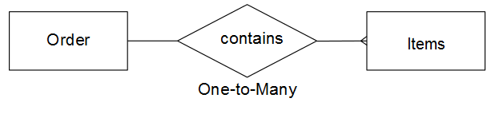
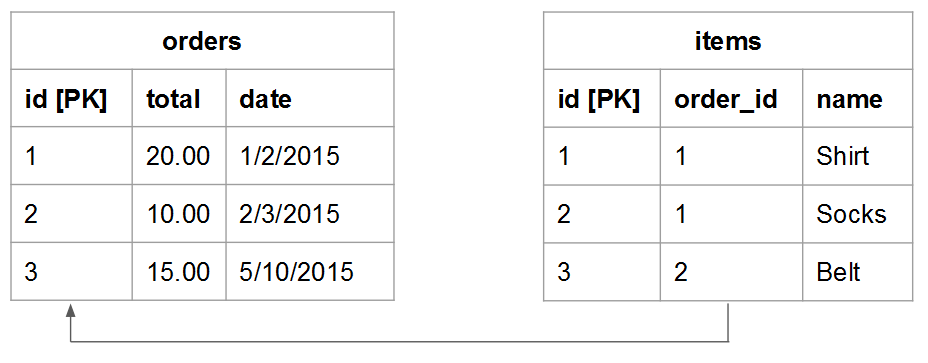
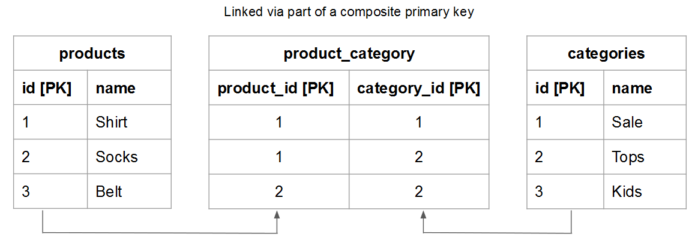

# テーブルの関係の理解と評価

2 つの特定のテーブル間の関係を評価する場合、あるテーブル内の可能なオカレンスが別のテーブルのエンティティに属する可能性がある場合の数を理解する必要があります。逆の場合も同様です。 例えば、`users` テーブルと `orders` テーブルを使用します。 この場合、特定の **ユーザー** が注文した **注文** の数と、所属する可能性のある **ユーザー** **注文** の数を把握する必要があります。

関係を理解することは、データの整合性を維持するために不可欠です。関係は、[ 計算列 ](../data-warehouse-mgr/creating-calculated-columns.md) および [ ディメンション ](../data-warehouse-mgr/manage-data-dimensions-metrics.md) の精度に影響を与えるからです。 詳しくは、[ 関係タイプ ](#types) および [Data Warehouseでテーブルを評価する方法 ](#eval) を参照してください。

## 関係タイプ {#types}

2 つのテーブル間に存在できる関係には、次の 3 つのタイプがあります。

1. [『ワン・ツー・ワン』](#onetoone)
1. [『一対多』](#onetomany)
1. [『多対多』](#manytomany)

### `One-to-One` {#onetoone}

`one-to-one` リレーションシップでは、テーブル `B` のレコードは、テーブル `A` の 1 つのレコードにのみ属します。 また、テーブル `A` のレコードは、テーブル `B` の 1 つのレコードのみに属します。

例えば、人と運転免許証番号の関係では、人は 1 つの運転免許証番号しか持つことができず、運転免許証番号は人のみに属します。

### `One-to-Many` {#onetomany}

`one-to-many` 関係では、テーブル `A` のレコードがテーブル `B` の複数のレコードに属する可能性があります。 `orders` と `items` の関係を考えます。注文には多くの項目を含めることができますが、項目は 1 つの注文に属します。 この場合、`orders` テーブルは一側で、`items` テーブルは多側です。

### `Many-to-Many` {#manytomany}

`many-to-many` 関係では、テーブル `B` のレコードがテーブル `A` の複数のレコードに属する可能性があります。 また、テーブル `A` のレコードがテーブル `B` の複数のレコードに属している場合もあります。

**製品** と **カテゴリ** の関係を考えます。製品は多くのカテゴリに属することができ、カテゴリには多くの製品を含めることができます。

## テーブルの評価 {#eval}

テーブル間に存在する関係の種類を考えると、Data Warehouseでテーブルを評価する方法を学ぶことができます。 これらの関係によって、複数テーブルの計算列を定義する方法が決まるので、テーブルの関係を識別する方法と、テーブルが属する側（`one` または `many`）を理解することが重要です。

Data Warehouse内の特定のテーブルのペアの関係を評価するには、次の 2 つの方法があります。 1 つ目の方法は、テーブルのエンティティがどのように相互にやり取りするかを考慮する [ 概念フレームワーク ](#concept) を採用しています。 2 つ目のメソッドは、[ テーブルのスキーマ ](#schema) を使用します。

### 概念フレームワークの使用 {#concept}

この方法では、概念フレームワークを使用して、2 つのテーブル内のエンティティが相互にどのようにやり取りできるかを記述します。 このフレームワークは、関係を考慮して、可能なものを評価することを理解することが重要です。

例えば、ユーザーと注文について考える場合は、関係で可能なことをすべて考慮してください。 登録ユーザーは、有効期間内に、注文を行ったり、1 回だけ、または複数の注文を行ったりすることはできません。 ビジネスを開始しても注文がない場合は、特定のユーザーが生涯に多くの注文を行える可能性があります。 テーブルは、これに対応するように作成されています。

このメソッドを使用するには：

1. 各テーブルで説明されているエンティティを識別します。 **ヒント：通常は名詞です**。 例えば、`user` テーブルと `orders` テーブルは、ユーザーと順序を明示的に記述しています。

1. これらのエンティティの相互作用を説明する 1 つ以上の動詞を識別します。 例えば、ユーザーと注文を比較する場合、ユーザーは注文を「発注」します。 もう一方の方向に行くと、注文はユーザーに「属する」と表示されます。

このタイプのフレームワークは、Data Warehouseのテーブルの任意のペアに適用できます。 これにより、関係のタイプ、片側のテーブル、多側のテーブルを簡単に識別できます。

2 つのテーブルの関係を表す用語を識別したら、最初のエンティティの特定のインスタンスと 2 番目のエンティティのインスタンスとの関係を考慮することにより、双方向のインタラクションを設定します。 各関係の例を次に示します。

### `One-to-One`

1 人の人は、運転免許証番号を 1 つしか持つことができません。 特定の運転免許証番号が 1 人の人のみに属しています。

これは、各テーブルが片側である `one-to-one` しい関係です。

### `One-to-Many`

1 つの指定された順序に、多くの項目を含めることができます。 1 つの特定の項目は、1 つの注文にのみ属します。

これは、注文テーブルが一方の側で、品目テーブルが多い側である `one-to-many` しい関係です。

### `Many-to-Many`

1 つの特定の製品が複数のカテゴリに属する可能性があります。 1 つの特定のカテゴリに多数の製品を含めることができます。

これは、各テーブルが多数の辺を持つ `many-to-many` しい関係です。

### テーブルのスキーマの使用 {#schema}

2 つ目のメソッドは、テーブルスキーマを使用します。 スキーマは、どの列が [`Primary`](https://en.wikipedia.org/wiki/Unique_key) キーおよび [`Foreign`](https://en.wikipedia.org/wiki/Foreign_key) キーかを定義します。 これらのキーを使用すると、テーブルを相互にリンクし、関係タイプを判断するのに役立ちます。

2 つのテーブルをリンクする列を特定したら、列タイプを使用してテーブルの関係を評価します。 次に例を示します。

### `One-to-one`

両方のテーブルの `primary key` を使用してテーブルがリンクされている場合、各テーブルに同じ一意のエンティティが記述され、関係が `one-to-one` されます。

例えば、`users` テーブルは、ほとんどのユーザー属性（名前など）を取得できますが、追加の `user_source` テーブルは、ユーザーの登録ソースを取得します。 各テーブルでは、行は 1 人のユーザーを表します。

### `One-to-many`

>[!NOTE]
>
>ゲストの注文に応じますか？ ゲストの注文がテーブルの関係に与える影響については、[ ゲストの注文 ](../data-warehouse-mgr/guest-orders.md) を参照してください。

`Foreign key` を指す `primary key` を使用してテーブルをリンクする場合、この設定は `one-to-many` の関係を表します。 一方の側は `primary key` を含むテーブルで、多くの側は `foreign key` を含むテーブルです。

### `Many-to-many`

次のいずれかに該当する場合、関係は `many-to-many` になります。

* `Non-primary key` 列は、2 つのテーブルのリンクに使用されています
  
* 複合 `primary key` の一部は、2 つのテーブルをリンクするために使用されます

## 次の手順

テーブルの関係を正しく評価することは、データを正確にモデリングするために重要です。 これで、テーブルが相互にどのように関連付けられるかを理解できたので、[Data Warehouse Manager でできること ](../data-warehouse-mgr/tour-dwm.md) を参照してください。
