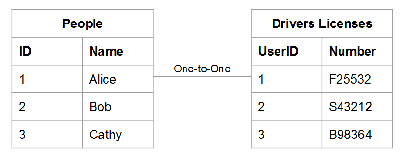
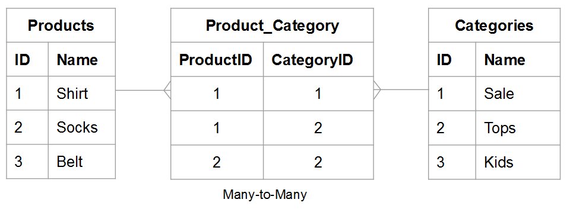
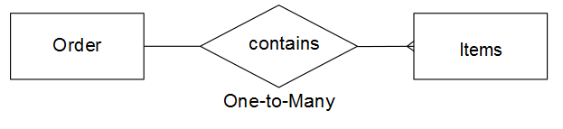
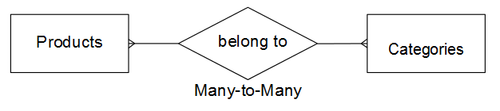
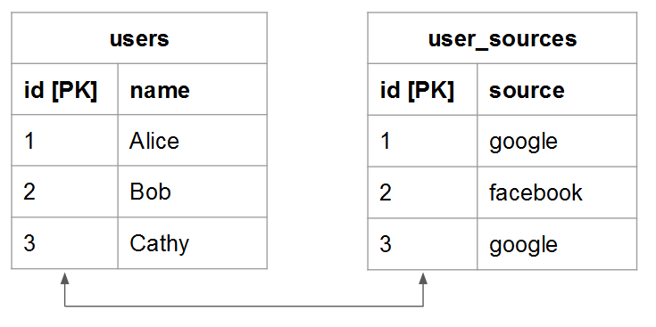
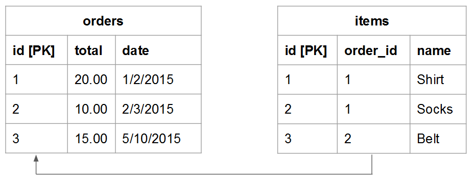
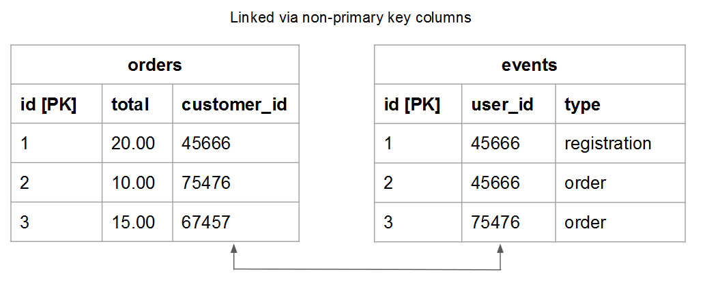
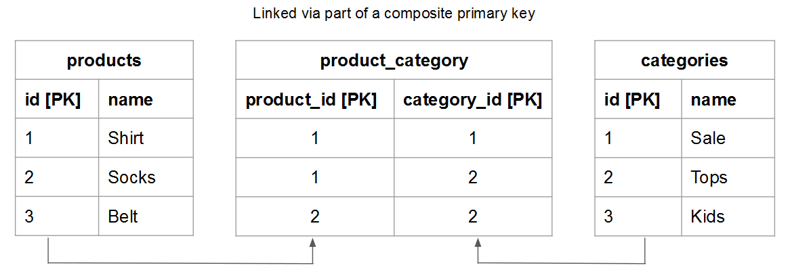

# テーブルの関係の理解と評価

2つの与えられたテーブル間の関係を評価する場合、あるテーブル内で発生する可能性のある事象が別のテーブル内のエンティティに属する可能性がある回数と、その逆の場合を理解する必要があります。 例えば、`users` テーブルと`orders` テーブルを使用します。 この場合、特定の&#x200B;**ユーザー**&#x200B;が配置した&#x200B;**注文**&#x200B;の数と、可能な&#x200B;**ユーザー**&#x200B;と&#x200B;**注文**&#x200B;の数を把握する必要があります。

関係を理解することは、[計算列](../data-warehouse-mgr/creating-calculated-columns.md)と[&#x200B; ディメンション &#x200B;](../data-warehouse-mgr/manage-data-dimensions-metrics.md)の精度に影響を与えるため、データの整合性を維持するために不可欠です。 詳しくは、[関係タイプ &#x200B;](#types)および[Data Warehouseのテーブルの評価方法を参照してください。](#eval)

## 関係タイプ {#types}

2つのテーブル間に存在できる関係には、次の3つのタイプがあります。

1. [『一対一』](#onetoone)
1. [『一対多』](#onetomany)
1. [『多対多』](#manytomany)

### `One-to-One` {#onetoone}

`one-to-one`関係では、テーブル `B`のレコードはテーブル `A`の1つのレコードにのみ属します。 テーブル `A`のレコードは、テーブル `B`の1つのレコードにのみ属します。

例えば、人と運転免許証番号との関係では、人は1つの運転免許証番号しか持てず、運転免許証番号は1人に属する。

2つのエンティティ間の1対1の関係を示す

### `One-to-Many` {#onetomany}

`one-to-many`関係では、テーブル `A`のレコードは、テーブル `B`の複数のレコードに属している可能性があります。 `orders`と`items`の関係について考えてみましょう。1つの注文には多数のアイテムが含まれますが、1つの注文に属しています。 この場合、`orders` テーブルは片側で、`items` テーブルは多数側です。

### `Many-to-Many` {#manytomany}

`many-to-many`関係では、テーブル `B`のレコードは、テーブル `A`の複数のレコードに属している可能性があります。 逆に、テーブル `A`のレコードは、テーブル `B`の複数のレコードに属している可能性があります。

**製品**&#x200B;と&#x200B;**カテゴリ**&#x200B;の関係について考えてみましょう。製品は多くのカテゴリに属することができ、カテゴリには多くの製品を含めることができます。

## テーブルの評価 {#eval}

テーブル間に存在するリレーションシップの種類を考えると、Data Warehouseでテーブルを評価する方法を学習できます。 これらの関係は、複数のテーブルの計算列の定義方法を形成するので、テーブルの関係を識別する方法と、テーブルが属する側（`one`または`many`）を理解することが重要です。

Data Warehouse内の特定のテーブルのペアの関係を評価するために使用できる方法は2つあります。 最初の方法では、テーブルのエンティティ同士の相互作用を考慮する[概念フレームワーク &#x200B;](#concept)を使用します。 2番目のメソッドは、[&#x200B; テーブルのスキーマ &#x200B;](#schema)を使用します。

### 概念フレームワークの使用 {#concept}

この方法では、概念フレームワークを使用して、2つのテーブル内のエンティティが互いにどのように相互作用できるかを説明します。 関係を考えると、このフレームワークが何が可能かを評価することを理解することが重要です。

例えば、顧客や注文について考えるとき、関係の中で可能なことをすべて考えてみましょう。 登録ユーザーは、生涯以内に注文、1回の注文、または複数の注文を行うことはできません。 ビジネスを立ち上げ、注文がない場合、特定のユーザーが生涯にわたって多くの注文を行うことができる可能性があります。 テーブルはそれに対応するように作られています。

この方法を使用するには：

1. 各テーブルに記述されているエンティティを特定します。 **ヒント：通常は名詞**&#x200B;です。 例えば、`user`と`orders`のテーブルは、ユーザーと注文を明示的に記述しています。

1. これらのエンティティがどのように相互作用するかを説明する1つ以上の動詞を特定します。 例えば、ユーザーを注文と比較する場合、ユーザーは注文を「配置」します。 別の方向に進むと、注文はユーザーに「属する」ことになります。

この種類のフレームワークは、Data Warehouse内のテーブルの任意のペアリングに適用できます。 これにより、関係のタイプと、どのテーブルが片側で、どのテーブルが多数側であるかを簡単に特定できます。

2つのテーブルの相互作用を説明する用語を特定したら、最初のエンティティの1つのインスタンスが2番目のエンティティにどのように関連しているかを考慮して、両方の方向で相互作用をフレーム化します。 各関係の例をいくつか示します。

### `One-to-One`

1人の人が1つの運転免許証番号のみを持つことができます。 運転免許証番号の一部は個人に限られます。

これは、各テーブルが片側である`one-to-one`関係です。

### `One-to-Many`

1つの注文に複数のアイテムが含まれる場合があります。 1つのアイテムは1つの注文にのみ属します。

これは、注文テーブルが1つの側面であり、項目テーブルが多数の側面である`one-to-many`関係です。

### `Many-to-Many`

1つの製品が多くのカテゴリに属している可能性があります。 1つのカテゴリに複数の製品が含まれる場合があります。

これは、各テーブルが多面的な`many-to-many`関係です。

### テーブルのスキーマの使用 {#schema}

2つ目の方法では、テーブルスキーマを使用します。 スキーマは、どの列が[`Primary`](https://en.wikipedia.org/wiki/Unique_key)と[`Foreign`](https://en.wikipedia.org/wiki/Foreign_key)のキーであるかを定義します。 これらのキーを使用してテーブルをリンクし、関係タイプを決定するのに役立てることができます。

2つのテーブルをリンクする列を特定したら、列タイプを使用してテーブルの関係を評価します。 例をいくつか紹介します。

### `One-to-one`

テーブルが両方のテーブルの`primary key`を使用してリンクされている場合、各テーブルに同じ一意のエンティティが記述されており、関係は`one-to-one`です。

例えば、`users` テーブルは、ほとんどのユーザー属性（名前など）をキャプチャし、補足の`user_source` テーブルはユーザー登録ソースをキャプチャします。 各テーブルでは、行は1人のユーザーを表します。

プライマリキーを使用した1対1の関係を示す

### `One-to-many`

>[!NOTE]
>
>ゲストの注文を受け付けていますか？ ゲスト注文がテーブルの関係にどのような影響を与えるかについては、[&#x200B; ゲスト注文](../data-warehouse-mgr/guest-orders.md)を参照してください。

テーブルが`Foreign key`を指す`primary key`を使用してリンクされている場合、この設定は`one-to-many`関係を表します。 片側は`primary key`を含むテーブルで、多くの側は`foreign key`を含むテーブルです。

外部キーを使用した1対多の関係を示す

### `Many-to-many`

次のいずれかがtrueの場合、関係は`many-to-many`です。

* `Non-primary key`列は2つのテーブルをリンクするために使用されています
  プライマリキー以外を使用した多対多の関係を示す
* 複合`primary key`の一部は、2つのテーブルをリンクするために使用されます

複合プライマリキーを使用した多対多の関係を示す

## 次のステップ

テーブルの関係を正しく評価することは、データを正確にモデリングするために非常に重要です。 テーブル同士の関係を理解したところで、[Data Warehouse Managerで実行できる処理](../data-warehouse-mgr/tour-dwm.md)を参照してください。
