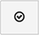
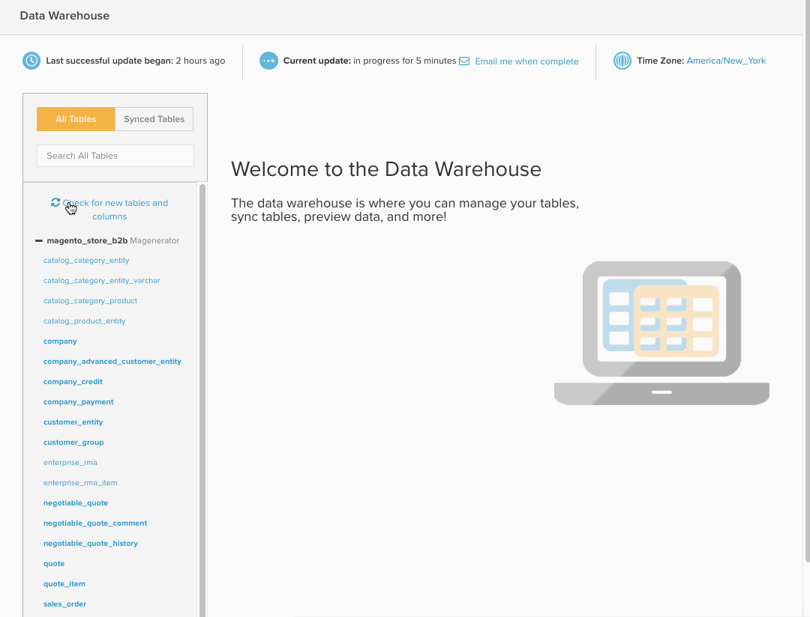
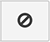
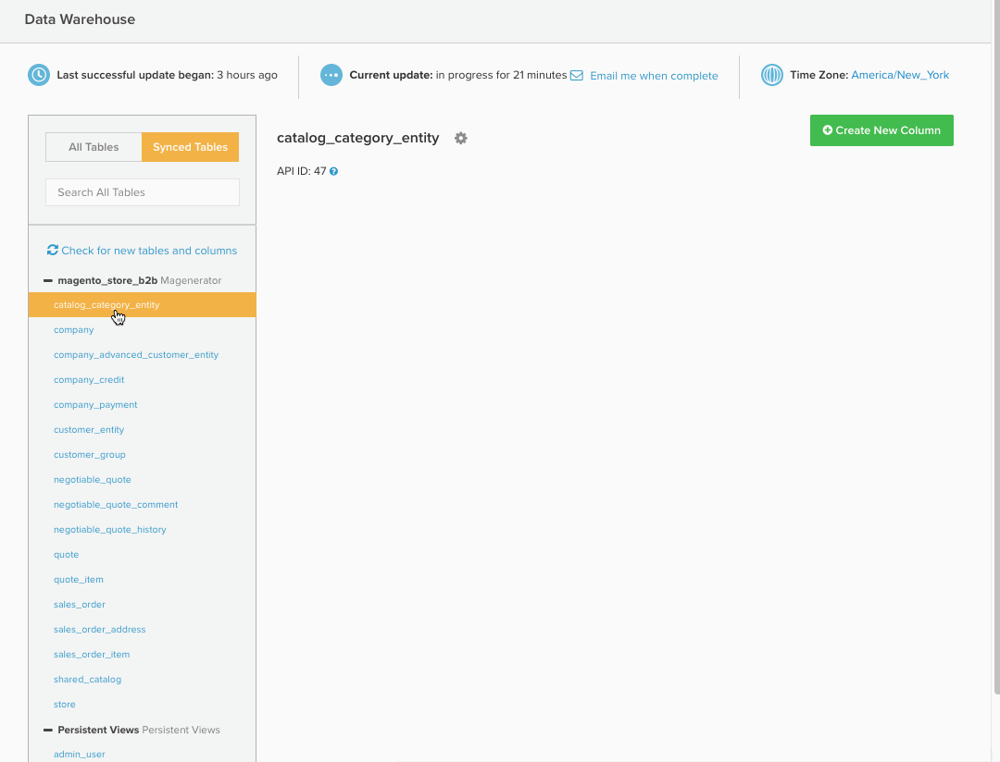

# Data Warehouse Manager

>[!NOTE]
>
>[管理者権限](../../administrator/user-management/user-management.md)が必要です

**[!UICONTROL Manage Data > Data Warehouse]**&#x200B;をクリックしてアクセスできるData Warehouse Managerは、[!DNL Adobe Commerce Intelligence] Data Warehouseへのポータルです。 Data Warehouse Managerでは、テーブルと列の同期設定を管理し、テーブルのスキーマをドリルダウンして、レポートで使用する計算列を作成できます。

主な内容：

* [あなたの周りの道を学ぶ](#learning)
* [表と列の同期](#syncing)
* [分かりやすい視覚表現](#calculated)
* [テーブルの削除と列の削除](#delete)
* [バックグラウンドでの新しいテーブルの同期](#syncnew)
* [新しい列はいつ使用できますか？](#when)

## あなたの周りの道を学ぶ {#learning}

`Data Warehouse Manager` ページの左側にはテーブル リストが含まれており、テーブルを簡単に切り替えることができます。 リストからテーブルを選択すると、テーブル管理領域にテーブルのスキーマが入力され、選択したテーブルを変更できます。

テーブルリスト内では、テーブルは接続ソースごとにグループ化されます。 これらのソースは[!UICONTROL Manage Data > Integrations]の下に追加され、データベース、[API](https://developer.adobe.com/commerce/services/reporting/)、またはサードパーティ製コネクタのいずれかになります。 テーブルリストの上部には、目的のテーブルを簡単に見つけることができる検索ボックスがあります。

検索ボックスの下に、`All Tables`と`Synced Tables`の2つのオプションが表示されます。 「`All Tables`」オプションには、Data Warehouseで使用可能なすべてのテーブルが一覧表示されます。このテーブルには、同期済みテーブルと非同期済みテーブルの両方が含まれます。

`Synced Tables` オプションには、既にData Warehouseに追加され、選択した列からデータがレプリケートされているすべてのテーブルが表示されます。

お探しのテーブルが`All Tables` リストに表示されませんか？ これには、次のような理由が考えられます。

* データソースがまだ追加されていません
* データソースはデータベースで、作成した[!DNL Commerce Intelligence] ユーザーにはアクセス権がありません。 この場合、ユーザーまたはデータベース管理者がアクセス権を付与する必要があります。
* データソースまたはテーブルが最近追加され、まだ同期されていません

## 表と列の同期 {#syncing}

### 新しいテーブルとネイティブ列の同期

Data Warehouse Managerでは、データソースを簡単に表示および管理できるだけでなく、同期する個々のテーブルや列を自由に選択できます。

1. `All Tables` オプションをクリックし、同期するテーブルを見つけます。
1. テーブルの名前をクリックして、スキーマをプレビューします。 テーブルが新しい場合、すべての列は`Unsynced`として表示されます。
1. 同期する列を確認します。

   >[!NOTE]
   >
   >テーブルにネイティブな列には、`Location`列に「自分のデータベースから」があります。

1. `Primary Key`列を確認してください。これらの列には、列名の横にキー記号があります。 データをData Warehouseに正しく同期するには、`Primary Key`が必要です。

   データベースから直接取得したテーブルを同期している場合、`Primary Keys`が表示されない可能性があります。 この場合は、データベース管理者に連絡して、プライマリキーまたはキーをテーブルに追加するようにリクエストしてください。
1. 完了したら、 ボタンをクリックします。

*成功！* メッセージが表示され、選択した列のステータスが`Pending`に変わります。 次の完全な更新が完了すると、新しく同期されたテーブルと列をレポートで使用できるようになります。 最初の同期後に新しい[&#x200B; レプリケーション方法](./cfg-replication-methods.md)を設定することもできます。

ここでは、そのプロセス全体を簡単に紹介します。

### バックグラウンドでの新しいテーブルの同期 {#syncnew}

大規模なテーブルを初めて同期する場合、Data Warehouseは、継続的に新しいデータを取得する前に、テーブル内のすべてのデータポイントを過去にさかのぼって取得する必要があります。 テーブルが大きい場合は、**更新サイクル**&#x200B;で最初の同期を順番に実行する必要がない可能性があります。 この場合、初期同期は、現在実行中の更新プログラムがある&#x200B;*parallel*&#x200B;のバックグラウンドで実行する必要があります。

これが確実に行われるように、テーブルを初めて同期する`Save and Sync Data Immediately` オプションを選択する必要があります。

### 新しい表と列の確認 {#forceupdate}

Data Warehouseでは、新しいソース、テーブル、または列が追加された時点で自動的に検出されません。 同期プロセスは週を通して実行され、新しい追加を検索して使用可能にしますが、プロセスの実行前に新しく追加されたテーブルと列にアクセスする場合は、構造同期を強制的に実行できます。

テーブルリストの検索バーの下に`Check for new tables and columns` リンクがあります。 このリンクをクリックすると、構造同期プロセスが強制的に開始されます。新しい追加は、通常10分後に使用できます。 ページを更新して、新しいソース、テーブルまたは列を表示します。

## 計算列の作成 {#calculated}

あらゆる情報源からのデータを容易に確認および管理できるため、ビジネスに関するインサイトをより容易に獲得できます。 しかし、Data Warehouse Managerでは、テーブル内に計算列を作成することで、さらに一歩踏み込むことができます。 `Calculated`列は、既存のデータから新しい情報を導き出します。

`user's lifetime revenue`を`users` テーブルに追加して、価値の高いユーザーを見つけるとします。 または、性別で収益をセグメント化する場合は、`customer's gender`を`orders` テーブルに追加できます。

詳細については、この[&#x200B; チュートリアル &#x200B;](../../data-analyst/data-warehouse-mgr/creating-calculated-columns.md)を参照してください。

## テーブルの削除と列の削除 {#delete}

Data Warehouseに同期するテーブルや列を選択できるのと同様に、削除することもできます。

>[!NOTE]
>
>テーブルの削除または列の削除は、削除を確認すると、依存レポート、指標、フィルターセットおよび列を削除します。 この操作を確実に実行します – **この操作は元に戻せません。**

誤って&#x200B;**[!UICONTROL Delete]**&#x200B;をクリックしても問題ありません。 依存関係チェックは、何かが削除される前に実行されるので、確認する前にすべてを確認する機会があります。

列を削除するには、列が属するテーブルをクリックします。 削除する列を確認し、 ボタンをクリックします。

同期したテーブルを削除するには、テーブル内のすべての列を選択し、 ボタンを再度クリックします。 これにより、このテーブルを使用するすべてのネイティブ列と計算列がData Warehouseから削除されます。

### 変更の確認

テーブルを削除する場合でも列を削除する場合でも、削除プロセスが完了する前に依存関係チェックが実行されます。 依存関係は、削除するテーブルまたは列を使用する計算列、指標、フィルターセット、レポートです。 検出された依存関係が表示されます。この時点で、プロセスをキャンセルするか、**[!UICONTROL Confirm Changes]**&#x200B;をクリックしてテーブルをドロップするか、列を削除します。

削除された依存関係は復元できませんが、今後ネイティブ列を再同期する必要がある場合は、テーブルと列を引き続き利用できます。

列を削除する方法を簡単に説明します。

## 新しい列はいつ使用できますか？ {#when}

次の完全な更新が完了すると、新しい同期列と新しい/更新された計算列が使用できるようになります。 更新がまだ進行中でない場合は、`Data Warehouse`または`Integrations` ページの上部に表示されている&#x200B;**[!UICONTROL Force update]**&#x200B;をクリックして、更新を強制できます。 更新完了時に、**[!UICONTROL Email me when complete]**&#x200B;をクリックしてメール通知をスケジュールすることもできます。

レポートで新しい列を使用する準備ができたら、[最初に指標に追加する必要があります](../data-warehouse-mgr/manage-data-dimensions-metrics.md)。 更新が完了するまでデータは利用できませんが、レポートでは新しい列を使用できます。 更新が完了すると、レポート内のデータが表示されます。

## まとめ

この記事はたくさんの内容を取り上げた。 ここでは、データベースとは何か、データの整理、テーブルの相互の関連付け、Data Warehouse Managerで何ができるかを解説します。

[計算列を作成](../data-warehouse-mgr/creating-calculated-columns.md)または[して、いくつかの興味深いレポートを作成](../../tutorials/using-visual-report-builder.md)して、知識をテストします。
