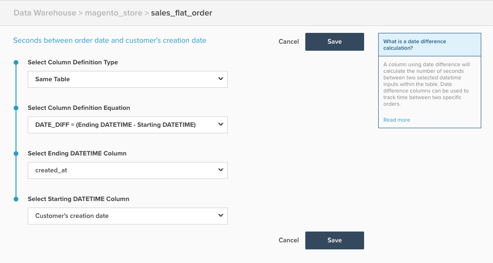

# 日付差分の計算列

このトピックでは、`Date Difference` ページで利用できる&#x200B;**[!DNL Manage Data > Data Warehouse]**&#x200B;計算列の目的と用途について説明します。 以下では、その仕組みと例、そして作成方法について説明します。

**説明**

`Date Difference`列タイプは、イベントタイムスタンプに基づいて、1つのレコードに属する2つのイベント間の時間を計算します。 この列で計算された生の値は秒単位ですが、レポートに表示するために、分、時間、日などに自動変換されます。 ただし、をフィルターまたはグループ化として使用する場合は、この値を秒単位で使用します。

`date difference`計算列を使用して、顧客登録から最初の注文までの平均時間など、2つのイベント間の平均時間または中央値を計算する指標を作成できます。

**例**

| **`id`** | **`timestamp_1`** | **`timestamp_2`** | **`Seconds between timestamp_2 and timestamp_1`** |
|--- |--- |--- |--- |
| `A` | 2015-01-01 00:00:00 | 2015-01-01 12:30:00 | 45000 |
| `B` | 2015-01-01 08:00:00 | 2015-01-01 10:00:00 | 7200 |

{style="table-layout:auto"}

上記の例では、`Date Difference`列は`Seconds between timestamp_2 and timestamp_1`列です。 計算`timestamp_2 minus timestamp_1`を実行します。

**力学**

次の手順では、`Date Difference`列を作成する方法について説明します。

1. **[!DNL Manage Data > Data Warehouse]** ページに移動します。
1. この列を作成するテーブルに移動します。
1. **[!UICONTROL Create a Column]**&#x200B;をクリックし、次のように列を設定します。
   * `Column Definition Type` > `Same Table`を選択
   * `Column Definition Equation` > `DATE_DIFF = (Ending DATETIME - Starting DATETIME)`を選択
   * `Ending DATETIME`列/終了日時フィールドを選択します。これは、通常、後で発生するイベントです
   * `Starting DATETIME`列**/開始日時フィールドを選択します。これは、通常、以前に発生したイベントです

1. 列に名前を指定し、**[!UICONTROL Save]**&#x200B;をクリックします。
1. 列は&#x200B;*すぐに*&#x200B;を使用できます。

例として、次の例は、`Seconds between order date and customer's creation date`を計算するように設定されています。

