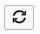
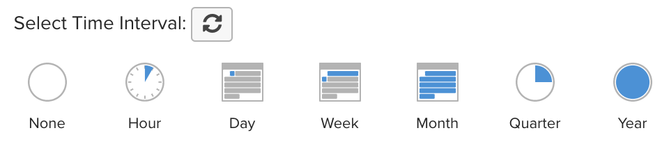

# ダッシュボード全体のフィルタリング

ダッシュボード全体のフィルタリングを使用すると、特定のダッシュボードですべてのレポートの一括編集をおこなうことができます。 異なる期間や異なる店舗で、同じ分析をすばやく表示できます。 前の年、月、または週の各店舗のパフォーマンスを簡単に比較できます。 さらに、新しく起動したキャンペーンに合わせてダッシュボード全体を更新できます。

## 日付フィルター

ダッシュボードのレポートの日付範囲や間隔を変更するには、右上隅にあるカレンダーアイコン () をクリックします。

データの表示は、 `Fixed Date Range` または事前に計算された様々な `Moving Date Ranges`:

この `Last Full...` 移動範囲オプションは、最後に完了した範囲を表します。 `This...` が現在の進行中の範囲になります。 例えば、現在 6 月の場合、 `Last Full Month` が _5 月 1 日～5 月 31 日_、 `This Month` が _6 月 1 日～今すぐ_.

または、独自の `Custom Moving Range`\:

間隔も変更します。 デフォルトのボタン () の場合は、日付範囲のみが変更されます。

すべてのレポートを初期の日付範囲と間隔に戻すには、 **[!UICONTROL Restore Defaults]** または、 **[!UICONTROL Cancel]**.

ダッシュボードの日付フィルタを指定すると、そのフィルタはそのダッシュボードにのみ適用されます。 他のダッシュボードに移動しても、適用されません。

>[!NOTE]
>
>この時 `Cohort Reports` および `SQL Reports` ダッシュボードレベルで変更を適用する際には、が含まれません。

## ストアフィルター

特定のストアのパフォーマンスを分析するには、右上隅にあるストアアイコン () をクリックします。 デフォルトでは、 `Store Filter` が `All Stores`：すべての [ストア表示](https://experienceleague.adobe.com/docs/commerce-admin/stores-sales/site-store/store-views.html) コマースサイトで使用できます。

>[!NOTE]
>
>ストアフィルターは、 [!DNL MBI] アカウント コマースデータに基づいて構築されていないレポートなど、フィルタの影響を受けないレポートがダッシュボードに含まれている場合、ストアフィルタが適用されても、それらのレポートは更新されません。 以下が可能です。 [連絡先サポート](../../guide-overview.md) ストアの選択に基づいてレポートを更新すると思われる場合や、アカウントストアのフィルターが誤って無効になっていると思われる場合。

ストアを `Store Filter`を使用すると、ダッシュボード間を移動する際にフィルターで選択内容が保持されます。 選択を維持すると、選択したストアのデータを、選択した `All Stores`.

## 共有ダッシュボードのフィルター

共有ダッシュボードの場合、あるユーザーが日付フィルターを設定すると、そのダッシュボードへのアクセス権を持つ他のユーザーにも、同じフィルターが適用されます。 ただし、この場合、ストアフィルターは適用されません。 ダッシュボードの所有者がストアフィルターを設定し、ダッシュボードを共有した場合、設定されたストアフィルターは別のユーザーに対して保持されません。 ユーザーが [アクセスを編集](../../data-user/dashboards/share-dashboard-with-users.md) をダッシュボードに追加して、ダッシュボードのフィルターを調整します。
