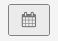
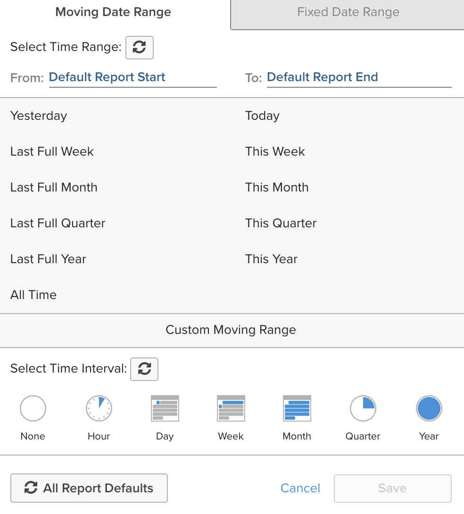
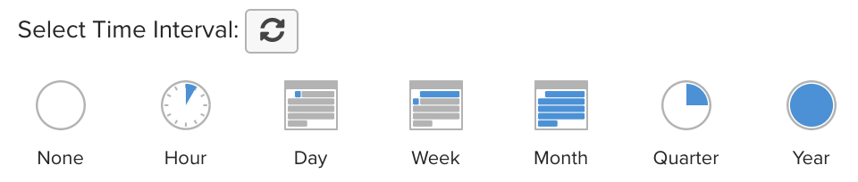

# ダッシュボード全体のフィルタリング

ダッシュボード全体のフィルタリングを使用すると、特定のダッシュボード上のすべてのレポートを一括編集できます。 異なる期間にわたって、または異なるストアに対して、同じ分析をすばやく表示できます。 店舗ごとの前年、月、週のパフォーマンスを簡単に比較できます。 新しく開始されたキャンペーンに対応するために、ダッシュボード全体を更新できます。

## 日付フィルター

ダッシュボード上のレポートの日付範囲または間隔を変更するには、右上隅（）のカレンダーアイコンをクリックします。

`Fixed Date Range`または事前計算されたさまざまな`Moving Date Ranges`を使用してデータを表示できます。

`Last Full...`移動範囲オプションは、最近完了した範囲を表し、`This...`は現在の進行中の範囲です。 例えば、6月の場合、`Last Full Month`は&#x200B;_5月1日～5月31_&#x200B;で、`This Month`は&#x200B;_6月1日～現在_&#x200B;です。

または、独自の`Custom Moving Range`\:

間隔も変更できます。 デフォルトのボタン（）を選択すると、日付範囲のみが変更されます。

すべてのレポートを初期の日付範囲と間隔に戻すには、**[!UICONTROL Restore Defaults]**&#x200B;をクリックするか、**[!UICONTROL Cancel]**&#x200B;をクリックします。

ダッシュボードの日付フィルターを指定すると、そのフィルターはそのダッシュボードにのみ適用されます。 他のダッシュボードに移動する場合は適用されません。

>[!NOTE]
>
>現在、`Cohort Reports`と`SQL Reports`は、ダッシュボードレベルで変更を適用する際には含まれていません。

## フィルターを保存

特定のストアのパフォーマンスを分析するには、右上隅のストアアイコン（）をクリックします。 デフォルトでは、`Store Filter`は`All Stores`に設定されており、Commerce サイトで利用可能なすべての[&#x200B; ストアビュー](https://experienceleague.adobe.com/docs/commerce-admin/stores-sales/site-store/store-views.html?lang=ja)のデータが表示されます。

>[!NOTE]
>
>[!DNL Commerce Intelligence] アカウント全体でストアフィルターが有効または無効になっています。 ダッシュボードに、フィルターの影響を受けないレポート （どの[!DNL Adobe Commerce] データにも組み込まれていないレポートなど）が含まれている場合、ストアフィルターが適用されたときに、これらのレポートは更新されません。 ストアの選択に基づいてレポートを更新する必要があると思われる場合、またはアカウント ストア フィルターが誤って無効になっていると思われる場合は、[&#x200B; サポート &#x200B;](https://experienceleague.adobe.com/docs/commerce-knowledge-base/kb/troubleshooting/miscellaneous/mbi-service-policies.html?lang=ja)にお問い合わせください。

`Store Filter`からストアを選択すると、ダッシュボード間を移動する際に、フィルターは選択内容を保持します。 選択範囲を保持すると、`All Stores`を選択するまで、選択したストアのデータをどこにでも表示できます。

## 共有ダッシュボードのフィルター

共有ダッシュボードの場合、1人のユーザーが日付フィルターを設定すると、ダッシュボードへのアクセス権を持つ他のユーザーに同じフィルターが適用されます。 ただし、この場合、ストアフィルターは適用されません。 ダッシュボードの所有者がストアフィルターを設定し、ダッシュボードを共有する場合、設定されたストアフィルターは別のユーザーに保持されません。 ダッシュボードフィルターを調整するには、ユーザーにダッシュボードへの[編集アクセス &#x200B;](../../data-user/dashboards/share-dashboard-with-users.md)が必要です。
