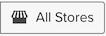

# ダッシュボード全体のフィルタリング

ダッシュボード全体のフィルタリングを使用すると、特定のダッシュボード上のすべてのレポートを一括編集できます。 同じ分析を異なる期間や店舗ですばやく確認できます。 ストアごとに前年、月、週のパフォーマンスを簡単に比較できます。 ダッシュボード全体を更新して、新しく開始されたキャンペーンに対応できます。

## 日付フィルター

ダッシュボードの日付範囲またはレポートの間隔を変更するには、右上隅にあるカレンダーアイコン（）に設定します。

を使用してデータを表示するように選択できます `Fixed Date Range` またはさまざまな事前計算済み `Moving Date Ranges`:

この `Last Full...` 移動範囲オプションは、最後に完了した範囲を表し、一方で `This...` は、現在の進行中の範囲です。 例えば、6 月の場合 `Last Full Month` 等しい _5 月 1 日～5 月 31 日_、間 `This Month` 等しい _6 月 1 日（PT） – 今_.

または独自に作成 `Custom Moving Range`\:

を選択して、間隔も変更します。 デフォルトボタンの選択（）は、日付範囲のみが変更されることを意味します。

すべてのレポートを初期の日付範囲および間隔に復元するには、をクリックします **[!UICONTROL Restore Defaults]** またはクリック **[!UICONTROL Cancel]**.

ダッシュボードに日付フィルターを指定すると、そのフィルターはそのダッシュボードにのみ適用されます。 他のダッシュボードに移動する場合は適用されません。

>[!NOTE]
>
>現在、 `Cohort Reports` および `SQL Reports` ダッシュボードレベルで変更を適用する場合は、が含まれません。

## フィルターの保存

特定のストアのパフォーマンスを分析するには、右上隅にあるストアアイコン（）に設定します。 デフォルトでは `Store Filter` はに設定されています。 `All Stores`。すべてのデータが表示されます。 [ビューを保存](https://experienceleague.adobe.com/docs/commerce-admin/stores-sales/site-store/store-views.html) Commerce サイトで使用できます。

>[!NOTE]
>
>ストアフィルターは全体に対して有効または無効になっています [!DNL Commerce Intelligence] アカウント。 ダッシュボードに、フィルターの影響を受けないレポートが含まれている場合（どのレポートにも基づいていないレポートなど） [!DNL Adobe Commerce] data）に設定した場合、これらのレポートは、ストアフィルターが適用される際に更新されません。 次のことができます [サポートに連絡する](https://experienceleague.adobe.com/docs/commerce-knowledge-base/kb/troubleshooting/miscellaneous/mbi-service-policies.html) ストアの選択に基づいてレポートを更新する必要があると思われる場合、またはアカウントストアのフィルターが誤って無効になっていると思われる場合。

からストアを選択した場合 `Store Filter`の場合、ダッシュボード間を移動しても、フィルターは選択内容を保持します。 選択を保持すると、を選択するまで、選択したストアのデータをどこにでも表示できます `All Stores`.

## 共有ダッシュボードのフィルター

共有ダッシュボードの場合、1 人のユーザーが日付フィルターを設定すると、ダッシュボードにアクセスできる他のユーザーには、同じフィルターが適用されます。 ただし、この場合、ストアフィルターは適用されません。 ダッシュボードの所有者がストアフィルターを設定してダッシュボードを共有すると、設定されたストアフィルターは別のユーザーには保持されません。 ユーザーの条件 [アクセスを編集](../../data-user/dashboards/share-dashboard-with-users.md) をダッシュボードに移動して、ダッシュボードフィルターを調整します。
