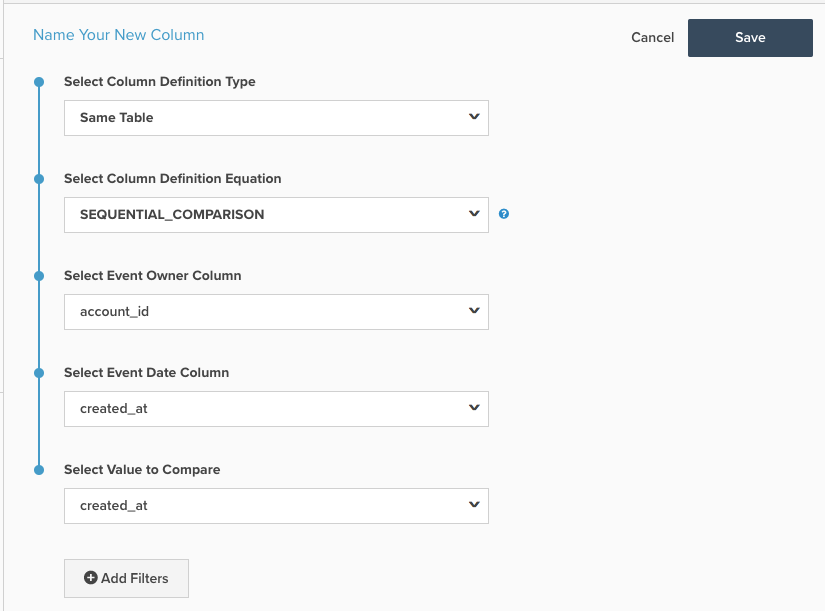

# 順次比較計算列

このトピックでは、`Sequential Comparison` ページで利用できる&#x200B;**[!DNL Manage Data > Data Warehouse]**&#x200B;計算列の目的と用途について説明します。 以下は、その仕組みとその例とその作成方法について説明します。

**説明**

`Sequential Comparison`列の種類：連続したイベントの違いを見つけます。 `Sequential Comparison`列の最も一般的なタイプは`Seconds since previous order`列です。 この列には3つの入力が必要です。

1. `Event Owner`：この入力により、行がグループ化されるエンティティが決まります。 例えば、`Seconds since previous order`列では、同じ顧客の前の順序からの秒数を求めるため、イベント所有者は顧客です。
1. `Event Date`：この入力は、イベントのシーケンスを適用します。 `Seconds since previous order`の場合、注文のタイムスタンプを含む列は`Event Date`である必要があります。 この入力は常にタイムスタンプです。
1. `Value to Compare`：この入力は、比較する実際の値です。 前の行の値を現在の行の値から減算します。 したがって、顧客の連続した注文間の時間差を見つける列は`Seconds since previous order`と呼ばれます。 この入力はタイムスタンプである必要はありません。 非タイムスタンプの例は、顧客の連続した注文間の注文値の違いを見つけることです。

**例**

| **`event_id`** | **`owner_id`** | **`timestamp`** | **`Seconds since owner's previous event`** |
|--- |--- |--- |--- |
| **`1`** | A | 2015-01-01 00:00:00 | NULL |
| **`2`** | B | 2015-01-01 00:30:00 | NULL |
| **`3`** | A | 2015-01-01 02:00:00 | 7200 |
| **`4`** | A | 2015-01-02 13:00:00 | 126000 |
| **`5`** | B | 2015-01-03 13:00:00 | 217800 |

上記の例では、`Seconds since owner's previous event`は`Sequential Comparison`の計算列です。 `owner_id = A`では、最初に`timestamp`列に基づいてシーケンスを識別し、次に前のイベントの`timestamp`を現在のイベントのタイムスタンプから減算します。 テーブルの3番目の行（`owner_id A`の2番目の行） - `Seconds since owner's previous event`の値は、「2015-01-01 02:00」と「2015-01-01 00:00:00」の間の秒数です。 この差は2時間=7200秒です。

この計算列タイプでは、所有者の最初のイベントに対応する行の値は`NULL`です。

**力学**

**イベント番号**&#x200B;列を作成するには：

1. **[!DNL Manage Data > Data Warehouse]** ページに移動します。

1. この列を作成するテーブルに移動します。

1. 右上隅の&#x200B;**[!UICONTROL Create New Column]**&#x200B;をクリックします。

1. `Same Table`を`Definition Type`として選択します（比較する列が同じテーブルにない場合は、再配置する必要がある可能性があります）。

1. `SEQUENTIAL_COMPARISON`を`Column Definition Equation`として選択します。

1. 上記の説明に従って、入力を選択します。
   - `Event Owner`
   - `Event Date`
   - `Value to Compare`

1. また、フィルターを追加して、行を考慮から除外することもできます。 除外された行には、この列の`NULL`値があります。

1. ページの上部にある列の名前を入力し、**[!UICONTROL Save]**&#x200B;をクリックします。

1. 列は&#x200B;*すぐに*&#x200B;を使用できます。

