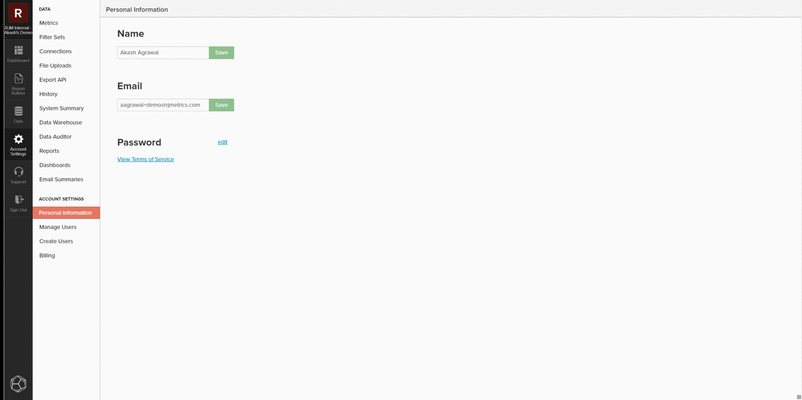
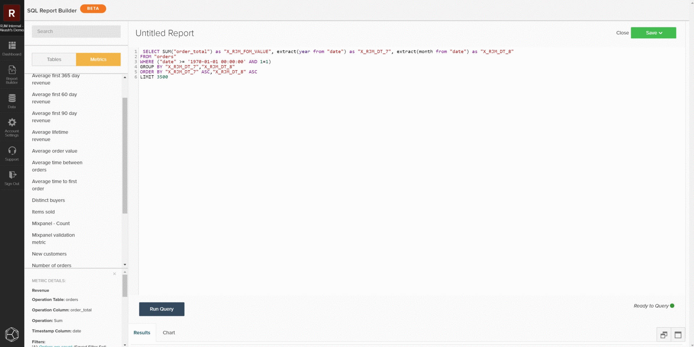

# [!DNL SQL Report Builder]

[!DNL SQL Report Builder]は、主に新しいレポートを作成し、分析を繰り返すために使用されますが、データと指標を効果的に監査するためにも使用できます。 次の情報では、[!DNL SQL Report Builder]を使用してデータと指標を監査し、結果をローカルデータベースのデータと比較する方法について説明します。

## 指標のクエリ

開始するには、[!DNL SQL Report Builder]に移動して&#x200B;**[!UICONTROL Report Builder > SQL Report Builder > Create Report]**&#x200B;を開きます。 [!DNL SQL] エディターのサイドバーを使用して、指標にカーソルを合わせて&#x200B;**[!UICONTROL Insert]**&#x200B;をクリックすると、指標をクエリに直接挿入できます。 これにより、その指標のクエリ定義がエディターに追加されます。 定義には、次のコンポーネントが含まれます。

- **指標の操作**&#x200B;が実行されています。以下の例では、`SUM()`が示しています。
- 指標が作成される&#x200B;**の** テーブルは、`FROM`句で示されます。
- 指標に追加された&#x200B;**フィルター（およびフィルターセット）**&#x200B;はすべて、次の例の`WHERE`句で示されています。
- データを注文する&#x200B;**タイムスタンプ** （年、月）のコンポーネント。以下の例の`ORDER BY`句で示されます。

クエリをより明確に表示するには、クエリフィールドでの表示方法を再形式できます。 準備ができたら、`Run Query`を選択します。 結果は、クエリの下のレポートパネルにテーブルとして入力されます。

## クエリの制限

特定の不一致またはデータのセットを特定する場合は、クエリを特定のサンプルに限定して、ローカルデータベースと照合する必要があります。 これを行うには、目的の制限に合わせてクエリを編集します。 次の例では、2013年1月1日以降の収益のみを含めるようにクエリを制限しています。 クエリを更新したら、もう一度&#x200B;**[!UICONTROL Run Query]**&#x200B;を選択して結果を更新します。

## 保存とエクスポート

レポートがニーズを満たしたら、レポートに明確な名前を付け、**[!UICONTROL Save]**&#x200B;をクリックし、保存するレポートのタイプとダッシュボードを選択します。 指標を監査する場合、Adobeでは、レポートを`Table`として保存し、テストダッシュボードに保存することをお勧めします。

レポートが保存されたら、`Go to Dashboard`を選択して、そのダッシュボードに移動します。 そこから、レポートを見つけて、**[!UICONTROL Options gear > Full `.csv`Export]**&#x200B;または&#x200B;**[!UICONTROL Full Excel Export]**&#x200B;を選択してデータを書き出すことができます。

## カスタムクエリ

また、カスタムクエリを作成し、結果を書き出して、ローカルデータベースと比較することもできます。 クエリ最適化[の](../../best-practices/optimizing-your-sql-queries.md) ガイドラインに従って、SQL エディターにクエリを記述します。 サイドバーの上部にあるボタンを使用して、[!DNL SQL Report Builder]で使用できるテーブルと指標のリストを切り替え、クエリに追加できます。 カスタムクエリがニーズに合ったら、レポートを保存し、そのデータをダッシュボードから書き出すことができます。

>[!NOTE]
>
>データを監査した後に不一致が見つかった場合は、[&#x200B; サポートへの連絡：データの不一致](https://experienceleague.adobe.com/docs/commerce-knowledge-base/kb/troubleshooting/miscellaneous/mbi-data-discrepancies.html) サポートのトピックで、次に行う処理について詳しく確認してください。
