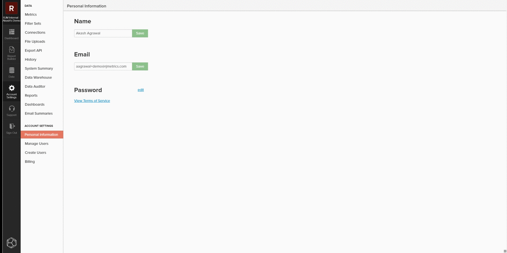

# `SQL Report Builder`

この `SQL Report Builder` は、主に新しいレポートを作成し、分析を繰り返し実行するために使用されますが、データと指標を効果的に監査するためにも使用できます。 次の情報では、 `SQL Report Builder` 結果をローカルデータベースのデータと比較できます。

## 指標のクエリ

利用を開始するには、 `SQL Report Builder` 移動して **[!UICONTROL Report Builder > SQL Report Builder > Create Report]**. SQL エディターのサイドバーを使用して、指標の上にマウスポインターを置いて「 **[!UICONTROL Insert]**. これにより、その指標のクエリ定義がエディターに追加されます。 定義には、次のコンポーネントが含まれます。

- この **指標操作** が実行され、以下の例の SUM() で示されます。
- この **～に関するテーブル** FROM 句で示す指標が作成されます。
- 任意 **フィルタ（およびフィルタセット）** が指標に追加されました。以下の例の WHERE 句で示されます。
- のコンポーネント **timestamp** （年、月）データの並べ替え先となるもの。以下の例の ORDER BY 句で示されます。

クエリをより明確に表示する場合は、クエリフィールドでの表示形式を再設定できます。 準備が整ったら、「 」を選択します。 `Run Query`. 結果は、クエリの下のレポートパネルにテーブルとして表示されます。

## クエリの制限

特定の不一致やデータのセットを特定する場合は、クエリを特定のサンプルに制限して、ローカルデータベースに対して確認する必要があります。 これをおこなうには、クエリを編集して、目的の制限に合わせます。 次の例では、クエリを制限して 2013 年 1 月 1 日以降の売上高のみを含めます。 クエリを更新した後、 **[!UICONTROL Run Query]** を再度クリックして、結果を更新します。

## 保存とエクスポート

レポートがニーズに合ったら、レポートに固有の名前を付けて「 」をクリックし、レポートをダッシュボードに保存します。 **[!UICONTROL Save]**&#x200B;をクリックし、保存するレポートの種類を選択し、「 」ダッシュボードを表示します。 指標を監査する場合、Adobeでは、レポートを `Table` テストダッシュボードに保存します。

レポートを保存したら、「 」を選択してそのダッシュボードに移動します。 `Go to Dashboard`. ここから、レポートを見つけて、「 」を選択することで、データをエクスポートできます。 **[!UICONTROL Options gear > Full `.csv`書き出し]** または **[!UICONTROL Full Excel Export]**.

## カスタムクエリ

また、カスタムクエリを記述し、結果を書き出してローカルデータベースと比較することもできます。 次の [クエリ最適化のガイドライン](../../best-practices/optimizing-your-sql-queries.md)を使用する場合は、SQL エディターでクエリを記述します。 サイドバーの上部にあるボタンを使用して、テーブルのリストと、 `SQL Report Builder` クエリに追加します。 カスタムクエリがニーズに合ったら、レポートを保存し、ダッシュボードからそのデータを書き出すことができます。

### まだつまずいた？

データの監査後に不一致が見つかった場合は、 [サポートへの問い合わせ：データの相違](https://experienceleague.adobe.com/docs/commerce-knowledge-base/kb/troubleshooting/miscellaneous/mbi-data-discrepancies.html?lang=en) 次の作業の詳細については、サポート記事を参照してください。
