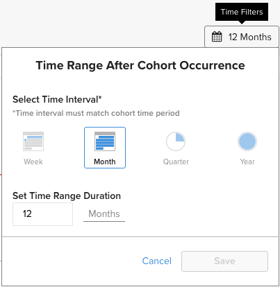
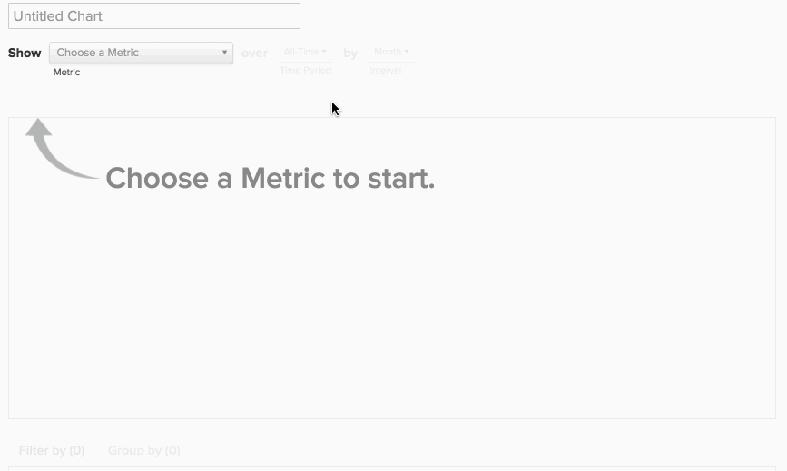

# コホートReport Builder

ユーザーの様々なサブセットの時間の経過に伴う動作を調べたいと思ったことはありますか？ 例えば、プロモーション期間中に登録したユーザーの平均ライフタイム売上高は、登録していないユーザーの平均ライフタイム売上高よりも高いのかと疑問に思ったことはありますか？ 答えが `Yes`、 `Cohort Report Builder` は、お客様に最適なツールです。 [!DNL MBI] は、この分析の実行とビジネスに合わせた関連性を持たせるために特別に最適化されています。

## コホート分析とは {#what}

`Cohort` 解析は、ライフサイクルにわたって同じ特性を共有するユーザーグループの解析として広く定義できます。 異なるユーザーグループにわたる行動傾向を識別できます。

詳しくは、 `cohort` 分析、 [ここを見る](https://www.cohortanalysis.com/) 私たちはそのサイトを書きました！

を [!DNL MBI] ダッシュボードを使用すると、簡単にユーザーを作成できます `cohorts` に基づく `cohort` アカウントの日付と指標。

## コホート分析が重要なのはなぜでしょうか？ {#important}

前述のように、 `cohort` 分析を使用すると、様々なユーザーグループ間で行動トレンドを識別できます。 特定のグループの行動を明確に理解することで、販売を最大限に活かすために意思決定と支出を調整できます。 例えば、全期間の売上高を取得します。 `cohort` 分析 — この種の分析は多くの理由で有益ですが、即座におこなうと、顧客獲得に関する意思決定が向上します。

## 独自の作成方法 `cohort` 分析？

### 新しいアーキテクチャ

以下は、 `Cohort Report Builder` の [新しいアーキテクチャ](../../administrator/account-management/new-architecture.md).

1. クリック **[!UICONTROL Report Builder]** ( 左側のタブまたは **[!UICONTROL Add Report** > **Create Report]** （任意のダッシュボード）

1. 内 `Report Builder` 選択画面、クリック **[!UICONTROL Create Report]** の横 `Visual Report Builder` オプション。

**指標の追加**

これで、 `Report Builder`分析を実行する指標を追加します ( 例： `Revenue` または `Orders`) をクリックします。

>[!NOTE]
>
>ネイティブ [!DNL Google Analytics] 指標は `Cohort Report Builder`.

**指標表示をに切り替える`Cohort`**

新しいウィンドウが開き、このウィンドウで `Cohort` レポート。

### を構築するには、5 つの仕様が必要です。 `Cohort` レポート：

1. グループ化の方法 `cohorts`
1. この `cohort` 期間
1. この `cohorts` 見る
1. 各データの最小量 `cohort` 次を含む
1. 次の値より後の時間範囲 `cohort` 発生件数

#### 1.グループ化 `cohorts`

`Cohorts` は、 **登録日** または **初回注文日**.

>[!NOTE]
>
>指標が構築されているのと同じタイムスタンプを `cohort` 日付。 これを必要とする分析の場合、 `Standard report builder` 代わりに、

#### 2. `Cohort` 期間

グループ化する期間を選択 `cohorts` 作成者： つまり、上で選択したタイムスタンプのどの部分が最も重要かを示します。の `week`, `month`, `quarter`または `year`?  レポートには、ここで選択した間隔に応じてデータが表示されます

#### 3.4. 次の数を設定： `cohorts` 各データの表示と量 `cohort` は、

これらのパラメーターは、 `cohorts` 君が興味を持っているのはその役に立つ `Preview` ボックスの下部に、レポートに表示されるコホートが正確に表示されます。

デフォルトでは、現在の `cohort` は、各 `cohort` から `0`. この場合、 `cohort` 現在の期間の場合、部分的なデータのみが含まれます。

#### 5.次の時間範囲 `Cohort` 発生件数

この機能を使用すると、選択した `cohorts`. 例えば、24 件の月次レポートを表示する場合、 `cohorts` 基準 `customer's first order date`ただし、興味を持つのはそれぞれの最初の 3 か月分のデータのみです `cohort`を使用する場合、 `number of cohorts to view` から `24` そして `time range after cohort occurrence` から `3`.

この値の間隔は、 `cohort time period` 値は `12` デフォルトではカレンダーアイコンをクリックして編集しない限り、値は変更されません。

#### その他のメモ

* [!UICONTROL Filters]:を `Standard` および `Cohort` ビュー。

* 詳しくは、 [`Perspectives`](#perspectives).

#### 例

ここでは、すべてをまとめる例を示します。 この例では、 `cohort`の初回購入。今後 6 ヶ月間に同じコホートが再度訪問するかどうかを確認します。

### レガシーアーキテクチャ

#### レガシーアーキテクチャ {#personalinfo}

以下に、旧バージョンの `Cohort Report Builder`. 新しいバージョンの使用に関心がある場合は、 [新しいアーキテクチャ](../../administrator/account-management/new-architecture.md) への移行の詳細 [!DNL MBI] 新しいアーキテクチャアカウント。

#### 独自の作成方法 `cohort` 分析？ {#create}

`Cohort` アクション分析！ ここでは、累積的およびユーザーごとの売上高が、時間の経過と共に増加している様子を見ることができます。

この節では、独自の `cohort` 分析。 例 ( およびプロセスを示すアニメーションGIF) については、 [「例」セクション](#examples) 」を参照してください。

1. クリック **[!UICONTROL Report Builder]** ( 左側のタブまたは **[!UICONTROL Add Report** > **Create Report]** （任意のダッシュボード）

1. 内 `Report Builder Selection` 画面、クリック **[!UICONTROL Create Report]** の横 `Cohort Analysis` オプション。

#### 指標の追加

これで、 `Cohort Report Builder`、指標を追加します ( 例： `Revenue` または `Number of orders`) をクリックします。

>[!NOTE]
>
>ネイティブ [!DNL Google Analytics] 指標は `Cohort Report Builder`.

#### コホート日の選択 {#date}

次に、 `cohort date`. ユーザーがグループ化される日付です。 例えば、次のような場合があります。 `User's first order date` または `User's registration date`.

>[!NOTE]
>
>指標の作成日と同じ日付を使用することはできません ( 例： `created at`) を `cohort date`.

#### 間隔と期間の設定

次に、 `Interval` および `Time Period`.

`Interval`
この `Interval` オプションを使用すると、 `length` の `cohorts`. 例えば、 `Month`に設定すると、レポートは月単位で測定されます。

X 軸上でのこれらの間隔の表示方法は、 **期間** メニュー

`Time Period`
以下を使用： `Time Period` 特定のユーザーを選択するメニュー `cohorts` をクリックして分析します。 次の項目を `cohort`、リストから選択、時間範囲の指定、または `cohorts` を含めます。 例えば、 `Specific Cohorts` 」オプションを使用する場合、分析に含める月を選択できます。

もし我々がグループ化していれば `cohorts` 登録日に基づいて、 `Specific Cohorts` リストに含まれる場合、その月に登録したユーザーが含まれます。

#### X 軸の定義

の下 `duration`に値を入力する場合、グラフの X 軸設定を定義できます。 つまり、各データポイントが表す期間と、分析に含めるデータポイントの数です。

#### の選択 `counting members` 表

ユーザーを `cohort date` 別のテーブルから結合されている場合、 `counting members in the … table` オプション。

この設定を理解するための例を見てみましょう。 例えば、 `Revenue` 指標別 `Customer's registration date`. また、パースペクティブを使用したいと考えました `Average value per cohort member` を参照してください。 購入者ごとの平均値を見つけるには、除算する購入者の数を決定する必要があります。 これは、 `customers` テーブル、またはお客様の個別購入者の数 `orders table` 同じ期間で？

この設定はその質問に対する回答を示します。 でのメンバーのカウント `customers` テーブルには、（購入を行ったかどうかに関わらず）すべての顧客が平均で含まれます。 でのメンバーのカウント `orders` テーブルには、購入をおこなった顧客のみが含まれます。

#### パースペクティブの選択 {#perspective}

指標とその分析方法を定義したら、 `perspective` を使用します。

レポートのビジュアライゼーションのすぐ上には、 `perspective` 設定。

詳しくは、 [パースペクティブ](#perspectives).

## コホート分析の例 {#examples}

これで、 `cohort` 分析、いくつか例を見てみましょう。

### 自分のユーザーが `cohorts` は、時間の経過と共に増加しています。

この例では、 `Revenue` 指標を使用する場合、コホートを `customer's first order date`、および最新の 8 つの `cohorts` ( `Time Period` メニュー ) をクリックして、分析に含めます。 コホートが時間の経過と共にどのように成長していくかを見るために、 `Cumulative Average Value per Cohort Member` `perspective`.

### ユーザーの全期間の異なる時点でのユーザーの注文件数の平均を知りたい。

!

この例では、 `Number of orders` 指標を使用する場合、コホートを `customer's first order date`に含まれ、最新の 8 つのコホート ( `Time Period` メニュー ) を使用して、分析で使用できます。 各コホートの平均注文数を確認するために、 `perspective` から `Average Value per Cohort Member`.

### ユーザーの将来の購入アクティビティと、最初の月のアクティビティとビジネスとの比較を理解したいと考えています。

## `Perspectives` {#perspectives}

`Standard`
これは、ライフサイクルの任意の時点での特定のコホートグループの増分貢献度を示します。 ( 例：「第 6 週」は、6 週目にユーザーが作成したすべてのデータポイントを表示します。)

`Average Value per Cohort Member`
これにより、 `Standard cohort` (1) の分析を各 `cohort` グループ化します。 すべてのコホートグループに同じ数のユーザーが含まれるわけではないので、これは、同じ数のコホートでのコホートパフォーマンスを比較する場合に役立ちます。 例えば、ある特定のユーザーからの平均 6 週間の売上高 `cohort`.

`Cumulative`
この `perspective` 従来の `cohort` 分析 `cumulative` 基準 つまり、ライフサイクルの任意の時点での、特定のコホートの現在までの合計貢献度を示します。 例えば、特定のコホートからの 6 週間のユーザー後の累積売上高。

`Cumulative Average Value per Cohort Member`
これにより、 `Cumulative` 各 `cohort` グループ化します。 これには、1 回あたりの平均ライフタイム貢献度（多くの場合、全期間平均売上高）が表示されます `cohort` 各期間のメンバー `cohort's` 人生。 例えば、6 月に参加した 6 か月のユーザーの後の全期間の平均売上高。

`Percent of First Value (show first value)`
これにより、集計を分析します `cohort` 特定の時間に `cohort's` 最初の期間での貢献の割合としてのライフサイクル。 例えば、6 月の売上高を 6 月に参加したユーザーの月 1 の売上高で割った値です。

`Percent of First Value (hide first value)`
これは、 `perspective` を上に置きます。ただし、最初の期間値の 100%は非表示になります。

## 折り返し {#finish}

この `Cohort Report Builder` は、現在、共通のユーザーをグループ化するために最適化されています `cohort date`. 類似のアクティビティまたは属性によるユーザーのグループ化に興味がある場合は、ぜひお役に立ててください。 チェックアウトをお勧めします [定性コホートに関するこのチュートリアル](../dev-reports/create-qual-cohort-analysis.md) をクリックして開始します。
