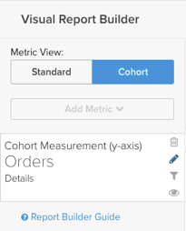
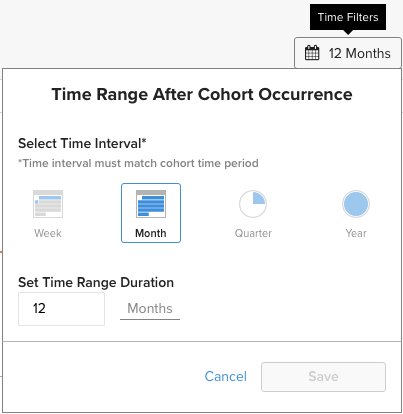
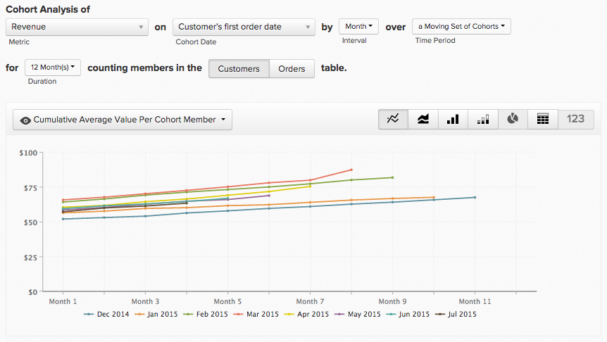
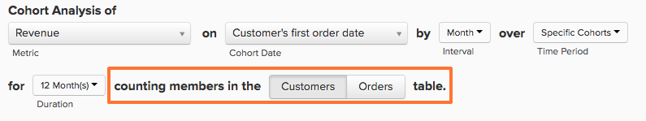
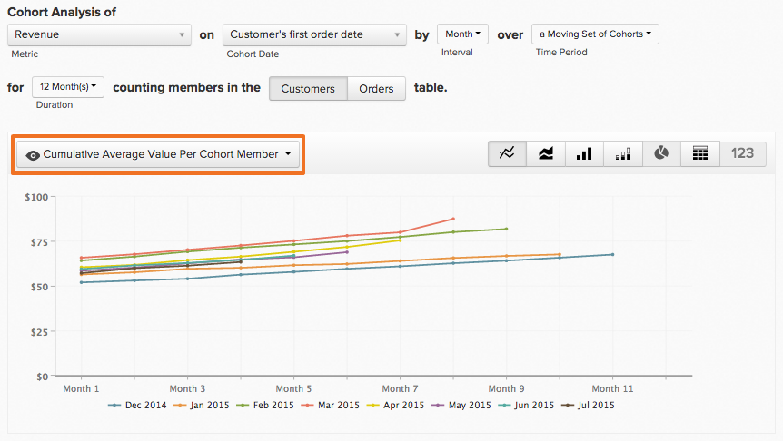
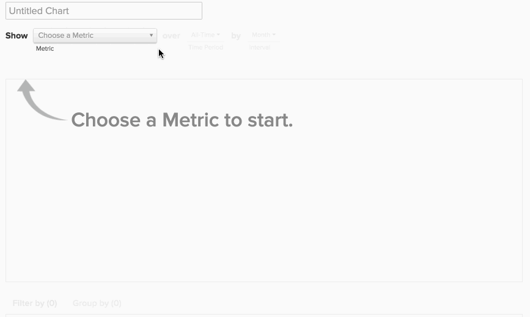

# コホートReport Builder

ユーザーのさまざまなサブセットが時間とともにどのように動作するかを調べたいと思ったことがありますか？ 例えば、プロモ – ション期間中に登録したオーディエンスの平均生涯売上が、そうでないオーディエンスよりも高くなったとします。 回答が`Yes`の場合、`Cohort Report Builder`は最適なツールです。 [!DNL Adobe Commerce Intelligence]は、この分析を実行し、ビジネスに関連するように最適化されています。

## コホート分析とは？ {#what}

`Cohort`分析は、ライフサイクルにわたって類似した特性を共有するユーザーグループの分析として広く定義できます。 これにより、さまざまなユーザーグループをまたいで行動トレンドを特定できます。

[!DNL Commerce Intelligence] ダッシュボードでは、アカウントの`cohorts`日付と指標に基づいてユーザー`cohort`を簡単に作成できます。

## コホート分析が重要である理由？ {#important}

前述したように、`cohort`分析を使用すると、異なるユーザーグループ間の行動傾向を特定できます。 特定のグループがどのような行動をとっているかをしっかりと把握することで、意思決定や支出を調整し、売上を最大化することができます。 たとえば、生涯売上`cohort`分析を考えてみましょう。この種の分析は多くの理由で有益ですが、即時的な分析の方が顧客獲得に関する意思決定が優れています。

## 独自の`cohort`分析を作成するにはどうすればよいですか？

### 新しいアーキテクチャ

`Cohort Report Builder`新しいアーキテクチャ [で](../../administrator/account-management/new-architecture.md)を使用する手順は次のとおりです。

1. 左側のタブの&#x200B;**[!UICONTROL Report Builder]**&#x200B;または任意のダッシュボードの&#x200B;**[!UICONTROL Add Report** > **Create Report]**&#x200B;をクリックします。

1. `Report Builder`選択画面で、**[!UICONTROL Create Report]** オプションの横にある`Visual Report Builder`をクリックします。

**指標の追加**

`Report Builder`に参加したので、分析を実行する指標を追加します（例：`Revenue`または`Orders`）。

>[!NOTE]
>
>ネイティブ [!DNL Google Analytics]指標は`Cohort Report Builder`と互換性がありません。

**指標ビューを`Cohort`**&#x200B;に切り替え

新しいウィンドウが開き、`Cohort` レポートの詳細を設定できます。

### `Cohort` レポートを作成するには、次の5つの仕様が必要です。

1. `cohorts`のグループ化方法
1. `cohort`期間
1. 表示する`cohorts`の数
1. 各`cohort`に含める必要があるデータの最小量
1. `cohort`以降の時間範囲

#### &#x200B;1. グループ化`cohorts`

`Cohorts`は、**登録日**&#x200B;または&#x200B;**最初の注文日**&#x200B;のように、タイムスタンプでグループ化されます。

>[!NOTE]
>
>`cohort`日付に対して指標が構築されているのと同じタイムスタンプを使用することはできません。 これを必要とする分析では、代わりに`Standard report builder`を使用できます。

#### &#x200B;2. `Cohort`期間

`cohorts`をグループ化する期間を選択してください。 言い換えれば、上記で選択したタイムスタンプのどの部分が最も重要なのでしょうか（`week`、`month`、`quarter`、または`year`）。 レポートには、ここで選択した間隔でデータが表示されます

#### 3と4です。 表示する`cohorts`の数と、各`cohort`に必要なデータの量を設定します

これらのパラメーターは、興味のある`cohorts`のみを表示するのに役立ちます。ウィンドウの下部にある便利な`Preview` ボックスには、レポートに表示されるコホートが正確に表示されます。

デフォルトでは、各`cohort`に必要なデータの最小量を`cohort`に変更しない限り、現在の`0`は含まれません。 この場合、現在の期間の`cohort`には部分的なデータのみが含まれます。

#### &#x200B;5. `Cohort`以降の時間範囲

この機能を使用すると、選択した`cohorts`に対して表示するデータの時間範囲を設定できます。 例えば、`cohorts`に基づいて24か月の`customer's first order date`を表示する場合、各`cohort`のデータの最初の3か月にのみ関心がある場合、`number of cohorts to view`を`24`に、および`time range after cohort occurrence`を`3`に設定できます。

この値の間隔は`cohort time period`で選択した値と同じように変更され、デフォルトでは値は`12`に設定されます。カレンダーアイコンをクリックして編集しない限り、値は変更されません。

日付オプションを表示する

#### その他のメモ

* [!UICONTROL Filters]: `Standard`と`Cohort`のビューを切り替えても、指標に適用された状態は維持されます。

* [`Perspectives`](#perspectives)を参照してください。

#### 例

次に、それらをすべてまとめる例を示します。 この例では、`cohort`の初回購入後の注文行動を確認して、そのコホートが今後6か月以内にリピート購入に戻るかどうかを確認します。

### レガシーアーキテクチャ

#### レガシーアーキテクチャ {#personalinfo}

以下は、`Cohort Report Builder`のレガシーバージョンに固有の手順です。 新しいバージョンを使用する場合は、[新しいアーキテクチャアカウントへの移行について詳しくは、](../../administrator/account-management/new-architecture.md)新しいアーキテクチャ [!DNL Commerce Intelligence]を参照してください。

#### 独自の`cohort`分析を作成するにはどうすればよいですか？ {#create}

`Cohort`分析を実行しています！ ここでは、売上が時間の経過とともに累積およびユーザーごとに増加していることを確認できます。

このセクションでは、独自の`cohort`分析の作成について説明します。 例（およびプロセスを示すアニメーション GIF）については、このトピックの[例セクション &#x200B;](#examples)を参照してください。

1. 左側のタブの&#x200B;**[!UICONTROL Report Builder]**&#x200B;または任意のダッシュボードの&#x200B;**[!UICONTROL Add Report** > **Create Report]**&#x200B;をクリックします。

1. `Report Builder Selection`画面で、**[!UICONTROL Create Report]** オプションの横にある`Cohort Analysis`をクリックします。

#### 指標の追加

`Cohort Report Builder`に入ったら、分析を実行する指標（例：`Revenue`または`Number of orders`）を追加します。

>[!NOTE]
>
>ネイティブ [!DNL Google Analytics]指標は`Cohort Report Builder`と互換性がありません。

#### コホート日の選択 {#date}

次の手順では、`cohort date`を指定します。 これは、ユーザーをグループ化する日付です。 例えば、`User's first order date`または`User's registration date`とします。

>[!NOTE]
>
>指標が構築されている日付（例：`created at`）を`cohort date`と同じ日付として使用することはできません。

#### 期間と期間の設定

次に、`Interval`と`Time Period`を設定します。

`Interval`
`Interval` オプションを使用すると、`length`の`cohorts`を設定できます。 例えば、これが`Month`に設定されている場合、レポートは月単位で測定されます。

これらの間隔のx軸での表示方法は、**期間** メニューを使用して変更できます。

`Time Period`
`Time Period` メニューを使用して、分析する特定のユーザー`cohorts`を選択します。 `cohort`ごとに表示したり、リストから選択したり、時間範囲を指定したり、`cohorts`のローリング時間範囲を定義して含めることができます。 例えば、`Specific Cohorts` オプションを使用した場合、分析に含める特定の月を選択できます。

を追加

登録日ごとに`cohorts`をグループ化し、`Specific Cohorts` リストで4月、5月、6月を選択した場合、その月に登録したすべてのユーザーが含まれます。

#### X軸の定義

`duration`では、グラフのX軸設定を定義できます。 すなわち、各データポイントがどれだけの期間を表し、分析に含めるデータポイントがどれだけあるかということです。

#### `counting members` テーブルを選択しています

別のテーブルから結合された`cohort date`によってユーザーをグループ化することを選択した場合、`counting members in the … table` オプションが表示される場合があります。

この設定を理解する例を見てください。 `Revenue`指標を`Customer's registration date`でコホートするレポートを作成したとします。 また、視点`Average value per cohort member`を使用して、購入者あたりの売上高を経時的に確認する必要もあります。 購入者一人あたりの平均価値を見つけるには、分割する購入者の数を決める必要があります。 `customers` テーブルの登録済み顧客の数か、または同じ期間の`orders table`の個別の購入者の数か？

この設定はその質問に答えます。 `customers` テーブルのメンバーの数には、すべての顧客（購入した場合でも購入した場合でも）が平均で含まれます。 `orders` テーブルのメンバー数には、購入した顧客のみが含まれます。

#### 遠近法の選択 {#perspective}

指標とその分析方法を定義したら、使用する`perspective`を選択できます。

レポートのビジュアライゼーションのすぐ上に、`perspective`設定のドロップダウンがあります。

[視点](#perspectives)を参照してください。

異なる表示オプションを表示する

## コホート分析の例 {#examples}

`cohort`分析の作成方法を理解したところで、いくつかの例を見てみましょう。

### ユーザー`cohorts`が時間の経過とともにどのように増加しているのかを知りたい。

この例では、`Revenue`指標を分析し、`customer's first order date`でコホートをグループ化し、分析に含める8つの最新の`cohorts` （`Time Period` メニューで定義）を選択しました。 コホートが時間の経過とともにどのように成長するかを確認するには、`Cumulative Average Value per Cohort Member` `perspective`を使用しました。

### ユーザーが生涯のさまざまな時点で行う注文の数を平均で把握する必要があります。

 （../../assets/cohort2.gif

この例では、`Number of orders`指標を分析し、`customer's first order date`でコホートをグループ化し、分析に8つの最新のコホート（`Time Period` メニューで定義）を含めました。 各コホートの平均注文数を表示するには、`perspective`を`Average Value per Cohort Member`に変更しました。

### ユーザーの今後の購買活動と、最初の月のビジネス活動との比較を理解したい。

## `Perspectives` {#perspectives}

`Standard`
これは、ライフサイクルの任意の時点における、特定のコホートグループの増分貢献度を示しています。 （例：「6週目」のポイントは、ユーザーが6週目に行ったすべてのデータポイントを表示します）。

`Average Value per Cohort Member`
これにより、（1）の`Standard cohort`分析が、各`cohort` グループのユーザー数で割られます。 すべてのコホートグループに同じユーザー数が含まれるわけではないため、コホートのパフォーマンスをリンゴ間で比較する場合に便利です。 例えば、特定の`cohort`からのユーザーあたりの平均売上は6週目です。

`Cumulative`
この`perspective`は、従来の`cohort`分析を`cumulative` ベースで表示しています。 つまり、ライフサイクルの任意の時点における、あるコホートのこれまでの貢献度の合計を示します。 たとえば、特定のコホートの利用者が6週間経過した後の累積売上などです。

`Cumulative Average Value per Cohort Member`
これにより、（3）の`Cumulative`分析が、各`cohort` グループのユーザー数で割られます。 これは、`cohort` ライフの各期間における`cohort's` メンバーあたりの平均生涯貢献度（多くの場合、平均生涯売上）を示します。 例えば、6月に参加したユーザーの6か月後の平均生涯売上を求めます。

`Percent of First Value (show first value)`
これは、`cohort` ライフサイクルの特定の時点における集計`cohort's`の貢献度を、最初の期間における貢献度の割合として分析します。 例えば、6か月の収益を、6月に参加したユーザーの1か月の収益で割った場合です。

`Percent of First Value (hide first value)`
これは上記の`perspective`と同じですが、最初の期間の値である100%が非表示になっていることを除きます。

## まとめ {#finish}

`Cohort Report Builder`は、共通の`cohort date`によってユーザーをグループ化するように最適化されています。 類似のアクティビティや属性によってユーザーをグループ化することもできます。 Adobeでは、[定性コホートに関するこのチュートリアル &#x200B;](../dev-reports/create-qual-cohort-analysis.md)を参照して開始することをお勧めします。
