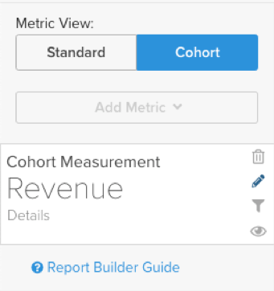
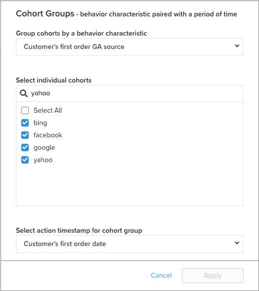
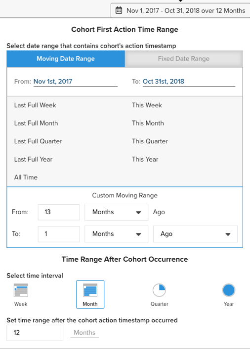

# 日付ベース以外のコホートの[!DNL Cohort Report Builder]

[`Cohort Report Builder`](../dev-reports/cohort-rpt-bldr.md)は、時間の経過に伴い、異なるユーザーのサブセットがどのように動作するかをマーチャントが調べるのに役立ちます。 以前は、`Cohort Report Builder`は、共通`cohort date`でユーザーをグループ化するように最適化されていました（例えば、特定の月に最初の購入を行ったすべての顧客のセット）。 `Non-Date Based Cohort`機能で、類似のアクティビティまたは属性でユーザーをグループ化できるようになりました。 この機能のユースケースをいくつか見てみましょう。

## ユースケース

これは包括的なリストではありませんが、この機能で達成できる潜在的な分析をいくつか紹介します。

* [!DNL Google]から取得した顧客の収益と[!DNL Facebook]の比較を調べています
* 最初に購入した顧客が米国とカナダの比較
* 様々な広告施策から獲得した顧客の行動の調査

## 分析の作成方法

1. 左側のタブの&#x200B;**[!UICONTROL Report Builder]**&#x200B;または任意のダッシュボードの&#x200B;**[!UICONTROL Add Report** > **Create Report]**&#x200B;をクリックします。

1. `Report Builder Selection`画面で、**[!UICONTROL Create Report]** オプションの横にある`Visual Report Builder`をクリックします。

### 指標の追加

`Report Builder`に参加したので、分析を実行する指標を追加します（例：`Revenue`または`Orders`）。

>[!NOTE]
>
>ネイティブ [!DNL Google Analytics]指標は`Cohort Report Builder`と互換性がありません。 この例の目標は、異なる[!DNL Google Analytics]のソースを通じて取得されたファースト オーダー顧客の売上を経時的に調べることです。

### `Metric View`を`Cohort`に切り替え

新しいウィンドウが開き、コホートレポートの詳細を設定できます。

コホートレポートを作成するには、次の5つの仕様が必要です。

1. コホートのグループ化方法
1. コホートの選択
1. アクションタイムスタンプ
1. コホートのファーストアクション時間範囲
1. コホート発生後の時間範囲

<!--{: width="200" height="224"}-->

#### &#x200B;1. グループ化`cohorts`

`Cohorts`は、この例`Customer's first order GA source`では、行動特性でグループ化されています。 ここで使用できるオプションは、指標の`groupable`として既に指定されている列です。

#### &#x200B;2. コホートの選択

与えられた特性のすべての結果を表示できます。 この結果、多数の`cohorts`が発生する可能性があるため、必要な特定の`cohorts` （`Customer's first order GA source`で使用できるさまざまな値に対応）を選択できます。

<!--{: width="300" height="338"}-->

#### 3. `Action timestamp`

これにより、指標が作成される列以外の日付ベースの列を選択できます。 以下では、特定の`action timestamp`に適用される時間範囲を選択する方法を見ていきます。

#### 4. `Cohort first action time range`

ここでは、`cohorts action timestamp`を含む日付範囲を選択します（2017年11月から2018年10月の間に最初の注文を行ったお客様）。 移動日付範囲または固定日付範囲を指定できます。

#### 5. `Time range after cohort occurrence`

月、週、または年ごとに`cohorts`を表示しますか？ この画面で選択内容を確認します。 このセクションの下で、`time range`が発生した後に`cohort action timestamp`を選択します。 たとえば、アクションの期間に最初の注文をおこなった顧客について、12か月間のデータを表示します。

<!--{: width="400" height="557"}-->

>[!NOTE]
>
>[!UICONTROL Filters]と`Standard`のビューを切り替えても、指標に適用された`Cohort`は変更されません。

### 関連

[`Perspectives`](../../data-analyst/dev-reports/cohort-rpt-bldr.md)を参照してください。
