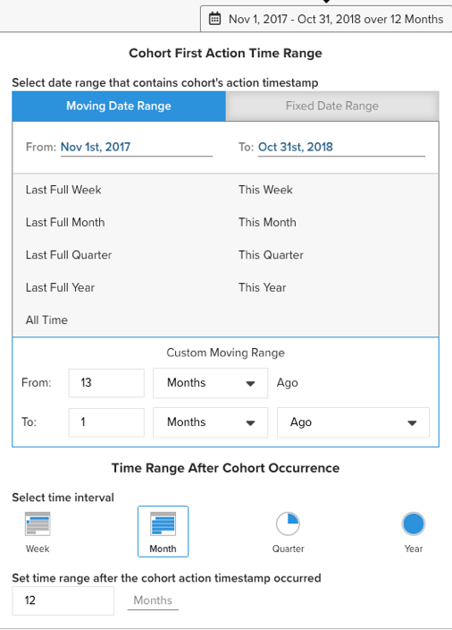

# [!DNL Cohort Report Builder] 日付ベース以外のコホートの場合

この [`Cohort Report Builder`](../dev-reports/cohort-rpt-bldr.md) は、マーチャントが時間の経過と共にユーザーの様々なサブセットの動作を研究するのを支援するのに最適です。 過去、 `Cohort Report Builder` は、共通のでユーザーをグループ化するために最適化されました `cohort date` （例えば、特定の月に最初の購入を行ったすべての顧客のセットなど）。 この `Non-Date Based Cohort` の機能で、類似のアクティビティまたは属性でユーザーをグループ化できるようになりました。 この機能の使用例をいくつか見てみましょう。

## ユースケース

これは包括的なリストではありませんが、この機能を使用して実行できる潜在的な分析をいくつか示します。

* から獲得した顧客の売上高の調査 [!DNL Google] 対 [!DNL Facebook]
* 米国とカナダで初回購入を行った顧客の分析
* 様々な広告キャンペーンで獲得した顧客の行動を見る

## 分析の作成方法

1. クリック **[!UICONTROL Report Builder]** 左側のタブまたは **[!UICONTROL Add Report** > **Create Report]** を任意のダッシュボードに表示します。

1. が含まれる `Report Builder Selection` 画面、クリック **[!UICONTROL Create Report]** 「」の横 `Visual Report Builder` オプション。

### 指標の追加

現在は、 `Report Builder`に基づいて、分析を実行する指標を追加します（例： `Revenue` または `Orders`）に設定します。

>[!NOTE]
>
>ネイティブ [!DNL Google Analytics] 指標は、と互換性がありません `Cohort Report Builder`. この例の目標は、異なるを通じて取得された初回顧客の売上高の推移を確認することです [!DNL Google Analytics] ソース。

### 切り替え `Metric View` 対象： `Cohort`

これにより新しいウィンドウが開き、コホートレポートの詳細を設定できます。

コホートレポートを作成するには、次の 5 つの仕様が必要です。

1. コホートのグループ化方法
1. コホートの選択
1. アクションタイムスタンプ
1. コホートの初回アクションの時間範囲
1. コホート発生後の時間範囲

<!--{: width="200" height="224"}-->

#### 1. グループ化 `cohorts`

`Cohorts` 次の例では、動作特性でグループ化されています `Customer's first order GA source`. ここで使用できるオプションは、既に次のように指定されている列です `groupable` を指標として使用します。

#### 2. コホートの選択

指定した特性のすべての結果を表示できます。 これは多くの結果を引き起こす可能性があるため `cohorts`具体的なを選択できます `cohorts` （これは、で使用可能な様々な値に対応します。 `Customer's first order GA source`）が必要です。

<!--{: width="300" height="338"}-->

#### 3. `Action timestamp`

これにより、指標を作成した列以外の日付ベースの列を選択できます。 以下では、特定のに適用される時間範囲の選択について説明します `action timestamp`.

#### 4. `Cohort first action time range`

以下は、を含む日付範囲の選択場所です。 `cohorts action timestamp` （2017 年 11 月から 2018 年 10 月まで初回注文があったお客様）。 これは、移動日付範囲または固定日付範囲にすることができます。

#### 5. `Time range after cohort occurrence`

を表示しますか？ `cohorts` 時間の経過と共に、月、週、または年別に表示しますか？ ここで、選択を行います。 そのセクションの下で、 `time range` 後 `cohort action timestamp` が発生しました。 例えば、アクションの時間範囲内に最初の注文を行った顧客の 12 か月のデータが表示されます。

<!--{: width="400" height="557"}-->

>[!NOTE]
>
>[!UICONTROL Filters] 以下を切り替えても、指標に適用されるデータは変わりません `Standard` および `Cohort` ビュー。

### 関連

参照： [`Perspectives`](../../data-analyst/dev-reports/cohort-rpt-bldr.md).
