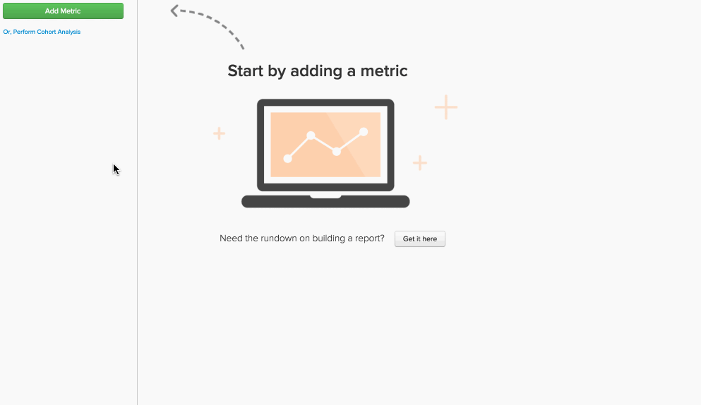
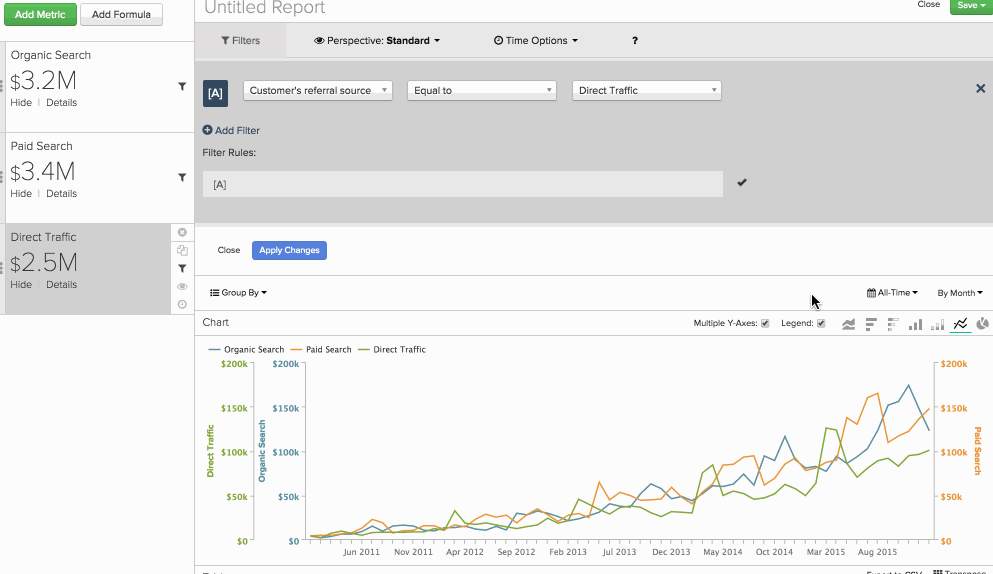

# `Qualitative Cohort Analysis` の作成

オーガニック検索で獲得した顧客と比較して、[!DNL Google Adwords] 獲得した顧客セグメントが LTV をどのように成長させるかをご存知ですか？ 同じレポートの中で、様々な顧客セグメントに関する `cohort` しい分析を並べて実行しようと考えたことはありますか？ その場合は、`qualitative cohort analysis` を参照すると、それらの質問に答えるのに役立ちます。

このトピックでは、定性的コホートの概要、この分析の構築に興味を持つ理由、[!DNL Commerce Intelligence] での作成方法について説明します。

## `qualitative cohorts` は何だ？ {#whatare}

一般的な分析 `Cohort`、ライフサイクルを通じて類似した特性を共有するユーザーグループの分析として広く定義できます。 これにより、様々なユーザーグループにわたる行動のトレンドを特定できます。

[ コホート分析 ](https://www.cohortanalysis.com/) を参照してください。

ほとんどの `cohort` は、[!DNL Commerce Intelligence] のグループのユーザーを、共通の日付（例えば、特定の月に最初の購入を行ったすべての顧客のセット）別にまとめて分析します。 `qualitative cohort` は少し異なります。時間ベースではない特性によって定義されるユーザーグループです。 例を次に示します。

* 広告キャンペーンから取得したすべてのユーザーのセット
* 最初の購入にクーポンが含まれている（または含まれていない）すべてのユーザーのセット
* 特定の年齢のすべてのユーザーのセット

## 通常の `cohort` ビルダーとの違いは何ですか？ {#different}

[`Cohort Analysis Builder`](../dev-reports/cohort-rpt-bldr.md) は、時間ベースの特性を使用してコホートをグループ化するために最適化されます。 これは、特定のユーザーのセグメント（有料検索キャンペーンで取得したすべてのユーザーなど）に焦点を当てた分析に最適です。 `Cohort Analysis Builder` では、（1）その特定のユーザーグループにフォーカスし、（2）日付（最初の注文日など）にフ `cohort` ーカスすることができます。

ただし、同じコホートレポートで複数のユーザーセグメントのコホート動作を分析する場合（`paid` search vs `organic` search vs direct traffic、おそらくですが）、`Report Builder` で作成できるより高度な分析です。

## 分析を設定するには、どのような情報をサポートに送信するとよいですか？ {#support}

`qualitative cohort` で `Report Builder` レポートを作成するには、Adobe アナリストチームが、必要なテーブルに [ 高度な計算列 ](../data-warehouse-mgr/creating-calculated-columns.md) を作成する必要があります。

これを作成するには、[ サポートチケット ](https://experienceleague.adobe.com/docs/commerce-knowledge-base/kb/troubleshooting/miscellaneous/mbi-service-policies.html) を送信します（この記事も参照してください）。 必要な知識を次に示します。

* コホート分析を実行する `metric` と、コホート分析で使用するテーブル （例：`Revenue` テーブルに基づいて作成された `orders`）。

* 定義する `user segments` と、その情報がデータベース内のどこに存在するか（例：`User's referral source` の様々な値は、`users` テーブルにネイティブで、`orders` に再配置されます）。

* 分析で使用する `cohort date` （例：`User's first order date` タイムスタンプ）。 この例では、各セグメントを確認して問い合わせること `How does a user's revenue grow in the months following their first order date?` できます。

* 分析を表示する `time interval` （例：`weeks` の後の `months`、`quarters` または `User's first order date`）。

Adobe アナリストチームが上記の手順に従ったら、新しい高度な計算列をいくつか用意して、レポートを作成できます。 次に、以下の手順に従ってこれを行うことができます。

## 定性コホート分析の作成 {#create}

まず、分析する指標ごとに 1 回、コホートする指標を追加し `cohort` す。 この例では、顧客の最初の注文後の数か月に行われた累積 `Revenue` を、`User's referral source` でセグメント化して表示します。 つまり、セグメントごとに 1 つの `Revenue` 指標を追加し、特定のセグメントに対してフィルターを適用します。

次に、レポートの時間オプションを 2 回変更する必要があります。

1. `time interval` を `None` に設定します。 これは、通常の時間オプションを使用する代わりに、最終的にディメンションとして時間間隔でグループ化するためです。

1. レポートの対象とする時間枠に `time range` を設定します。

この例では、`all time` の `Revenue` しいビューを見ます。 この後、一連のドットで終わります。

3 番目に、`cohorts` を設定するように調整します。 Adobe アナリストチームに指定した `cohort date` と `time interval` に基づいて、`cohort` 付け日を実行するディメンションがアカウントに存在します。 この例では、そのカスタムディメンションは `Months between this order and customer's first order date` と呼ばれます。 このディメンションを使用すると、次のことができます。

* `Group by` オプションを使用してディメンションを `group by` きます

* 目的の `dimension` のすべての値を選択します

* `Show top/bottom option` で、目的の上位 X か月を選択し、`Months between this order and customer's first order date` ディメンションで並べ替えます

これで、指定した `cohort` ごとに 1 行ずつ表示できます。 この例を今すぐ確認してください。各リファラルソースのユーザーが投稿した `Revenue` ール `grouped by`、最初の注文から後続の注文までの月数が表示されます。 この例では、`Cumulative perspective` の集計の増加を確認する `cohorts'` ールも追加しました。詳細については、結果テーブルを参照してください。

これは何を意味しますか？ ここで、特定のリファラルソース `Paid search` は、顧客の購入有効期間の最初の 1 か月では価値がありますが、リピート売上高で顧客ベースを保持することはできません。 `Direct Traffic` の収益は当初は少ない額で積み上げられますが、それ以降の数か月の収益は実際には同じようなペースで積み上げられます。

どんな方法で分析しても、分析は分析ツールボックス `cohort` 強力なツールになります。 このタイプの分析は、従来の `time-based cohorts` では得られないビジネスに関する興味深いインサイトを得ることができ、より良いデータ駆動型の意思決定を行うことができます。
