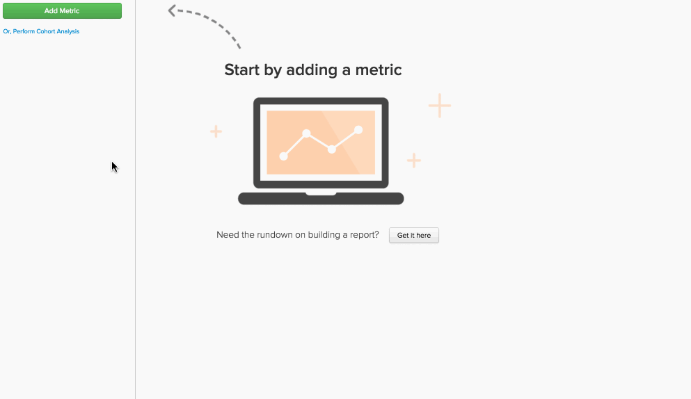
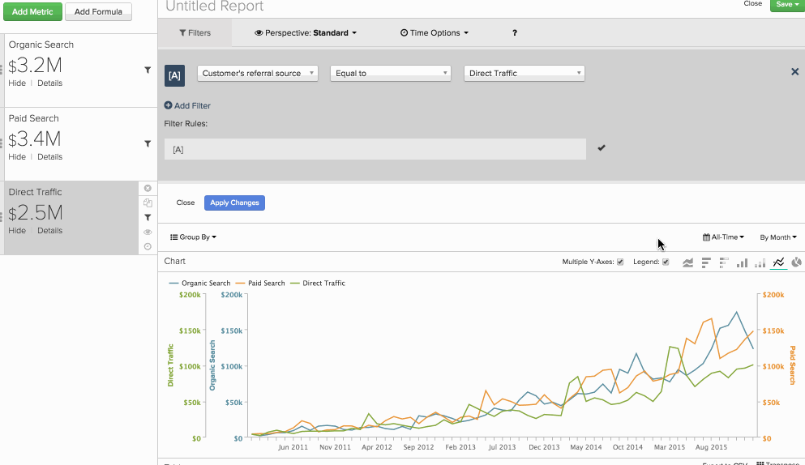

# `Qualitative Cohort Analysis`を作成

[!DNL Google Adwords]で獲得した顧客セグメントが、オーガニック検索で獲得した顧客セグメントと比較して、LTVをどのように成長させているかご存知ですか？ 同じレポートで、異なる顧客セグメントに対して`cohort`分析を並べて実行することを考えたことがありますか？ その場合は、`qualitative cohort analysis`を使用して質問に答えることができます。

このトピックでは、定性コホートとは何か、なぜこの分析の構築に興味を持つのか、そして[!DNL Commerce Intelligence]で作成する方法について詳しく説明します。

## `qualitative cohorts`とは？ {#whatare}

一般に`Cohort`分析は、ライフサイクルにわたって類似した特性を共有するユーザーグループの分析として広く定義できます。 これにより、さまざまなユーザーグループをまたいで行動トレンドを特定できます。

`cohort`のほとんどの[!DNL Commerce Intelligence]分析では、共通の日付でユーザーをグループ化しています（例えば、特定の月に最初の購入を行ったすべての顧客のセット）。 `qualitative cohort`は少し異なります。時間ベースではない特性によって定義されるユーザーグループです。 次に例を示します。

* 広告キャンペーンから取得されたすべてのユーザーのセット
* 最初の購入にクーポンが含まれているか、含まれていないユーザーのセット
* 特定の年齢に属するすべてのユーザーのセット

## これは通常の`cohort` ビルダーとどのように異なりますか？ {#different}

[`Cohort Analysis Builder`](../dev-reports/cohort-rpt-bldr.md)は、時間ベースの特性を使用してコホートをグループ化するために最適化されています。 これは、特定のユーザーセグメント（有料検索キャンペーンを通じて獲得したすべてのユーザーなど）に焦点を当てた分析に最適です。 `Cohort Analysis Builder`では、（1）特定のユーザーグループに焦点を当て、（2） `cohort`を日付（最初の注文日など）に設定できます。

ただし、同じコホートレポートで複数のユーザーセグメントのコホート動作を分析する場合（`paid`検索と`organic`検索と直接トラフィックの比較）は、この高度な分析を`Report Builder`で構築できます。

## 分析の設定のサポートにはどのような情報を送信すればよいですか？ {#support}

`qualitative cohort`で`Report Builder` レポートを作成するには、Adobe アナリスト チームが必要なテーブルに[高度な計算列](../data-warehouse-mgr/creating-calculated-columns.md)を作成します。

これらを作成するには、[ サポートチケット ](https://experienceleague.adobe.com/docs/commerce-knowledge-base/kb/troubleshooting/miscellaneous/mbi-service-policies.html)を提出してください（この記事を参照してください）。 次の点に留意してください。

* コホート分析を実行する`metric`とその使用するテーブル （例：`Revenue`、`orders` テーブル上に構築）。

* 定義する`user segments`とその情報がデータベース内のどこに存在するか（例：`User's referral source`の異なる値、`users` テーブルにネイティブで、`orders`に再配置）。

* 分析で使用する`cohort date` （例：`User's first order date` タイムスタンプ）。 この例では、各セグメントを見て`How does a user's revenue grow in the months following their first order date?`に質問することができます。

* 分析を表示する`time interval` （例：`weeks`、`months`、または`quarters`、`User's first order date`の後）。

Adobeのアナリストチームが上記の質問に回答したら、レポートを作成するための新しい高度な計算列がいくつかあります。 次に、以下の手順に従ってこれを行うことができます。

## 定性コホート分析の構築 {#create}

まず、分析する各`cohort`に対して、コホートに関心のある指標を追加します。 この例では、顧客の最初の注文から数か月後に行われた累積`Revenue`を`User's referral source`でセグメント化して表示します。 つまり、セグメントごとに1つの`Revenue`指標を追加し、特定のセグメントに対してフィルターを実行します。

次に、レポートの時間オプションを2つ変更する必要があります。

1. `time interval`を`None`に設定します。 これは、通常の時間オプションを使用する代わりに、時間間隔でディメンションとして最終的にグループ化するからです。

1. レポートでカバーする時間のウィンドウに`time range`を設定します。

この例では、`all time`の`Revenue` ビューを見ています。 この後、一連のドットで終わる必要があります。

第三に、`cohorts`を設定するように調整します。 Adobe アナリスト チームに指定した`cohort date`および`time interval`に基づいて、`cohort`の日付を実行するディメンションがアカウントに含まれています。 この例では、そのカスタムディメンションは`Months between this order and customer's first order date`と呼ばれます。 このディメンションを使用すると、次のことが可能になります。

* `Group by` オプションを含むディメンション `group by`

* 対象となる`dimension`のすべての値を選択してください

* `Show top/bottom option`で、興味のある上位Xか月を選択し、`Months between this order and customer's first order date` ディメンションで並べ替えます

これで、指定した`cohort`ごとに1行ずつ表示できるようになります。 今すぐ例をご覧ください。各紹介ソースのユーザーが投稿した`Revenue`、最初の注文から後続の注文までの月数`grouped by`が表示されます。 この例では、`Cumulative perspective`を追加して`cohorts'`集計の増加を確認しました。詳細については、結果テーブルを参照してください。

具体的には？ ここでは、特定の紹介ソース `Paid search`は、顧客の購入期間の最初の月には価値がありますが、リピート収益で顧客基盤を維持できません。 `Direct Traffic`は低い金額で始まりますが、その後の数か月の売上は、実際には同じようなペースで増加します。

`cohort`分析は、分析ツールボックスの強力なツールです。 この種類の分析を行うと、従来の`time-based cohorts`では得られないビジネスに関する興味深いインサイトが得られ、データ主導の意思決定をより適切におこなえるようになります。
