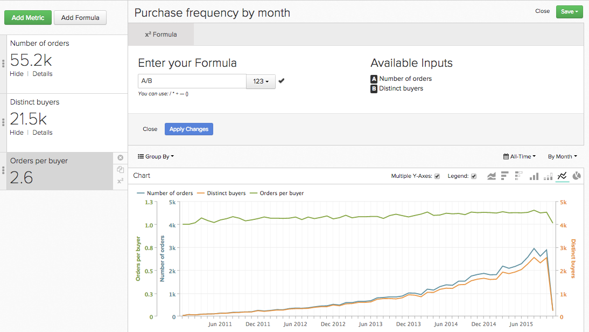

# `Report Builder` の数式

[`Report Builder`](../../tutorials/using-visual-report-builder.md) では、アカウントで [ 定義済み指標 ](../../data-user/reports/ess-manage-data-metrics.md) を使用して強力なビジュアライゼーションを作成できます。 これらの指標を式で組み合わせることで、データから追加のインサイトを得ることができます。 このトピックでは、`Report Builder` で数式を使用する方法を詳しく説明します。ここでは、ジャンプしましょう。

## `formula` とは{#what}

`Report Builder` では、`formula` は、何らかの数学的ロジックに基づいて 1 つ以上の指標を組み合わせたものです。 典型的な例を次に示します。

この例では、`Number of orders metric (A)` と `Distinct buyers metric (B)` を使用します。購入者が月に作成した注文の平均数はどれくらいですか？という質問に答えることを目標にします。 式のパラメーターは次のとおりです。

* `Definition`：ここでは、入力指標に数学を適用します。 この例では、注文数を個別の購入者の数で割ると、注文数の平均がわかります。 したがって、の定義は（A/B）になります。

* `Format`：数式は数値、期間、または通貨金額を返しますか？ 数式の定義の横にはドロップダウンがあり、これを使用して戻り値の形式を指定できます。 この場合、数値です。

* `Miscellaneous`：数式のタイムスタンプ、グループ化、パースペクティブ、フィルターはすべて、入力指標に継承されます。 何もすることがない！

## レポートで `formulas` を使用するにはどうすればよいですか？ {#how}

基本について説明したので、いくつかの例を見てみましょう。

### 例：初回注文に起因する売上高の割合を確認したい。

この例では、`Revenue` と `Revenue (first time orders)` の指標を使用しました。 `Revenue (first time orders)(B)` 指標を `Revenue metric (A)` で割り、戻り値の形式を `Percent` に設定すると、初回注文に起因する可能性がある売上高の割合を見つけることができます。

### 例：注文あたりの平均売上高を知りたいのですが、`promo code` をオファーする場合とオファーしない場合。

この例では、`Revenue` と `Number of orders` の指標を使用しました。 この質問に対する答えは、`Revenue (A)` を `Number of orders (B)` で割り、戻り値の形式を `Currency` に設定するという 2 つの手順で構成されます。 次に、数式の結果（`Avg. Revenue per order`）のみを表示し、結果を `Promo code` でグループ化しました。

### 例：新規顧客の UTM ソースの配布を知りたいとします。

この質問に対する答えを見つけるには、次の手順が必要です。

1. 最初に `New Customers` の指標を追加し、次に `utm_source - all` でグループ化しました。 これは、指標 `A` または `New Customers (grouped)` です。

1. 次に、`New Customers (grouped)` 指標を複製し、独立したディメンションを使用するように設定しました。 指標 `B` - `New customers (ungrouped)` – 新規顧客の合計数を示します。

1. 両方の指標を非表示にした後、数式の定義を `A/B` に設定します。 これにより、`New customers (grouped)` が `New Customers (ungrouped)` で除算されます。

1. 次に、結果の形式を `Percent` に設定します。

この例では、`Stacked Columns` パースペクティブを使用して結果を月ごとに表示しました。 これにより、新規顧客の配分を月単位で比較できます。

## まとめ {#wrapup}

上記の例で、数式の `timestamp`、`groupings`、`perspectives`、`filters` が入力指標から継承されていることに気がつきましたか？ 指標と同様に、数式を使用して `perspectives` および [ 独立した時間オプション ](../../tutorials/time-options-visual-rpt-bldr.md){:target=&quot;_blank&quot;} を使用できることに注意してください。

`Report Builder` での数式の使用に関するその他の質問については、[ サポートにお問い合わせください ](https://experienceleague.adobe.com/docs/commerce-knowledge-base/kb/troubleshooting/miscellaneous/mbi-service-policies.html?lang=ja)。
