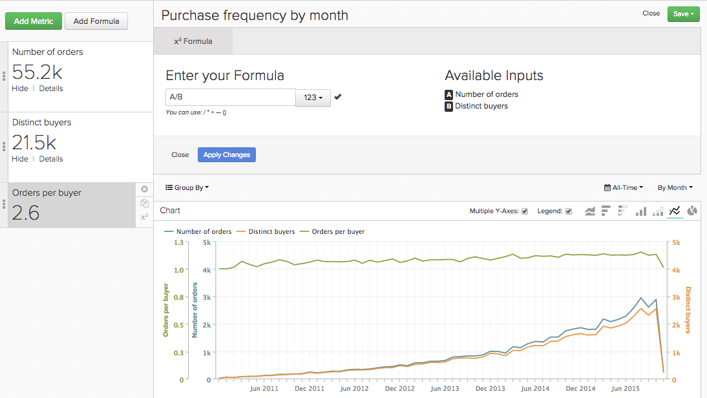
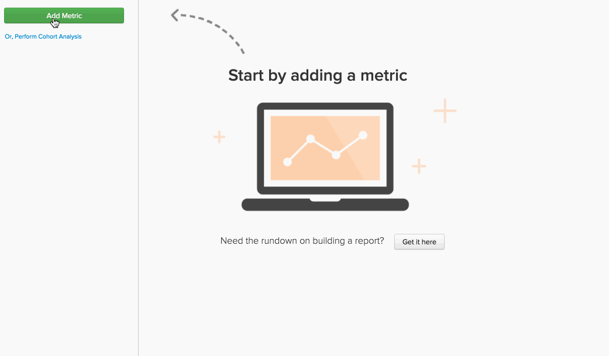
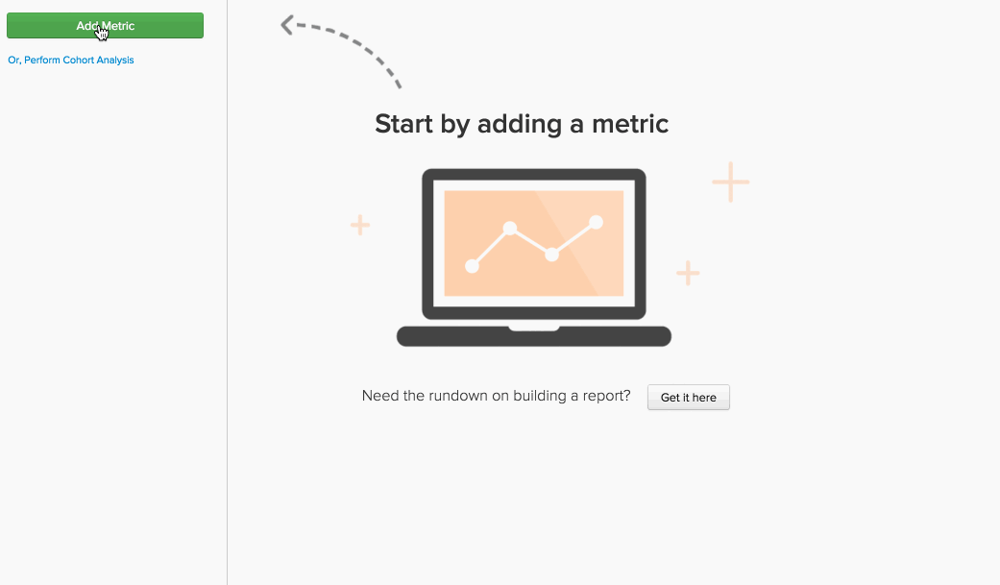
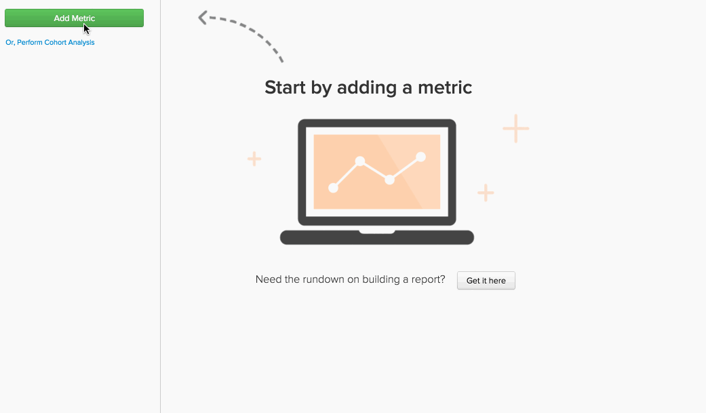

# `Report Builder`の数式

[`Report Builder`](../../tutorials/using-visual-report-builder.md)では、アカウントで[定義された指標](../../data-user/reports/ess-manage-data-metrics.md)を使用して、強力なビジュアライゼーションを作成できます。 これらの指標を数式でつなぎ合わせることで、データからさらにインサイトを得ることができます。 このトピックでは、`Report Builder`で数式を使用する方法について詳しく説明します。すぐに始めることができます。

## `formula`とは {#what}

`Report Builder`では、`formula`は数学的論理に基づく1つ以上の指標の組み合わせに過ぎません。 典型的な例は次のようになります。

この例では、`Number of orders metric (A)`と`Distinct buyers metric (B)`を使用します。目標は、「購入者が毎月行っている平均注文数は？」という質問に答えることです。 式のパラメーターは次のとおりです。

* `Definition`：ここでは、入力指標に計算を適用します。 この例では、注文数を個別の購入者の数で割ると、平均注文数が表示されます。 つまり、定義は（A/B）です。

* `Format`：数式で数値、期間、または通貨金額が返されますか？ 数式の定義の横にはドロップダウンがあり、これを使用して戻り値の形式を指定できます。 この場合は、数値です。

* `Miscellaneous`：数式のタイムスタンプ、グループ化、遠近法、フィルターはすべて、入力指標によって継承されます。 ここには何もすることがありません！

## レポートで`formulas`を使用するにはどうすればよいですか？ {#how}

さて、基本について説明したので、いくつかの例を見てみましょう。

### 例：売上の何割が初回注文に起因するかを調べたい。

この例では、`Revenue`および`Revenue (first time orders)`指標を使用しました。 `Revenue (first time orders)(B)`指標を`Revenue metric (A)`で割り、返品形式を`Percent`に設定すると、初回注文に起因する売上の割合を見つけることができます。

### 例：`promo code`を提供していない場合の注文あたりの平均売上を知りたい。

この例では、`Revenue`および`Number of orders`指標を使用しました。 この質問に対する回答には、2つのステップが含まれます。`Revenue (A)`を`Number of orders (B)`で割り、戻り値の形式を`Currency`に設定します。 次に、数式結果（`Avg. Revenue per order`）のみを表示できるようにし、結果を`Promo code`でグループ化しました。

### 例：新規顧客のUTM ソースの分布を知りたい。

この質問に対する回答を見つけるには、いくつかのステップを踏む必要があります。

1. 最初に`New Customers`指標を追加し、次に`utm_source - all`でグループ化しました。 これは指標`A`または`New Customers (grouped)`です。

1. 次に、`New Customers (grouped)`指標を複製し、独立したディメンションを使用するように設定します。 指標`B` - `New customers (ungrouped)` – 新規顧客の合計数を示します。

1. 両方の指標を非表示にした後、数式定義を`A/B`に設定します。 これにより、`New customers (grouped)`が`New Customers (ungrouped)`で割られます。

1. 次に、結果の形式を`Percent`に設定します。

この例では、`Stacked Columns` パースペクティブを使用して、月ごとに結果を表示しました。 これにより、新規顧客の分布を月々ベースで比較することができます。

## まとめ {#wrapup}

上記の例で、数式の`timestamp`、`groupings`、`perspectives`、`filters`がその入力指標から継承されていることに気づきましたか？ 数式は、指標と同様に、`perspectives`および[独立した時間オプション &#x200B;](../../tutorials/time-options-visual-rpt-bldr.md){: target="_blank"}を使用するために使用できます。

`Report Builder`での数式の使用に関して追加の質問がある場合は、[&#x200B; サポートにお問い合わせください](https://experienceleague.adobe.com/docs/commerce-knowledge-base/kb/troubleshooting/miscellaneous/mbi-service-policies.html)。
