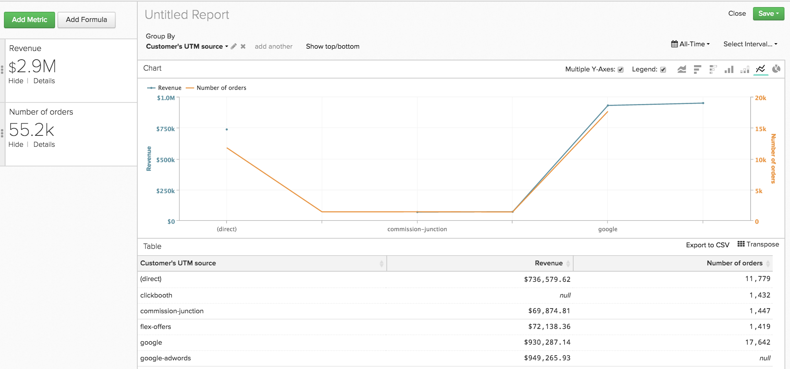
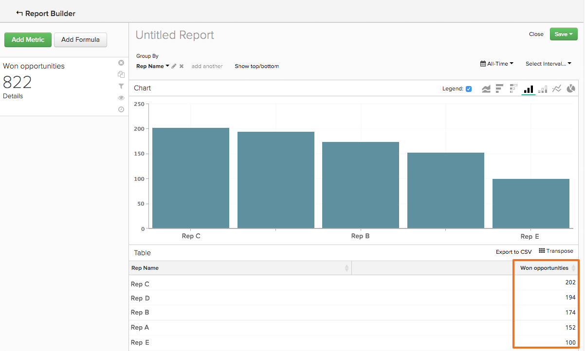
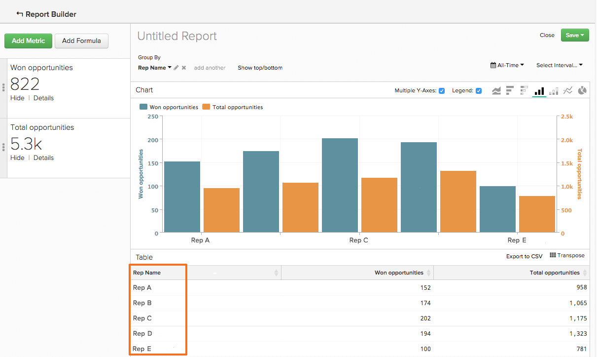

# `Show Top/Bottom`機能を使用したデータの順序

`Visual Report Builder`では、時間の経過に伴って傾向が変化する分析を作成するよりも多くのことができます。 例えば、獲得チャネルとマーケティングチャネルの価値を示すレポートを作成するだけでなく、パフォーマンスが最も高い上位5つを示すレポートを作成することもできます。 同様に、売上が最も多い州を示すレポートを作成することで、マーケティング活動に再フォーカスすることができます。

このようなデータの並べ替えと順序付けは、`Group By`と`Time Interval of None`の両方を使用するレポートで行うことができます。 これらの要素が両方ともレポート内にある場合、`Show Top/Bottom`機能はグラフのプレビューの上に表示されます。 この機能を使用すると、設定したパラメーターに基づいて、上位（最高から最低）および下位（最低から最高）のデータポイントを表示できます。

## 「どのように使うのか？」 {#how}

**[!UICONTROL Show Top/Bottom link]**&#x200B;をクリックして、表示と並べ替えのパラメーターを設定します。 テキストボックス内の数値は、整数（`5`など）または`ALL`のいずれかです。 次に、指標またはグループ化でレポートを並べ替えることもできます。

例えば、最も多くの収益をもたらした5つの紹介ソースを表示する場合、次のようにします。

1. レポートに`Revenue`指標を追加します。

1. `Group By`を追加して、参照元で指標をセグメント化します。

1. `Time Interval`を`None`に設定します。

1. `Show Top/Bottom`の設定で、表示を`5`に設定し、収益の合計金額が上位5件の紹介ソースのみがレポートに含まれるようにします。

>[!NOTE]
>
>レポートには`Time Interval`がないため、値（この場合は上位5つの参照ソース）が時間の経過とともに変化する可能性があります。 1つの参照元が収益で別の参照元を上回ると、ソースが表示される順序が変更されます。

## 複数の指標を使用する場合は？ {#multiplemetrics}

この機能を使用すると、レポート内に複数の指標がある場合、各指標はそれ自体または1つのグループでのみ並べ替えることができるため、複雑になります。

例えば、リファラルソース別にグループ化された`Revenue`と`Number of orders`の両方の指標を使用してレポートを作成したとします。 `Revenue`は`Revenue`または参照元によってのみ並べ替えることができ、`Number of orders`は`Number of orders`または参照元によってのみ並べ替えることができます。

つまり、収益を生み出す上位`Revenue`件の紹介ソースからのみ`5`を表示できますが、収益を生み出す上位`5`件の紹介ソースからも注文数を表示することはできません。 簡単に言えば、複数の指標がある場合、各指標をグループ化して並べ替えることが最善の策です。

以下は、グループ化ではなく`Revenue`指標を単独で並べ替えたグラフの例です。 ご覧のとおり、グループ化によって指標を並べ替えないと、奇妙な（そして最終的には役に立たない）レポートが作成されました。

両方の指標をグループ化して並べ替えた場合、グラフは次のようになります。

## デフォルトで値はどのように並べ替えられますか？ {#defaultsorting}

`Group by`と`Time Interval`の`None`を含むレポートに1つの指標のみが含まれている場合、`Visual Report Builder`のデフォルトの順序は、指標に基づく上位の値を表示することです。 この場合、必要に応じて`Show Top/Bottom`機能が不要になる場合があります。

この例は、営業担当者がクローズした商談の数を示しています。 このテーブルは、指標（この場合は`Won Opportunities`）に基づいて、最高から最低に自動的に並べ替えられます。

ただし、2つ目の指標が追加された場合、デフォルトでは、グループ化に基づいて上位を順序付けします。 指標とグループ化が追加されると、デフォルトの並べ替えは、最初のグループ化、次に2番目のグループ化などに基づいて行われます。

## まとめ {#wrapup}

ここでは、いくつかの基本的な機能について説明しますが、この機能には多くの興味深い用途があります。

先ほどの営業担当者の例や商談を考えてみましょう。 `Time Interval`を削除し、`Group By`を適用し、グループ化に基づいてデータを並べ替えることで、各担当者の獲得商談数の詳細を把握することができました。 また、`Show Top/Bottom`機能を使用して、トップパフォーマーを見つけましょう。
