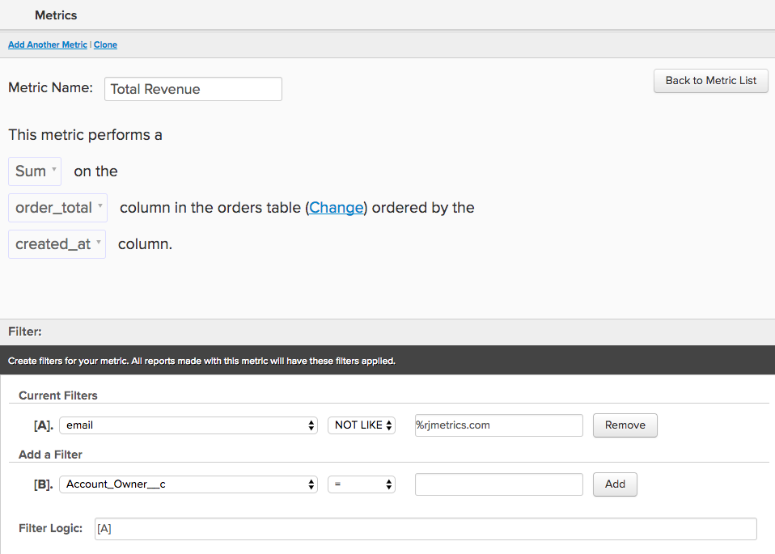
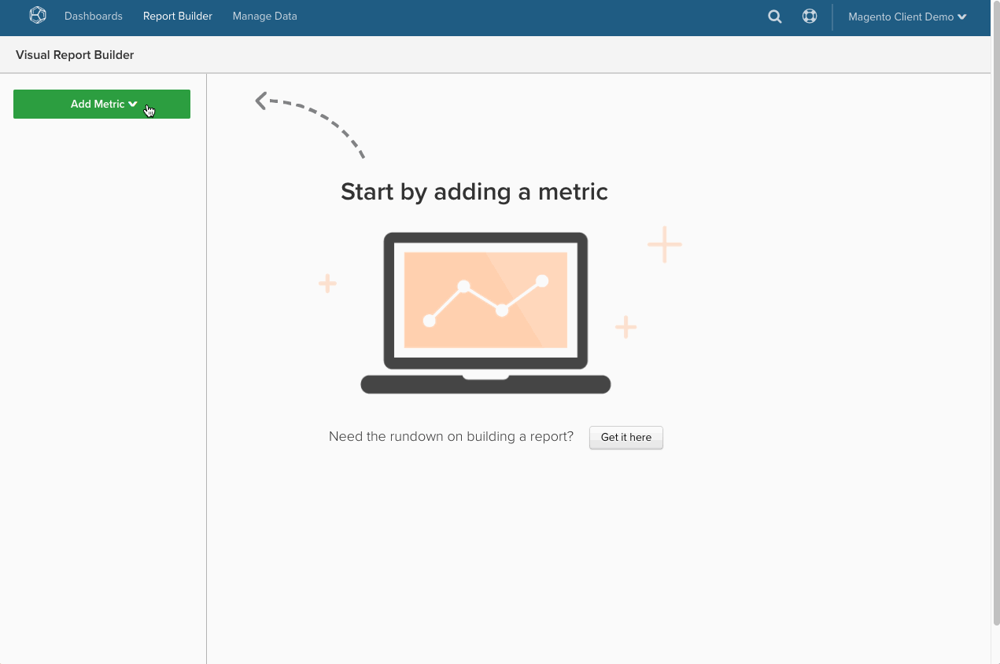

# Commerce IntelligenceでのSQL クエリの翻訳

SQL クエリが、[で使用する](../data-warehouse-mgr/creating-calculated-columns.md)計算列[、](../../data-user/reports/ess-manage-data-metrics.md)指標[、](../../tutorials/using-visual-report-builder.md) レポート [!DNL Commerce Intelligence]にどのように変換されるのか、疑問に思ったことはありませんか？ SQLのヘビーユーザーであれば、[!DNL Commerce Intelligence]でのSQLの翻訳方法を理解することで、[Data Warehouse Manager](../data-warehouse-mgr/tour-dwm.md)でよりスマートに作業し、[!DNL Commerce Intelligence]基盤を最大限に活用することができます。

このトピックの最後に、SQL クエリ句と&#x200B;**要素に対する**&#x200B;翻訳行列[!DNL Commerce Intelligence]があります。

まず、一般的なクエリを確認します。

| | |
|--- |--- |
| `SELECT` |  |
| `a,` | レポート `group by` |
| `SUM(b)` | `Aggregate function` （列） |
| `FROM c` | `Source` テーブル |
| `WHERE` |  |
| `d IS NOT NULL` | `Filter` |
| `AND time < X`   `AND time >= Y` | レポート `time frame` |
| `GROUP BY a` | レポート `group by` |

この例では、ほとんどの翻訳ケースを取り上げますが、いくつかの例外があります。 `aggregate`関数の翻訳方法から始めます。

## 集計関数

クエリの集計関数（例：`count`、`sum`、`average`、`max`、`min`）は、**の**&#x200B;指標の集計&#x200B;**または**&#x200B;列の集計[!DNL Commerce Intelligence]の形式になります。 差別化要因は、集約を実行するために結合が必要かどうかです。

上記のそれぞれの例を見てみましょう。

## 指標の集計 {#aggregate}

`within a single table`を集計する場合は、指標が必要です。 例えば、上記のクエリの`SUM(b)`集計関数は、列`B`を合計する指標で表される可能性が高くなります。 

`Total Revenue`指標を[!DNL Commerce Intelligence]で定義する方法の具体的な例を見てみましょう。 翻訳しようとしている以下のクエリを確認します。

| | |
|--- |--- |
| `SELECT` |  |
| `SUM(order_total) as "Total Revenue"` | `Metric operation` （列） |
| `FROM orders` | `Metric source` テーブル |
| `WHERE` |  |
| `email NOT LIKE '%@magento.com'` | 指標`filter` |
| `AND created_at < X`  `AND created_at >= Y` | 指標`timestamp` （およびレポート `time range`） |

**[!UICONTROL Manage Data** > **&#x200B;指標&#x200B;**/**新規指標を作成]**&#x200B;をクリックして指標ビルダーに移動します。最初に、適切な`source` テーブルを選択する必要があります。この場合は`orders` テーブルです。 次に、次に示すように指標が設定されます。

## 列集計

別のテーブルから結合された列を集計する場合は、計算列が必要です。 例えば、`customer`という名前の`Customer LTV` テーブルに列が組み込まれている場合、`orders` テーブル内のその顧客に関連付けられたすべての注文の合計値が合計されます。

この集計のクエリは次のようになります。

|  |  |
|--- |--- |
| `Select` | |
| `c.customer_id` | 集計所有者 |
| `SUM(o.order_total) as "Customer LTV"` | 集計操作（列） |
| `FROM customers c` | 集計所有者テーブル |
| `JOIN orders o` | 集約ソーステーブル |
| `ON c.customer_id = o.customer_id` | パス |
| `WHERE o.status = 'success'` | 集約フィルター |

[!DNL Commerce Intelligence]でこれを設定するには、Data Warehouse Managerを使用する必要があります。ここでは、`orders`と`customers` テーブルの間にパスを作成し、お客様のテーブルに`Customer LTV`という列を作成します。

`customers`と`orders`の間に新しいパスを確立する方法を確認します。 最終的な目標は、`customers` テーブルに新しい集計列を作成することです。そのため、最初にData Warehouseの`customers` テーブルに移動し、**[!UICONTROL Create a Column** > **&#x200B;定義を選択&#x200B;**> **SUM]**&#x200B;をクリックします。

次に、ソーステーブルを選択する必要があります。 `orders` テーブルへのパスが存在する場合は、ドロップダウンから選択するだけです。 ただし、新しいパスを作成する場合は、**[!UICONTROL Create new path]**&#x200B;をクリックすると、次の画面が表示されます。

ここでは、結合しようとしている2つのテーブル間の関係を慎重に検討する必要があります。 この場合、`Many`のお客様に`One`件の注文が関連付けられている可能性があるため、`orders` テーブルは`Many`側に表示されますが、`customers` テーブルは`One`側に選択されています。

>[!NOTE]
>
>[!DNL Commerce Intelligence]では、`path`はSQLの`Join`と同等です。

パスが保存されたら、`Customer LTV`列を作成できます。 以下を参照してください。

を使用した顧客生涯価値分析のアニメーション デモ

`Customer LTV` テーブルに新しい`customers`列を作成したので、この列を使用して[指標の集計](#aggregate)を作成する準備が整いました（例えば、顧客あたりの平均LTVを見つけるために）。 `group by` テーブルに組み込まれている既存の指標を使用して、レポートの計算列で`filter`または`customers`を実行することもできます。

>[!NOTE]
>
>後者の場合、新しい計算列を作成するたびに、ディメンションを[または](../data-warehouse-mgr/manage-data-dimensions-metrics.md)として使用する前に、既存の指標`filter`に`group by`追加する必要があります。

Data Warehouse Managerでの計算列の作成[を参照してください](../data-warehouse-mgr/creating-calculated-columns.md)。

## `Group By`句

クエリの`Group By`関数は、ビジュアルレポートのセグメント化またはフィルタリングに使用される列として[!DNL Commerce Intelligence]で表されることが多いです。 例として、以前に検索した`Total Revenue` クエリを再検討しますが、今回は`coupon\_code`で収益をセグメント化して、どのクーポンが最も収益を生み出しているかをより深く理解できるようにします。

次のクエリから開始します。

| | |
|--- |--- |
| `SELECT coupon_code,` | レポート `group by` |
| `SUM(order_total) as "Total Revenue"` | `Metric operation` （列） |
| `FROM orders` | `Metric source` テーブル |
| `WHERE` |  |
| `email NOT LIKE '%@magento.com'` | 指標`filter` |
| `AND created_at < '2016-12-01'`   `AND created_at >= '2016-09-01'` | 指標`timestamp` （およびレポート `time range`） |
| `GROUP BY coupon_code` | レポート `group by` |

>[!NOTE]
>
>前に開始したクエリとの唯一の違いは、グループとして「クーポン\_code」を追加することです。_

以前に作成したのと同じ`Total Revenue`指標を使用して、クーポンコードでセグメント化された収益レポートを作成する準備が整いました。 以下のGIFを見て、9月から11月のデータを見て、このビジュアルレポートを設定する方法を示します。

## 数式

場合によっては、クエリに複数の集計が含まれ、別々の列間の関係が計算されることがあります。 例えば、クエリの平均注文額を次の2つの方法のいずれかで計算できます。

* `AVG('order\_total')`または
* `SUM('order\_total')/COUNT('order\_id')`

前者の方法は、`order\_total`列で平均を実行する新しい指標の作成を含みます。 ただし、`Total Revenue`と`Number of orders`を計算する指標が既に設定されていると仮定すると、後者のメソッドをレポートビルダーで直接作成できます。

一歩引いて、`Average order value`のクエリ全体を見てみましょう。

| | |
|--- |--- |
| `SELECT` |  |
| `SUM(order_total) as "Total Revenue"` | 指標`operation` （列） |
| `COUNT(order_id) as "Number of orders"` | 指標`operation` （列） |
| `SUM(order_total)/COUNT(order_id) as "Average order value"` | 指標`operation` （列） / 指標操作（列） |
| `FROM orders` | 指標`source` テーブル |
| `WHERE` |  |
| `email NOT LIKE '%@magento.com'` | 指標`filter` |
| `AND created_at < '2016-12-01'`  `AND created_at >= '2016-09-01'` | 指標のタイムスタンプ（およびレポート期間） |

次に、`Total Revenue`と`Number of orders`を計算する指標が既に設定されていると仮定します。 これらの指標が存在するので、`Report Builder`を開いて、`Formula`機能を使用してオンデマンド計算を作成するだけです。

## まとめ

SQLのヘビーユーザーであれば、[!DNL Commerce Intelligence]でクエリをどのように変換するかを考えることで、計算列、指標、レポートを作成できます。

クイックリファレンスについては、以下のマトリックスを参照してください。 これは、SQL句の同等の[!DNL Commerce Intelligence]要素と、クエリでの使用方法に応じて、複数の要素にマッピングする方法を示しています。

## Commerce Intelligence Elements

| **`SQL Clause`** | **`Metric`** | **`Filter`** | **`Report group by`** | **`Report time frame`** | **`Path`** | **`Calculated column inputs`** | **`Source table`** |
|---|---|---|---|---|---|---|---|
| `SELECT` | X | - | X | - | - | X | - |
| `FROM` | - | - | - | - | - | - | X |
| `WHERE` | - | X | - | - | - | - | - |
| `WHERE` （時間要素付き） | - | - | - | X | - | - | - |
| `JOIN...ON` | - | X | - | - | X | X | - |
| `GROUP BY` | - | - | X | - | - | - | - |
