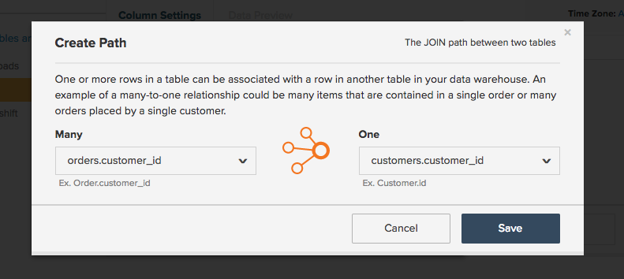

# Commerce Intelligence での SQL クエリの翻訳

SQL クエリが [計算列](../data-warehouse-mgr/creating-calculated-columns.md), [指標](../../data-user/reports/ess-manage-data-metrics.md)、および [レポート](../../tutorials/using-visual-report-builder.md) を使用している [!DNL Commerce Intelligence]・ SQL を使用している場合は、 [!DNL Commerce Intelligence] を使用すると、 [Data Warehouse管理](../data-warehouse-mgr/tour-dwm.md) そして、 [!DNL Commerce Intelligence] プラットフォーム。

このトピックの最後に、 **翻訳マトリックス** SQL クエリ句の場合は、 [!DNL Commerce Intelligence] 要素。

まず、一般的なクエリを確認します。

| | |
|--- |--- |
| `SELECT` |  |
| `a,` | レポート `group by` |
| `SUM(b)` | `Aggregate function` （列） |
| `FROM c` | `Source` 表 |
| `WHERE` |  |
| `d IS NOT NULL` | `Filter` |
| `AND time < X`   `AND time >= Y` | レポート `time frame` |
| `GROUP BY a` | レポート `group by` |

この例では、ほとんどの翻訳例を扱いますが、いくつか例外があります。 に進み、 `aggregate` 関数が翻訳されます。

## 集計関数

集計関数 ( 例： `count`, `sum`, `average`, `max`, `min`) をクエリで使用する場合は、次の形式を使用します。 **指標の集計** または **列の集計** in [!DNL Commerce Intelligence]. 差分係数は、集計を実行するために結合が必要かどうかです。

上記のそれぞれの例を見てみましょう。

## 指標の集計 {#aggregate}

集計には指標が必要です `within a single table`. 例えば、 `SUM(b)` 上記のクエリの集計関数は、列を合計した指標で表される可能性が最も高くなります `B`. 

特定の例を見てみましょう。 `Total Revenue` 指標は [!DNL Commerce Intelligence]. 翻訳を試みる以下のクエリを確認します。

| | |
|--- |--- |
| `SELECT` |  |
| `SUM(order_total) as "Total Revenue"` | `Metric operation` （列） |
| `FROM orders` | `Metric source` 表 |
| `WHERE` |  |
| `email NOT LIKE '%@magento.com'` | 指標 `filter` |
| `AND created_at < X`  `AND created_at >= Y` | 指標 `timestamp` ( およびレポート `time range`) |

クリックして指標ビルダーに移動します **[!UICONTROL Manage Data** > **&#x200B;指標&#x200B;**> **新しい指標を作成]**&#x200B;の場合、最初に適切な `source` 表 ( この場合は `orders` 表。 次に、指標が次のように設定されます。

## 列の集計

別のテーブルから結合された列を集計する場合は、集計列が必要です。 例えば、 `customer` というテーブル `Customer LTV`: `orders` 表。

この集計のクエリは、次のようになります。

|  |  |
|--- |--- |
| `Select` | |
| `c.customer_id` | 所有者を集計 |
| `SUM(o.order_total) as "Customer LTV"` | 集計操作（列） |
| `FROM customers c` | 集計所有者テーブル |
| `JOIN orders o` | 集計ソーステーブル |
| `ON c.customer_id = o.customer_id` | パス |
| `WHERE o.status = 'success'` | 集計フィルター |

で設定します。 [!DNL Commerce Intelligence] を使用するには、Data Warehouseマネージャーを使用し、 `orders` および `customers` テーブルを作成し、 `Customer LTV` を設定します。

次の `customers` および `orders`. 目標は、 `customers` テーブルに移動し、最初に `customers` Data Warehouseの表を開き、 **[!UICONTROL Create a Column** > **&#x200B;定義を選択&#x200B;**> **SUM]**.

次に、ソーステーブルを選択する必要があります。 パスが `orders` 表では、ドロップダウンから選択するだけです。 新しいパスを作成する場合は、 **[!UICONTROL Create new path]** 次の画面が表示されます。

ここでは、結合しようとしている 2 つのテーブル間の関係を慎重に考慮する必要があります。 この場合、次のような状況が発生する可能性があります。 `Many` 関連する注文 `One` 顧客、したがって `orders` 表が `Many` 一方、 `customers` テーブルが選択されました `One` サイド。

>[!NOTE]
>
>In [!DNL Commerce Intelligence], a `path` は、 `Join` SQL の

パスを保存したら、 `Customer LTV` 列！ 以下を参照してください。

これで、新しい `Customer LTV` 列の `customers` テーブルを作成する準備が整いました [指標の集計](#aggregate) この列を使用します（例えば、顧客ごとの平均 LTV を見つける場合）。 また、 `group by` または `filter` 既存の指標を使用してレポート内の計算列で `customers` 表。

>[!NOTE]
>
>後者の場合は、新しい計算列を作成する際は常に、 [既存の指標にディメンションを追加する](../data-warehouse-mgr/manage-data-dimensions-metrics.md) 以前は `filter` または `group by`.

詳しくは、 [計算列の作成](../data-warehouse-mgr/creating-calculated-columns.md) をData Warehouseマネージャに追加します。

## `Group By` 句

`Group By` クエリ内の関数は、 [!DNL Commerce Intelligence] ビジュアルレポートのセグメント化またはフィルタリングに使用する列。 例として、 `Total Revenue` 以前に確認したクエリですが、今回は売上高を `coupon\_code` を使用して、どのクーポンが最も高い売上高を生み出しているかをより深く理解できます。

まず、次のクエリを使用します。

| | |
|--- |--- |
| `SELECT coupon_code,` | レポート `group by` |
| `SUM(order_total) as "Total Revenue"` | `Metric operation`（列） |
| `FROM orders` | `Metric source` 表 |
| `WHERE` |  |
| `email NOT LIKE '%@magento.com'` | 指標 `filter` |
| `AND created_at < '2016-12-01'`   `AND created_at >= '2016-09-01'` | 指標 `timestamp` ( およびレポート `time range`) |
| `GROUP BY coupon_code` | レポート `group by` |

>[!NOTE]
>
>以前に開始したクエリとの唯一の違いは、グループ化の基準として「coupon\_code」を追加することです。_

同じ `Total Revenue` 以前に作成した指標を使用して、クーポンコード別にセグメント化された売上高のレポートを作成できます。 9 月から 11 月のデータに関するこのビジュアルレポートの設定方法を以下の gif で確認してください。

## 数式

クエリでは、別々の列間の関係を計算するために、複数の集計が含まれる場合があります。 例えば、次の 2 つの方法のいずれかで、クエリの平均注文額を計算できます。

* `AVG('order\_total')` または
* `SUM('order\_total')/COUNT('order\_id')`

前者の方法では、新しい指標を作成し、その指標の平均は `order\_total` 列。 ただし、 `Total Revenue` および `Number of orders`.

少し戻って、クエリ全体を見てみましょう。 `Average order value`:

| | |
|--- |--- |
| `SELECT` |  |
| `SUM(order_total) as "Total Revenue"` | 指標 `operation` （列） |
| `COUNT(order_id) as "Number of orders"` | 指標 `operation` （列） |
| `SUM(order_total)/COUNT(order_id) as "Average order value"` | 指標 `operation` （列） /指標の操作（列） |
| `FROM orders` | 指標 `source` 表 |
| `WHERE` |  |
| `email NOT LIKE '%@magento.com'` | 指標 `filter` |
| `AND created_at < '2016-12-01'`  `AND created_at >= '2016-09-01'` | 指標のタイムスタンプ（およびレポートの時間範囲） |

次に、 `Total Revenue` および `Number of orders`. これらの指標が存在するので、 `Report Builder` を使用してオンデマンド計算を作成し、 `Formula` 機能：

## 折り返し

SQL の負荷が高いユーザーの場合は、クエリが [!DNL Commerce Intelligence] では、計算列、指標およびレポートを作成できます。

クイックリファレンスについては、以下のマトリックスを参照してください。 これは、SQL 句の同等の値を示します [!DNL Commerce Intelligence] 要素と、クエリでの使用方法に応じて、複数の要素にどのようにマッピングできるかを指定できます。

## Commerce インテリジェンス要素

| **`SQL Clause`** | **`Metric`** | **`Filter`** | **`Report group by`** | **`Report time frame`** | **`Path`** | **`Calculated column inputs`** | **`Source table`** |
|---|---|---|---|---|---|---|---|
| `SELECT` | X | - | X | - | - | X | - |
| `FROM` | - | - | - | - | - | - | X |
| `WHERE` | - | X | - | - | - | - | - |
| `WHERE` （時間要素を使用） | - | - | - | X | - | - | - |
| `JOIN...ON` | - | X | - | - | X | X | - |
| `GROUP BY` | - | - | X | - | - | - | - |
