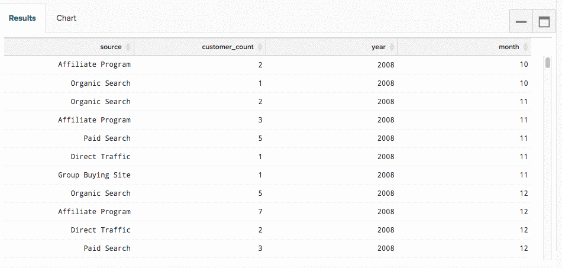

# [!DNL SQL Report Builder] の使用

>[!NOTE]
>
>SQL グラフを作成および編集するには、[&#x200B; 管理者権限 &#x200B;](../../administrator/user-management/user-management.md) が必要です。 ユーザー `Standard` ダッシュボード上でこれらのグラフの順序を変更でき、従来のグラフと同じエクスペリエンスを持つユーザーは `Read-only` とんどいません。 さらに、`Read-only` ユーザーはクエリのテキストにアクセスできません。

詳しくは、[&#x200B; トレーニングビデオ &#x200B;](https://experienceleague.adobe.com/docs/commerce-knowledge-base/kb/how-to/mbi-training-video-sql-report-builder.html) を参照してください。

[!DNL SQL] （構造化照会言語）は、データベースとの通信に使用されるプログラミング言語です。 [!DNL Commerce Intelligence] では、Data Warehouseからデータ [!DNL SQL] クエリまたは取得するために使用されます。 ダッシュボード上のレポートを見てみましょう。各レポートは、その背後で [!DNL SQL] のクエリによって動作しています。

[[!DNL SQL Report Builder]](../dev-reports/sql-rpt-bldr.md) を使用して、Data Warehouseに直接クエリを実行し、結果を表示して、グラフに変換できます。 「」をクリックして、[!DNL SQL Report Builder] でレポートの作成を開始 **[!UICONTROL Report Builder** > **[!DNL SQL Report Builder]]** きます。

詳しくは、[&#x200B; トレーニングビデオ &#x200B;](https://experienceleague.adobe.com/docs/commerce-knowledge-base/kb/how-to/mbi-training-video-sql-report-builder.html) を参照してください。

[!DNL SQL Report Builder] を使用すると、Data Warehouseに直接クエリを実行し、結果を表示して、すばやくグラフに変換できます。 [!DNL SQL] を使用したレポートの作成で最も役に立つ点は、作成した列に対して繰り返し処理を行うために、更新サイクルで待機する必要がないことです。 結果が適切でない場合は、期待どおりになるまで、クエリをすばやく編集して再実行できます。

このトピックでは、[!DNL SQL Report Builder] の使い方を説明します。 方法がわかったら、ビジュアライゼーションの [!DNL SQL] のチュートリアルを確認するか、記述したクエリの一部を最適化してみてください。

この記事では、次の内容について説明します。

1. [クエリの作成](#writing)

1. [クエリの実行と結果の表示](#runquery)

1. [ビジュアライゼーションの作成](#createviz)

1. [レポートの保存](#save)

## [!DNL SQL Report Builder] 統合

[[!DNL Google Analytics]](../importing-data/integrations/google-analytics.md) で使用できない統合は [[!DNL SQL Report Builder]](../dev-reports/sql-rpt-bldr.md) のみです。 この機能は開発中です。

[!DNL SQL] レポートの作成を開始するには、ダッシュボードの上部にある「**[!UICONTROL Report Builder]**」または「**[!UICONTROL Add Report]**」をクリックします。 [!DNL Report Picker] 画面で、「**[!UICONTROL SQL Report Builder]**」をクリックして [!DNL SQL] Editor を開きます。

## はじめに

レポートを編集するには、 歯車アイコン [!DNL SQL]）アイコンをクリックし、「**[!UICONTROL Edit]**」をクリックします。

## クエリの作成 {#writing}

>[!NOTE]
>
>[!DNL SQL Report Builder] クエリでは大文字と小文字が区別されます。 クエリを記述する際は、正しいケースを使用していることを確認してください。そうでない場合、予期しない結果やエラーが発生する可能性があります。

[&#x200B; クエリ最適化のガイドライン &#x200B;](../../best-practices/optimizing-your-sql-queries.md) に従って、クエリエディターで [!DNL SQL] エリを記述します。

>[!IMPORTANT]
>
>**[!DNL SQL] レポートの指標** - SQL レポートに指標を挿入すると、指標の `current definition` が使用されます。

指標が将来更新された場合、SQL レポートには変更が反映 *されません*。 変更を有効にするには、レポートを手動で編集する必要があります。

サイドバーの上部にあるボタンを使用して、[!DNL SQL Report Builder] で使用できるテーブルと指標のリストを切り替えることができます。 リストに探しているものが表示されない場合は、サイドバーの上部にある検索バーを使用して検索してみてください。

また、[!DNL SQL] エディターのサイドバーを使用して、指標、テーブルおよび列にカーソルを合わせてクリックすることで、クエリに直接挿入 **[!UICONTROL Insert]** きます。

![[!DNL SQL] エディターへのテーブルの挿入 &#x200B;](../../assets/SQL_RB_Insert_Table.png)

>[!NOTE]
>
>SQL Report Builderでは、PostgreSQL でサポートされている任意の [SELECT 関数 &#x200B;](https://www.postgresql.org/docs/9.5/sql-select.html#SQL-SELECT-LIST) またはデータを変更しない任意の関数がサポートされています。 これには、AVG、COUNT、COUNT DISTINCT、MIN/MAX、SUM などが含まれますが、これらに限定されません。

また、どの `JOIN` 型もサポートされていますが、Adobeでは、`JOIN` 型の中で最もコストが低いので、INNER JOIN のみを使用することをお勧めします。

## クエリの実行と結果の表示 {#runquery}

クエリの作成が完了したら、「**[!UICONTROL Run Query]**」をクリックします。 結果は、SQL エディターの下のテーブルに表示されます。

結果に誤りがあると思われる場合は、クエリを編集し、問題がなくなるまで再実行できます。

[&#x200B; エディターの下に、説明を含むメッセージ &#x200B;](../../best-practices/optimizing-your-sql-queries.md) が表示される場合があります。 これらのいずれかが表示された場合は、クエリが実行されておらず、少し微調整が必要であることを意味します。

クエリの編集が完了したら、ビジュアライゼーションの作成または作業内容のダッシュボードへの保存に進むことができます。

## ビジュアライゼーションの作成 {#createviz}

クエリ結果を使用してビジュアライゼーションを作成するには、**[!UICONTROL Chart]** ールパネルの「`Results`」タブをクリックします。 このタブでは、次の項目を選択します。

* `Series`、または測定する列（**販売された商品** など）。
* `Category`、またはデータのセグメント化に使用する列（**獲得ソース** など）。
* `Labels` または X 軸の値。

ビジュアライゼーションプロセスがどのように表示されるかを次に示します。

ビジュアライゼーションの作成方法に関する詳細な手順については、[SQL クエリからのビジュアライゼーションの作成チュートリアル &#x200B;](../../tutorials/create-visuals-from-sql.md){: target="_blank"} を参照してください。

## レポートの保存 {#save}

作業内容を保存する前に、レポートに名前を付ける必要があります。 [&#x200B; 命名のベストプラクティスガイドライン &#x200B;](../../best-practices/naming-elements.md){: target="_blank"} に従い、レポートの内容を明確に伝えるものを選択してください。

**[!UICONTROL Save]** エディターの右上隅にある「[!DNL SQL]」をクリックし、レポート `Type` （`Chart` または `Table`）を選択します。 まとめるには、レポートの保存先のダッシュボードを選択し、「**[!UICONTROL Save to Dashboard]**」をクリックします。

### データの分析

#### [!DNL SQL Report Builder]

[[!DNL SQL Report Builder]](../dev-reports/sql-rpt-bldr.md) を使用すると、Data Warehouseに対して直接クエリを実行し、結果を表示して、レポートにすばやく変換できます。 [!DNL SQL] を使用すると、[&#x200B; または  [!DNL SQL]  Report Builder で &#x200B;](https://docs.aws.amazon.com/redshift/latest/dg/c_SQL_functions.html) 使用できない `Visual` 関数を使用 `Cohort` できるので、データをより詳細に制御できます。

[!DNL SQL] を使用して作成された計算列は、更新サイクルに依存しません。つまり、自由に繰り返し処理し、結果をすぐに確認できます。

>[!NOTE]
>
>これは列の構造にのみ適用され、データの鮮度には適用されません。 新しいデータは、引き続き、正常に完了した更新サイクルに依存します。

| **これは…に最適です** | **これは…にはあまり適していません** |
|---|---|
| 中級/上級アナリスト | 初心者 – あなたは [!DNL SQL] れを知る必要があります。 |
| [!DNL SQL] に精通した | 単純な分析 – クエリの記述は、単に [!UICONTROL Visual Report Builder] を使用するよりも作業が複雑になる場合があります。 |
| 1 回限りの計算列の作成 | 他のユーザーとの共有 – あなたのオーディエンスを考慮してください：彼らは [!DNL SQL] れを理解していますか？ そうしないと、レポートの作成方法で混乱する可能性があります。 |
| `one-to-many` の関係を持つデータ |  |
| 新しい列または分析のテスト |  |

#### データベースと SQL エディターの結果

ほとんどの場合、結果の違いは更新サイクルに起因する可能性があります。 データベースからData Warehouseにデータをレプリケートしている [!DNL Commerce Intelligence] 合は、同じクエリを使用しても結果が異なる場合があります。

接続の問題によって、不一致が発生する場合もあります。 「`Connections`」をクリックして **[!DNL Manage Data** > **Connections]** ページに移動し、チェックアウトします。- データベース統合に関するエラーはありますか？ その場合は、再び動作させるには [&#x200B; 統合の再認証 &#x200B;](https://experienceleague.adobe.com/docs/commerce-knowledge-base/kb/how-to/mbi-reauthenticating-integrations.html) が必要になることがあります。

すべての統合が正常に接続され、更新サイクルの途中ではない場合は、他の何かが問題である可能性があります。

#### [!DNL SQL] レポートを削除すると、基になる列もData Warehouseから削除されますか？

いいえ、どのように作成したかに関係なく、Data Warehouseから列が失われることはありません。

`Data Warehouse Manager` を使用して作成された列は、その列を使用するレポートまたはクエリを削除しても影響を受けません。

[!DNL SQL Report Builder] を使用して作成された列は、Data Warehouseに保存されません。

#### `Report Builder` と `SQL Report Builder`

[!DNL SQL Report Builder] を使用すると、グラフを作成および構造化する際の柔軟性が向上します。例えば、`X` 軸と `Y` 軸に表示する値を選択できます。 [!DNL SQL Report Builder] でのグラフの作成について詳しくは、[&#x200B; クエリからのビジュアライゼーションの作成  [!DNL SQL]  チュートリアルを参照し &#x200B;](../../tutorials/create-visuals-from-sql.md) ください。

#### `Cohort Report Builder` {#cohortrb}

[!DNL Visual Report Builder] とは異なり、この [[!DNL Cohort Report Builder]](../dev-reports/cohort-rpt-bldr.md) は、類似したユーザーグループの行動のトレンドを時間の経過と共に分析し、特定するという単一の目的に対して使用されます。 [!DNL Cohort Report Builder] を使用するのに [!DNL SQL] に精通している必要はないので、使い始めたばかりの場合でも、ためらうことなくダイビングできます。

| **これは…に最適です** | **これは…にはあまり適していません** |
|---|---|
| 中級/上級アナリスト | 初心者 – あなたは練習を定義するコホートが必要です。 |
| 行動の経時的なトレンドの特定 | 定性分析 – [&#x200B; 実行 &#x200B;](../dev-reports/create-qual-cohort-analysis.md) できますが、Adobeの支援が必要です。 |

## 更新サイクル後のクエリの再構築

クエリを再構築する必要はありません。 [[!DNL SQL Report Builder]](../dev-reports/sql-rpt-bldr.md) を使用して作成されたレポートは、従来の `Report Builder` で作成されたレポートと同様に保存されます。 グラフの更新プロセス [!DNL SQL] 同じです。データを更新すると、グラフの値が再計算され、再表示されます。

>[!NOTE]
>
>[!DNL SQL] レポート/クエリを削除する場合、基になる列はData Warehouseから削除されません。 列の作成方法にかかわらず、列は失われません。

* Data Warehouse Manager を使用して作成された列は、その列を使用するレポートまたはクエリを削除しても影響を受けません。

* SQL Report Builderを使用して作成された列は、Data Warehouseに保存されません。

## まとめ {#wrapup}

もう少し難しいことに挑戦する場合は、ビジュアライゼーションに最適化されたクエリを記述してみませんか？ 開始するには、[&#x200B; クエリからのビジュアライゼーションの作成  [!DNL SQL]  チュートリアル &#x200B;](../../tutorials/create-visuals-from-sql.md){: target="_blank"} を参照してください。
