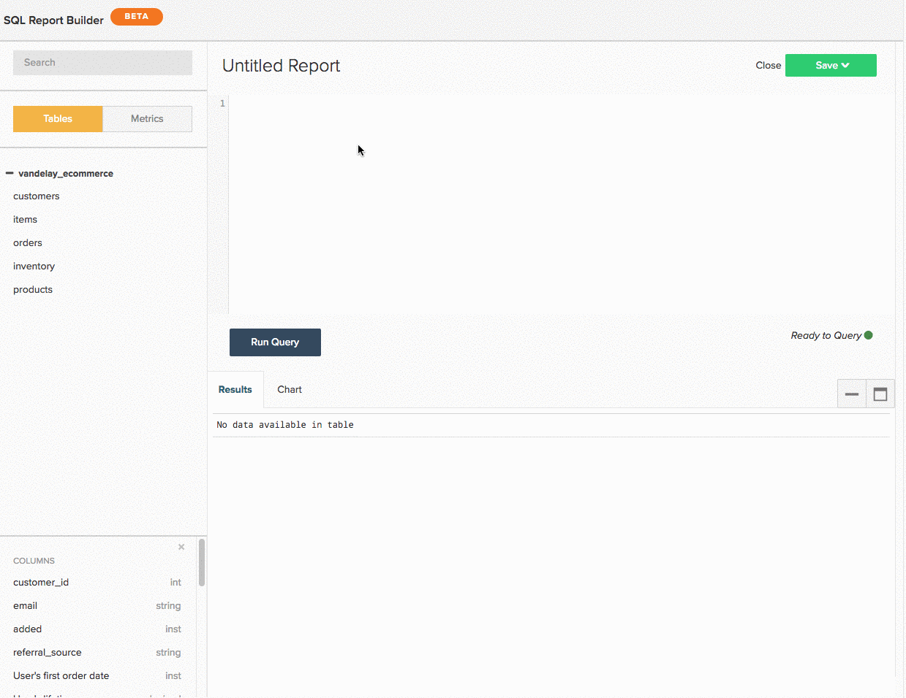
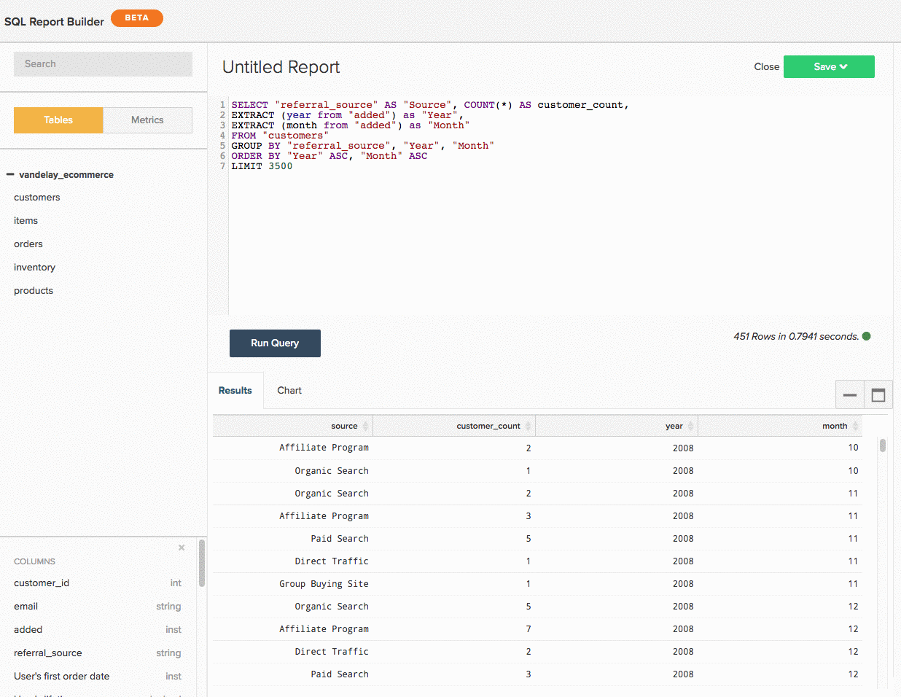

# [!DNL SQL Report Builder]の使用中

>[!NOTE]
>
>SQL チャートを作成および編集するには、[管理者権限](../../administrator/user-management/user-management.md)が必要です。 `Standard`人のユーザーがダッシュボードでこれらのグラフを並べ替えることができ、`Read-only`人のユーザーが従来のグラフと同じエクスペリエンスを使用できます。 さらに、`Read-only`人のユーザーはクエリのテキストにアクセスできません。

詳細については、[ トレーニング ビデオ ](https://experienceleague.adobe.com/docs/commerce-knowledge-base/kb/how-to/mbi-training-video-sql-report-builder.html)を参照してください。

[!DNL SQL] （構造化問い合わせ言語）は、データベースとの通信に使用されるプログラミング言語です。 [!DNL Commerce Intelligence]では、[!DNL SQL]を使用して、Data Warehouseからデータを照会または取得します。 ダッシュボードのレポートを見てください。バックグラウンドでは、各レポートに[!DNL SQL] クエリが利用されています。

[[!DNL SQL Report Builder]](../dev-reports/sql-rpt-bldr.md)を使用して、Data Warehouseに直接クエリを実行し、結果を表示して、グラフに変換できます。 [!DNL SQL Report Builder]をクリックすると、**[!UICONTROL Report Builder** > **[!DNL SQL Report Builder]]**&#x200B;を使用したレポートの作成を開始できます。

詳細については、[ トレーニング ビデオ ](https://experienceleague.adobe.com/docs/commerce-knowledge-base/kb/how-to/mbi-training-video-sql-report-builder.html)を参照してください。

[!DNL SQL Report Builder]を使用すると、Data Warehouseに直接クエリを実行して結果を表示し、すばやくグラフに変換できます。 [!DNL SQL]を使用してレポートを作成する際の最も優れた点は、作成した列を繰り返し更新するために更新サイクルを待つ必要がないことです。 結果が正しく表示されない場合は、期待に合うまで、クエリをすばやく編集して再実行できます。

このトピックでは、[!DNL SQL Report Builder]を使用する方法について説明します。 詳しくは、[!DNL SQL]のビジュアライゼーションのチュートリアルを参照するか、書き込んだクエリの一部を最適化してみてください。

この記事の内容：

1. [クエリの記述](#writing)

1. [クエリの実行と結果の表示](#runquery)

1. [ビジュアライゼーションの作成](#createviz)

1. [レポートの保存](#save)

## [!DNL SQL Report Builder]統合

[[!DNL Google Analytics]](../importing-data/integrations/google-analytics.md)は、[[!DNL SQL Report Builder]](../dev-reports/sql-rpt-bldr.md)で使用できない唯一の統合です。 この機能は開発中です。

[!DNL SQL] レポートの作成を開始するには、ダッシュボードの上部にある&#x200B;**[!UICONTROL Report Builder]**&#x200B;または&#x200B;**[!UICONTROL Add Report]**&#x200B;をクリックします。 [!DNL Report Picker]画面で、**[!UICONTROL SQL Report Builder]**&#x200B;をクリックして[!DNL SQL] エディターを開きます。

## 詳細を見る

レポートを編集するには、歯車アイコン [!DNL SQL]）アイコンをクリックし、**[!UICONTROL Edit]**&#x200B;をクリックします。

## クエリの記述 {#writing}

>[!NOTE]
>
>[!DNL SQL Report Builder] クエリでは、大文字と小文字が区別されます。 クエリを作成する際は、正しいケースを使用しているか、予期しない結果やエラーが発生する可能性があることを確認してください。

クエリ最適化[の](../../best-practices/optimizing-your-sql-queries.md) ガイドラインに従って、[!DNL SQL] エディターでクエリを記述します。

>[!IMPORTANT]
>
>**レポートの[!DNL SQL]指標** - SQL レポートに指標を挿入すると、指標の`current definition`が使用されます。

指標が将来更新された場合、SQL レポート *は変更を反映しません*。 変更を有効にするには、レポートを手動で編集する必要があります。

サイドバーの上部にあるボタンを使用して、[!DNL SQL Report Builder]で使用できるテーブルと指標のリストを切り替えることができます。 リストに探しているものが表示されない場合は、サイドバーの上部にある検索バーを使用して検索してみてください。

[!DNL SQL] エディターのサイドバーを使用して、指標、テーブル、列をクエリに直接挿入することもできます。クエリにカーソルを合わせて「**[!UICONTROL Insert]**」をクリックします。

![ テーブルを[!DNL SQL] エディターに挿入しています。](../../assets/SQL_RB_Insert_Table.png)

>[!NOTE]
>
>PostgreSQLでサポートされている[SELECT関数](https://www.postgresql.org/docs/9.5/sql-select.html#SQL-SELECT-LIST)またはデータを変更しない関数は、SQL Report Builderでサポートされています。 これには、AVG、COUNT、COUNT DISTINCT、MIN/MAX、SUMが含まれますが、これらに限定されません。

また、任意の`JOIN`型がサポートされますが、Adobeでは、`JOIN`型の中で最も安価なINNER JOINのみを使用することをお勧めします。

## クエリの実行と結果の表示 {#runquery}

クエリの書き込みが完了したら、**[!UICONTROL Run Query]**&#x200B;をクリックします。 結果は、SQL エディターの下のテーブルに表示されます。

結果に問題がある場合は、クエリを編集して、問題が解決するまで再実行できます。

エディターの下に[件のメッセージが表示され、その中にEXPLAINが含まれていることがあります](../../best-practices/optimizing-your-sql-queries.md)。 これらのいずれかが表示された場合は、クエリが実行されておらず、少し調整が必要であることを意味します。

クエリの編集が完了したら、ビジュアライゼーションの作成またはダッシュボードへの保存に進むことができます。

## ビジュアライゼーションの作成 {#createviz}

クエリ結果を使用してビジュアライゼーションを作成するには、**[!UICONTROL Chart]** ペインの「`Results`」タブをクリックします。 このタブでは、次を選択します。

* `Series`、または&#x200B;**販売済みアイテム**&#x200B;など、測定する列。
* `Category`、またはデータのセグメント化に使用する列（**獲得ソース**&#x200B;など）。
* `Labels`、またはX軸の値。

ここでは、そのプロセスの概要を解説します。

ビジュアライゼーションの作成方法について詳しくは、[SQL クエリからのビジュアライゼーションの作成チュートリアル ](../../tutorials/create-visuals-from-sql.md){: target="_blank"}を参照してください。

## レポートの保存 {#save}

作業内容を保存する前に、レポートに名前を付ける必要があります。 [の命名に関する](../../best-practices/naming-elements.md){: target="_blank"} ベストプラクティスのガイドラインに従い、レポートの内容を明確に伝えるものを選択することを忘れないでください。

**[!UICONTROL Save]** エディターの右上隅にある[!DNL SQL]をクリックし、レポート `Type` （`Chart`または`Table`）を選択します。 レポートを保存するダッシュボードを選択し、**[!UICONTROL Save to Dashboard]**&#x200B;をクリックします。

### データの分析

#### [!DNL SQL Report Builder]

[[!DNL SQL Report Builder]](../dev-reports/sql-rpt-bldr.md)を使用すると、Data Warehouseに直接クエリを実行して結果を表示し、レポートにすばやく変換できます。 [!DNL SQL]を使用すると、[または [!DNL SQL]  レポートビルダーで使用できない](https://docs.aws.amazon.com/redshift/latest/dg/c_SQL_functions.html)関数`Visual`を`Cohort`使用できるので、データをより詳細に制御できます。

[!DNL SQL]を使用して作成された計算列は、更新サイクルに依存しません。つまり、必要に応じて繰り返し処理し、すぐに結果を確認できます。

>[!NOTE]
>
>これは、列の構造にのみ適用され、データの鮮度には適用されません。 更新データは、正常に完了した更新サイクルに依存します。

| **これは…**&#x200B;に最適です | **これは…**&#x200B;にとってあまり良くありません |
|---|---|
| 中級/上級アナリスト | 初心者 – [!DNL SQL]について知る必要があります。 |
| [!DNL SQL]の達人 | 単純な分析 – クエリの作成は、[!UICONTROL Visual Report Builder]を使用するだけでは不十分です。 |
| 1回限りの計算列の作成 | 他のユーザーとの共有 – あなたのオーディエンスを考慮してください：彼らは[!DNL SQL]を理解していますか？ そうでない場合は、レポートの作成方法を間違える可能性があります。 |
| `one-to-many`件の関係を持つデータ |  |
| 新しい列または分析のテスト |  |

#### データベースとSQL エディターの結果

多くの場合、結果の違いは更新サイクルに起因します。 [!DNL Commerce Intelligence]がデータベースからData Warehouseにデータをレプリケートする処理中の場合、同じクエリを使用しても結果が異なる場合があります。

接続の問題により、不一致が生じる場合もあります。 「`Connections`」をクリックして&#x200B;**[!DNL Manage Data** > **Connections]** ページに移動し、チェックアウトします。問題のあるデータベース統合にエラーがありますか？ その場合は、[統合の再認証](https://experienceleague.adobe.com/docs/commerce-knowledge-base/kb/how-to/mbi-reauthenticating-integrations.html)が必要になる場合があります。

すべての統合が正常に接続されていて、更新サイクルの途中にない場合は、別の問題が発生する可能性があります。

#### [!DNL SQL] レポートを削除すると、基礎となる列もData Warehouseから削除されますか？

いいえ、どのように列を構築したかに関係なく、Data Warehouseから列が失われることはありません。

`Data Warehouse Manager`を使用して作成された列は、それを使用するレポートまたはクエリを削除しても影響を受けません。

[!DNL SQL Report Builder]を使用して作成された列は、Data Warehouseに保存されません。

#### `Report Builder`対`SQL Report Builder`

[!DNL SQL Report Builder]を使用すると、グラフを作成および構造化する際に柔軟性が向上します。例えば、`X`軸と`Y`軸に表示する値を選択できます。 [!DNL SQL Report Builder]でのグラフの作成について詳しくは、[ クエリからのビジュアライゼーションの作成 [!DNL SQL]  チュートリアルを参照してください。](../../tutorials/create-visuals-from-sql.md)

#### `Cohort Report Builder` {#cohortrb}

[!DNL Visual Report Builder]とは異なり、[[!DNL Cohort Report Builder]](../dev-reports/cohort-rpt-bldr.md)は、類似のユーザーグループの行動傾向を経時的に分析および特定するという単一の目的を目的としています。 [!DNL Cohort Report Builder]を使用するには[!DNL SQL]の知識は必要ないので、始めたばかりであれば、迷うことなく飛び込むことができます。

| **これは…**&#x200B;に最適です | **これは…**&#x200B;にとってあまり良くありません |
|---|---|
| 中級/上級アナリスト | 初心者：練習を定義するコホートが必要です |
| 長期的な行動傾向の特定 | 定性分析 – [完了](../dev-reports/create-qual-cohort-analysis.md)できますが、Adobeの支援が必要です。 |

## 更新サイクル後のクエリの再構築

クエリを再構築する必要はありません。 [[!DNL SQL Report Builder]](../dev-reports/sql-rpt-bldr.md)を使用して作成されたレポートは、従来の`Report Builder`で作成されたレポートと同様に保存されます。 [!DNL SQL] グラフの更新プロセスは同じです。データが更新されると、グラフの値が再計算され、再表示されます。

>[!NOTE]
>
>[!DNL SQL] レポート/クエリを削除しても、基になる列はData Warehouseから削除されません。 列の作成方法に関係なく、列を失うことはありません。

* Data Warehouse Managerを使用して作成された列は、それを使用するレポートまたはクエリを削除しても影響を受けません。

* SQL Report Builderを使用して作成された列は、Data Warehouseに保存されません。

## まとめ {#wrapup}

もう少し難しいことをしたい場合は、視覚化のために最適化されたクエリを書いてみましょう。 開始するには、[ クエリからのビジュアライゼーションの作成 [!DNL SQL]  チュートリアル ](../../tutorials/create-visuals-from-sql.md){: target="_blank"}を参照してください。
