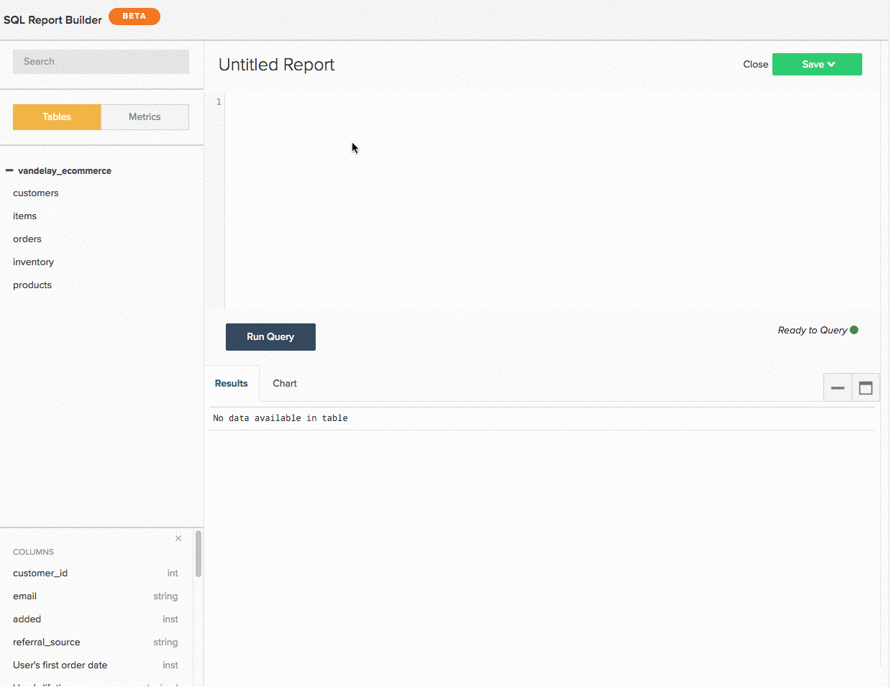

# 使用 [!DNL SQL Report Builder]

>[!NOTE]
>
>必要 [管理者権限](../../administrator/user-management/user-management.md) をクリックし、SQL チャートを作成および編集します。 `Standard` ユーザーは、ダッシュボードでこれらのグラフを並べ替えることができます。 `Read-only` ユーザーは、従来のグラフと同じエクスペリエンスを持ちます。 さらに、 `Read-only` ユーザーはクエリのテキストにアクセスできません。

詳しくは、 [トレーニングビデオ](https://experienceleague.adobe.com/docs/commerce-knowledge-base/kb/how-to/mbi-training-video-sql-report-builder.html) を参照してください。

[!DNL SQL](Structured Query Language) は、データベースとの通信に使用されるプログラミング言語です。 In [!DNL Commerce Intelligence], [!DNL SQL] を使用して、データをData Warehouseに問い合わせたり、取得したりします。 ダッシュボード上でレポートを確認します。バックグラウンドで、それぞれが [!DNL SQL] クエリ。

以下を使用して、 [[!DNL SQL Report Builder]](../dev-reports/sql-rpt-bldr.md) を使用して、Data Warehouseに直接問い合わせ、結果を表示し、グラフに変換します。 レポートの作成を開始するには、 [!DNL SQL Report Builder] クリックして **[!UICONTROL Report Builder** > **[!DNL SQL Report Builder]]**.

詳しくは、 [トレーニングビデオ](https://experienceleague.adobe.com/docs/commerce-knowledge-base/kb/how-to/mbi-training-video-sql-report-builder.html) を参照してください。

この [!DNL SQL Report Builder] を使用すると、Data Warehouseに直接問い合わせ、結果を表示し、すばやくグラフに変換できます。 の使用に関する最善の部分 [!DNL SQL] レポートを作成するには、作成する列を繰り返す更新サイクルを待つ必要はありません。 結果が正しく表示されない場合は、クエリをすばやく編集し、期待どおりに実行できます。

このトピックでは、 [!DNL SQL Report Builder]. 道を知ったら、 [!DNL SQL] ビジュアライゼーションに関するチュートリアルを参照するか、作成したクエリの一部を最適化してみてください。

この記事では、次の内容を説明します。

1. [クエリの作成](#writing)

1. [クエリの実行と結果の表示](#runquery)

1. [ビジュアライゼーションの作成](#createviz)

1. [レポートの保存](#save)

## [!DNL SQL Report Builder] 統合

[[!DNL Google Analytics]](../importing-data/integrations/google-analytics.md) は、と共に使用できない唯一の統合です。 [[!DNL SQL Report Builder]](../dev-reports/sql-rpt-bldr.md). この機能は開発中です。

を作成し始めるには、以下を実行します。 [!DNL SQL] レポート、クリック **[!UICONTROL Report Builder]** または **[!UICONTROL Add Report]** をクリックします。 内 [!DNL Report Picker] 画面、クリック **[!UICONTROL SQL Report Builder]** 開く [!DNL SQL] 編集者。

## はじめに

レポートを編集するには、歯車 () アイコン ( [!DNL SQL] — ベースのグラフとクリック **[!UICONTROL Edit]**.

## クエリの作成 {#writing}

>[!NOTE]
>
>[!DNL SQL Report Builder] クエリでは大文字と小文字が区別されます。 クエリを記述する際は、正しいケースを使用していることを確認してください。そうしないと、予期しない結果やエラーが発生する場合があります。

次の [クエリ最適化のガイドライン](../../best-practices/optimizing-your-sql-queries.md)、 [!DNL SQL] 編集者。

>[!IMPORTANT]
>
>**の指標 [!DNL SQL] レポート** - SQL レポートに指標を挿入すると、 `current definition` の値が使用されます。

指標が将来更新される場合、SQL レポート *次の値と等しくない* 変更が反映されます。 変更を有効にするには、レポートを手動で編集する必要があります。

サイドバーの上部にあるボタンを使用して、テーブルのリストと、 [!DNL SQL Report Builder]. リストに何を探しているかが表示されない場合は、サイドバーの上部にある検索バーを使用して検索してみてください。

また、 [!DNL SQL] 指標、テーブルおよび列をクエリに直接挿入する場合は、クエリにマウスポインターを置いて「 **[!UICONTROL Insert]**:

![テーブルの [!DNL SQL] 編集者。](../../assets/SQL_RB_Insert_Table.png)

>[!NOTE]
>
>任意 [SELECT 関数](https://www.postgresql.org/docs/9.5/sql-select.html#SQL-SELECT-LIST)、または PostgreSQL でサポートされるデータを変更しない関数は、SQLReport Builderでサポートされます。 これには、AVG、COUNT、COUNT DISTINCT、MIN/MAX、SUM などが該当しますが、これらに限定されません。

また、任意の `JOIN` タイプはサポートされていますが、Adobeでは INNER JOIN の使用のみが推奨されています。INNER JOIN は `JOIN` タイプ。

## クエリの実行と結果の表示 {#runquery}

クエリの記述が完了したら、「 **[!UICONTROL Run Query]**. 結果は、SQL エディタの下の表に表示されます。

結果に何か問題があるように見える場合は、クエリを編集し、問題が解決するまで再実行できます。

時々、 [エディタの下に EXPLAIN を含むメッセージ](../../best-practices/optimizing-your-sql-queries.md). これらのいずれかが表示される場合は、クエリが実行されておらず、微調整が必要です。

クエリの編集が完了したら、ビジュアライゼーションの作成またはダッシュボードへの作業の保存に進むことができます。

## ビジュアライゼーションの作成 {#createviz}

クエリ結果を使用してビジュアライゼーションを作成するには、 **[!UICONTROL Chart]** 」タブをクリックします。 `Results` ウィンドウ このタブで、次を選択します。

* この `Series`または、測定する列（例： ） **販売済みアイテム**.
* この `Category`または、データのセグメント化に使用する列 ( 例： **獲得ソース**.
* この `Labels`または X 軸の値。

次に、ビジュアライゼーションプロセスの概要を示します。

ビジュアライゼーションの作成方法について詳しくは、 [SQL クエリからのビジュアライゼーションの作成のチュートリアル](../../tutorials/create-visuals-from-sql.md){:target=&quot;_blank&quot;}。

## レポートの保存 {#save}

作業内容を保存する前に、レポートに名前を付ける必要があります。 忘れずに [命名に関するベストプラクティスのガイドライン](../../best-practices/naming-elements.md){:target=&quot;_blank&quot;} を選択し、レポートの内容を明確に伝えるものを選択します。

クリック **[!UICONTROL Save]** の右上隅に [!DNL SQL] エディターを開き、レポートを選択します。 `Type` (`Chart` または `Table`) をクリックします。 まとめるには、レポートの保存先となるダッシュボードを選択し、「 **[!UICONTROL Save to Dashboard]**.

### データの分析

#### [!DNL SQL Report Builder]

[[!DNL SQL Report Builder]](../dev-reports/sql-rpt-bldr.md) を使用すると、Data Warehouseに直接問い合わせ、結果を表示し、すばやくレポートに変換できます。 使用 [!DNL SQL] また、 [使用する [!DNL SQL] 使用できない関数](https://docs.aws.amazon.com/redshift/latest/dg/c_SQL_functions.html) 内 `Visual` または `Cohort` Report Builderを使用して、データをより詳細に制御できます。

を使用して作成された計算列 [!DNL SQL] は、更新サイクルに依存しません。つまり、必要に応じて繰り返し実行し、即座に結果を確認できます。

>[!NOTE]
>
>これは列の構造にのみ適用され、データの鮮度には適用されません。 新しいデータは、正常に完了した更新サイクルに依存します。

| **これは…に最適です。** | **これは…** |
|---|---|
| 中級アナリスト/上級アナリスト | 初心者 — 知る必要がある [!DNL SQL]. |
| この [!DNL SQL] 経験豊富な | 単純な分析 — 単に [!UICONTROL Visual Report Builder]. |
| 1 回限りの計算列の作成 | 他のユーザーと共有する — オーディエンスを考慮：彼らは理解している [!DNL SQL]? そうでない場合は、レポートの作成方法に混乱する可能性があります。 |
| データの格納先 `one-to-many` 関係 |  |
| 新しい列または分析のテスト |  |

#### データベースと SQL エディタの結果

ほとんどの時間、結果の違いは、更新サイクルに起因する可能性があります。 If [!DNL Commerce Intelligence] は、データベースからData Warehouseにデータをレプリケートするプロセス中で、同じクエリを使用している場合でも、異なる結果が表示される場合があります。

接続の問題によって不整合が生じる場合もあります。 次に移動： `Connections` ページをクリック **[!DNL Manage Data** > **Connections]** チェックアウトするには、問題のデータベース統合にエラーはありますか。 その場合は、 [統合の再認証](https://experienceleague.adobe.com/docs/commerce-knowledge-base/kb/how-to/mbi-reauthenticating-integrations.html) もう一度動かすために

すべての統合が正常に接続され、更新サイクルの途中にない場合は、他に何か問題が発生する可能性があります。

#### 次を削除します。 [!DNL SQL] レポートは基になる列もData Warehouseから削除しますか？

いいえ。どのように作成したかに関係なく、Data Warehouseから列が失われることはありません。

を使用して作成された列 `Data Warehouse Manager` を使用するレポートまたはクエリを削除しても、影響は受けません。

を使用して作成された列 [!DNL SQL Report Builder] はData Warehouseに保存されません。

#### `Report Builder` 対比 `SQL Report Builder`

この [!DNL SQL Report Builder] を使用すると、グラフを作成および構造化する際に柔軟性が高まります。例えば、表示する値を選択できます `X` および `Y` 軸 グラフの作成について詳しくは、 [!DNL SQL Report Builder]、 [からのビジュアライゼーションの作成 [!DNL SQL] クエリ](../../tutorials/create-visuals-from-sql.md) チュートリアル

#### `Cohort Report Builder` {#cohortrb}

とは異なり、 [!DNL Visual Report Builder]、 [[!DNL Cohort Report Builder]](../dev-reports/cohort-rpt-bldr.md) は、単一の目的を目的としており、類似したユーザーグループの行動トレンドを経時的に分析および識別します。 の使用 [!DNL Cohort Report Builder] 必要ない [!DNL SQL] 経験豊富なので、出発したばかりなら、ためらうことなくすぐに飛び込むことができます。

| **これは…に最適です。** | **これは…** |
|---|---|
| 中級アナリスト/上級アナリスト | 初心者 — 練習用のコホートが必要です。 |
| 経時的な行動トレンドの特定 | 定性分析 — 可能 [完了](../dev-reports/create-qual-cohort-analysis.md)を使用するには、Adobeの支援が必要です。 |

## 更新サイクル後の問合せの再構築

クエリを再構築する必要はありません。 を使用して作成されたレポート [[!DNL SQL Report Builder]](../dev-reports/sql-rpt-bldr.md) は、従来の `Report Builder`. の更新プロセス [!DNL SQL] グラフは同じです。データを更新すると、グラフの値が再計算され、再表示されます。

>[!NOTE]
>
>を削除する場合 [!DNL SQL] レポート/クエリの場合、基になる列がData Warehouseから削除されることはありません。 どのように作成したかに関係なく、列は失われません。

* Data Warehouseマネージャを使用して作成した列は、それらを使用するレポートまたはクエリを削除しても影響を受けません。

* SQLReport Builderを使用して作成した列はData Warehouseに保存されません。

## 折り返し {#wrapup}

もう少し難しいことを試したい場合は、ビジュアライゼーション用に最適化されたクエリを記述してみてはどうですか。 以下を確認します。 [からのビジュアライゼーションの作成 [!DNL SQL] クエリのチュートリアル](../../tutorials/create-visuals-from-sql.md){:target=&quot;_blank&quot;} をクリックして開始します。
