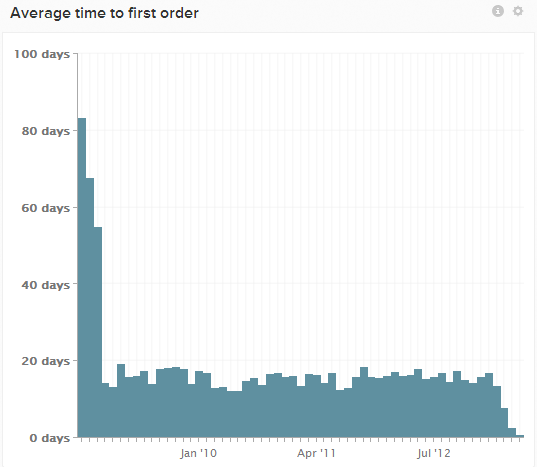

# 最初の購入までの平均時間レポート

多くのAdobeのお客様は、ユーザーのグループの登録日から最初の購入日までの平均時間を示す`Average time to first purchase`という名前の指標とグラフを使用しています。 データは、時間が現在に近づくにつれて、ほぼ常に下に傾きます。

これは、これらの新しい顧客が、結合日から1か月以上経過した購入履歴をまだ生成していないためです。 購入したことがない利用者は、（購入するまで）まったく含まれないため、新しい顧客グループでは平均的に下方に偏ります。

この指標を見る方法として、他にもいくつかの潜在的な方法があり、それがバイアスを引き起こします。 その一例をご紹介します。

## 例：最初の注文の`cohort`分析を実行する

`Users` ダッシュボードに`Time to first order cohort`という名前のグラフがある可能性があります。 このレポートでは、`Distinct buyers`指標を使用して、ユーザーを登録後`cohort`週間または数ヶ月でグループ化し、登録後の数週間または数ヶ月に最初の購入を行ったユーザーの比率（`0`から`1`の間）を表示します。

このグラフは、2014年12月に登録したユーザーについて、`0.56` （または`56%`）が最初の注文を2か月（例：2015年1月）までに行ったことを示す場合があります。

このコホート分析は、時間の経過に伴うユーザーのアクティブ化率を示す優れた指標です。 このグラフが平坦化または停滞し始め、それでも購入者へのコンバージョン率が100%に近くない場合は、メールキャンペーンで残りのユーザーをアクティブ化する時期が来ている可能性があります。
