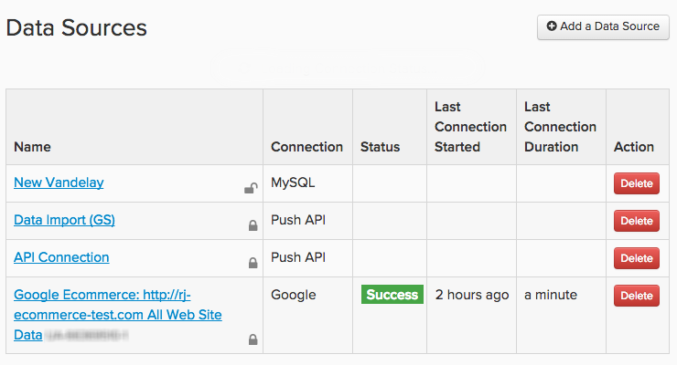

# データの接続

[!DNL Adobe Commerce Intelligence]では、データソースは`integrations`と呼ばれます。 `integration`が正常に接続されると、Data Warehouse Managerで同期できるテーブルを参照できるようになります。

統合は、`Connections` ページを使用して追加および管理されます。このページには、**[!UICONTROL Manage Data** > **Connections]**&#x200B;をクリックしてアクセスできます。 ここにあるのは、次のようになります。

* アカウントに接続されたすべての統合のリスト

* 統合タイプ

* ステータス （[!DNL Google Analytics]および[!DNL Data Import API]接続に空白のステータスフィールドがある）

* 接続テスト （`Last Connection Started`列）が最後に実行された時間

## 統合の種類

データを[!DNL Commerce Intelligence]に取り込む方法は4つあります。データベースへの接続、SaaS統合への接続、`.csv` ファイルのアップロード、Adobe APIの使用です。

## データベース統合

[!DNL Commerce Intelligence]は、[MySQL](../../importing-data/integrations/mysql-via-ssh-tunnel.md)、[Microsoft SQL](../integrations/microsoft-sql-server.md)、[MongoDB](../integrations/mongodb-via-ssh-tunnel.md)、[PostgreSQL](../integrations/postgresql.md)などのSQL ベースおよびNoSQL データベースをサポートしています。

データベースの資格情報を使用してデータベースを[!DNL Commerce Intelligence]に直接接続できますが、Adobeでは、SSH トンネルなどの実証済みの暗号化方式を使用することをお勧めします。 これにより、データがData Warehouseに取り込まれる際にも、データの安全性とセキュリティが確保されます。

接続方法やデータベースの種類によっては、設定を完了するために技術的な専門知識が必要になる場合があります。

## `SaaS`統合

spree-commerce-logo.png

`SaaS`統合は、[[!DNL Google Adwords]](../integrations/google-adwords.md)、[[!DNL Salesforce]](../integrations/salesforce.md)、[[!DNL Zendesk]](../integrations/zendesk.md)などのサービスです。 サードパーティデータはベンダーのサーバー上に存在するため、データベースのデータから直接アクセスすることはできません。

通常、[!DNL Commerce Intelligence]で統合を設定するのは、アカウントの資格情報を入力するだけと同じくらい簡単です。 一部のサービスでは、認証を完了するためにAPI キーが必要になる場合があります。 必要な資格情報を生成する手順については、[統合セクション &#x200B;](../integrations/integrations.md)を参照してください。

## ファイルのアップロード

補足ソースからData Warehouseにデータを取り込む方法がわかりませんか？ [`File Upload`機能](../connecting-data/using-file-uploader.md)を使用すると、日常的な意思決定に必要のないデータを取り込むことができます。 書式設定ルールに従って、`.csv`個のファイルをData Warehouseにすばやくアップロードし、他のデータソースと結合できます。

## [!DNL Commerce Intelligence] `Import API`

独自のソースからデータを自動的に取得する場合は、[!DNL Commerce Intelligence] `Import API`を使用できます。 基本的に、データベースまたは`SaaS`統合にない場合は、`Import API`関数が最適です。

APIを使用するには、少し技術的な専門知識が必要です。小さなRubyまたはPHP スクリプトの作成とメンテナンスに慣れている人は、資格を持っているだけではありません。

`Import API`の使用を開始する方法について詳しくは、[開発者サイト &#x200B;](https://developer.adobe.com/commerce/services/reporting/)および[API キーの生成方法](https://developer.adobe.com/commerce/services/reporting/import-api/)を参照してください。

## 統合の追加

統合を追加するには、**[!UICONTROL Manage Data** > **Connections]**&#x200B;をクリックし、**[!UICONTROL Add a New Data Source]**&#x200B;をクリックします。 追加する統合のアイコンをクリックし、ヘルプトピックの手順に従って設定します。

* [統合に関するFAQ](https://support.magento.com/hc/en-us/sections/360003161871-Integration-FAQ)
* [利用可能 &#x200B;](../integrations/integrations.md)
* [テーブルの統合](../../../best-practices/consolidating-your-tables.md)
* [データベースへのアクセスの制限](../../../administrator/account-management/restrict-db-access.md)

**必要な統合が表示されませんか？**&#x200B;一部の統合をアカウントに表示するには、アクティブ化する必要があります。 [!DNL Facebook]のようなものを探しているが、リストに記載されていない場合は、[&#x200B; サポートチケットを送信](https://experienceleague.adobe.com/docs/commerce-knowledge-base/kb/troubleshooting/miscellaneous/mbi-service-policies.html)してください。

**統合のエラーステータスが表示される場合**、[&#x200B; トラブルシューティングの節](https://support.magento.com/hc/en-us/sections/360003078151)を参照してヘルプを確認してください。

## 更新の正常性を監視する（オプション）

ソースを接続した後は、基本的なヘルスチェックを自動化して、完全な更新が完了していることを確認します。 開発者ドキュメントの[更新サイクルステータス API](https://developer.adobe.com/commerce/services/reporting/update-cycle-status-api/)を使用して、クライアントの最新の完了済み更新サイクルを取得し、内部ダッシュボードまたはアラートに表示します。
