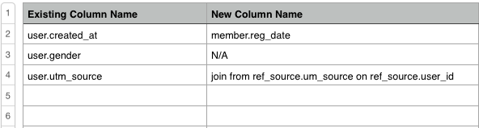

# データ移行

新しいデータベーススキーマ、サーバーまたはレポートデータベースへの移行は、ストレスを感じることなく行えます。 [[!DNL Adobe]  サービスチーム &#x200B;](https://experienceleague.adobe.com/docs/commerce-knowledge-base/kb/troubleshooting/miscellaneous/mbi-service-policies.html?lang=ja) が移行の支援を提供します。

移行をできる限りスムーズに行うには、移行リクエストを送信する際に、できるだけ詳しく説明する必要があります。 このトピックには、リクエストを送信し、移行を開始するために必要なすべてが含まれています。 お客様のニーズを包括的に把握することで、プロジェクトの範囲が適切に設定され、見積もりが正確になることを保証します。

## はじめに {#started}

開始する前に、次の質問に対する回答を知っておく必要があります。

* **新しいデータベースは新しいサーバーにありますか？** リクエストを送信する前に、**[!UICONTROL Manage Data** > **Connections]** でデータ接続の設定を更新します。 その方法について復習する必要がある場合は、[`Integrations`](../integrations/integrations.md) のセクションに移動して、使用しているデータベースの種類の説明を参照してください。

* **すべての履歴データは新しいデータベースに存在しますか、それとも移行する必要がありますか？** 移行プロセス中に履歴データと新しいデータを統合できます。 統合が必要ない場合でも、ご要望をお聞かせください。

上記の回答を得たら、移行のタイプを知る必要があります。 新しいデータベースには [`same`](#sameschema) スキーマがありますか、それとも [`different`](#newschema) スキーマがありますか。 以下のディスカッションでは、各移行タイプの詳細な手順を確認できます。

## 同じスキーマを持つ新しいデータベースへの移行 {#sameschema}

リクエストを送信する際に、データベーススキーマが変更されていないこと、接続が既に [!DNL Adobe Commerce Intelligence] で設定されていることを知らせてください。

データベースに新しい名前が付いている場合は、ダッシュボードを正しく移行できるように、リクエストに名前を含めます。

データベース名が変更されない場合、移行は完了です。 次回の完全更新が完了すると、ダッシュボードとレポートが更新されます。

## 異なるスキーマを持つ新しいデータベースへの移行 {#newschema}

>[!IMPORTANT]
>
>新しいデータベースで、特定のデータ列に同等の列がない場合、特定の分析がプロセスで失われる可能性があります。

このタイプの移行を正常に完了するには、既存のデータ列を新しいデータベース内の同等のデータ列と照合する必要があります。 これは必須ではありませんが、マッチングを行うことで、リクエストの応答時間を短縮し、移行の価格を下げることができます。

自分で照合することに不安がない場合は、次の手順に従って、完成したスプレッドシートを要求に添付します。

1. Data Warehouse（**[!UICONTROL Manage Data** > **Data Warehouse]**）と現在同期しているすべてのテーブルと列を確認します。

1. スプレッドシートで、新しいデータベースに移行するすべてのテーブルにタブを作成します。

1. 各タブで、移行する必要がある既存の列すべてに列を作成します。 Adobeでは、`Existing column name` のような名前を付けることをお勧めします。

1. また、スプレッドシートの各タブで、新しいデータベースの同等の列に対して別の列を作成する必要もあります。 Adobeでは、列に `New column name` のような名前を付けることをお勧めします。

1. 既存の列と同等の列を入力します。 既存の列に対応する新しい列がない場合は、`N/A` と入力します。

   また、新しいデータベースに同じ情報を計算する新しい方法がある場合は、[`New column name`] 列に入力します。

次に例を示します。

>[!NOTE]
>
>新しいデータベースで、特定のデータ列に同等の列がない場合、特定の分析がプロセスで失われる可能性があります。

## リクエストを送信するにはどうすればよいですか？ {#submitreq}

[&#x200B; サポートリクエストを送信 &#x200B;](https://experienceleague.adobe.com/docs/commerce-knowledge-base/kb/troubleshooting/miscellaneous/mbi-service-policies.html?lang=ja) いただくことで、当社にご連絡いただけます。

列に一致するスプレッドシートの作成について前の節の手順に従っている場合は、必ず添付してください。

## 次の手順 {#wrapup}

プロジェクトの対象範囲を特定するには、移行作業を行うCommerce サービスチームのアナリストと協力が必要です。 変更の複雑さとユーザーおよびアナリストの即応性は、移行にかかる時間に直接影響します。 詳細を絞り込むと、タイムラインが確立され、作業明細書と共に送信されます。
