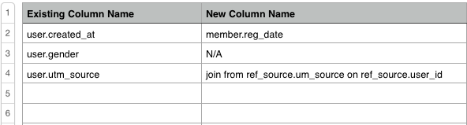

# データ移行

新しいデータベーススキーマ、サーバー、またはレポートデータベースへの移行にストレスを感じる必要はありません。 [[!DNL Adobe]  サービスチーム &#x200B;](https://experienceleague.adobe.com/docs/commerce-knowledge-base/kb/troubleshooting/miscellaneous/mbi-service-policies.html)は、移行支援を提供しています。

移行を可能な限りスムーズに行うために、移行リクエストを送信する際は、できるだけ詳細に説明する必要があります。 このトピックには、リクエストを送信して移行を開始するために必要なすべての情報が含まれています。 ニーズを包括的に把握することで、プロジェクトが適切に範囲を絞られ、見積もりが正確であることを保証できます。

## Adobe Experience Managerの導入方法 {#started}

まず、次の質問に対する回答を確認する必要があります。

* **新しいデータベースは新しいサーバー上にありますか？** リクエストを送信する前に、**[!UICONTROL Manage Data** > **Connections]**&#x200B;でデータ接続の設定を更新してください。 この方法に関するリフレッシュが必要な場合は、[`Integrations`](../integrations/integrations.md) セクションに移動し、使用しているデータベースの種類の手順を確認してください。

* **すべての履歴データは新しいデータベースに存在しますか？それとも移行する必要がありますか？**&#x200B;移行プロセス中に、履歴データと新しいデータを統合できます。 統合が必要ない場合でも、ご希望の方はお知らせください。

上記に対する回答を得たら、移行の種類を知る必要があります。 新しいデータベースには[`same`](#sameschema) スキーマがありますか、それとも[`different`](#newschema) スキーマがありますか？ 以下の説明では、各移行タイプの詳細な手順について説明します。

## 同じスキーマを持つ新しいデータベースへの移行 {#sameschema}

リクエストを送信する際に、データベーススキーマが変更されていないこと、および接続が既に[!DNL Adobe Commerce Intelligence]に設定されていることを知らせてください。

データベースに新しい名前がある場合は、ダッシュボードを適切に移行できるように、その名前をリクエストに含めます。

データベース名が変更されない場合は、移行が完了します。 次の完全な更新が完了すると、ダッシュボードとレポートが更新されます。

## 別のスキーマを持つ新しいデータベースへの移行 {#newschema}

>[!IMPORTANT]
>
>特定のデータ列が新しいデータベースに同等の列がない場合、プロセスで特定の分析が失われる可能性があります。

このタイプの移行を正常に完了するには、既存のデータ列を新しいデータベースの同等の列と一致させる必要があります。 これは必須ではありませんが、マッチングを実行することで、リクエストのターンアラウンドタイムを短縮し、移行の価格を下げることができます。

自分でマッチングを行うことに慣れている場合は、次の手順に従い、完成したスプレッドシートをリクエストに添付してください。

1. 現在Data Warehouse （**[!UICONTROL Manage Data** > **Data Warehouse]**）に同期しているすべてのテーブルと列を確認します。

1. スプレッドシートで、新しいデータベースに移行するテーブルごとにタブを作成します。

1. 各タブで、移行が必要なすべての既存の列の列を作成します。 Adobeでは、`Existing column name`のような名前を付けることをお勧めします。

1. また、スプレッドシートの各タブで、新しいデータベースの同等の列に対して別の列を作成する必要があります。 Adobeでは、列に`New column name`のような名前を付けることをお勧めします。

1. 既存の列と同等の列を入力します。 既存の列に新しい同等の列がない場合は、`N/A`と入力します。

   また、新しいデータベースに同じ情報を計算する新しい方法がある場合は、[`New column name`]列に入力します。

例を次に示します。

>[!NOTE]
>
>特定のデータ列が新しいデータベースに同等の列がない場合、プロセスで特定の分析が失われる可能性があります。

## 質問がある場合に？ {#submitreq}

[&#x200B; サポートリクエストを送信](https://experienceleague.adobe.com/docs/commerce-knowledge-base/kb/troubleshooting/miscellaneous/mbi-service-policies.html)することにより、当社に連絡できます。

前のセクションの手順に従って列に一致するスプレッドシートを作成する場合は、必ず添付してください。

## 次のステップ？ {#wrapup}

プロジェクトの範囲を決定するには、移行を実行するCommerce Services チームのアナリストと共同で作業する必要があります。 変更の複雑さと、ユーザーとアナリストの応答性は、移行にかかる時間に直接影響します。 詳細を明確にすることで、タイムラインが設定され、作業指示書とともに送付されます。
