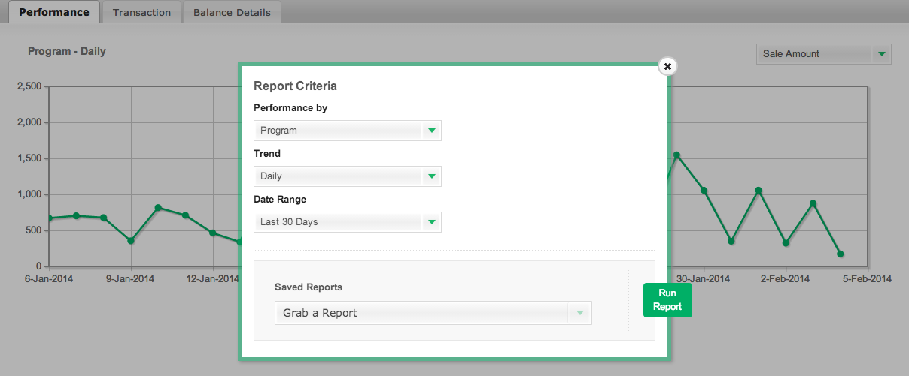

# [!DNL CJ Affiliate] データの読み込み

データ [!DNL CJ Affiliate (Commission Junction)][!DNL Adobe Commerce Intelligence] に読み込むには、次の手順に従い、結果のファイルを [ サポートチケット ](https://experienceleague.adobe.com/docs/commerce-knowledge-base/kb/troubleshooting/miscellaneous/mbi-service-policies.html) に添付します。 Adobeはアカウントにデータテーブルを設定し、ユーザーが引き続き個別にデータをアップロードできるようにします。

## [!DNL CJ Affiliate] データのエクスポート

1. [!DNL CJ Affiliate] アカウントで、「`Reports`」タブに移動します。

1. 「`Performance`」タブで、「`Report Options`」を選択します。

1. 「`Performance By`」を `Program` に、「`Trend`」を `Daily` に、「`Date Range`」を監査対象の日付範囲に設定します。

   <!--{:.zoom}-->

1. 「`Run Report`」を選択します。

1. `File Format` ドロップダウンで「`CSV`」を選択します。  「**[!UICONTROL Download]**」をクリックします。

   <!--{:.zoom}-->

1. ファイルをダウンロードしたら、[!DNL Commerce Intelligence] Data Warehouseに [ ファイルをアップロード ](../connecting-data/using-file-uploader.md) できます。

   これにより、[!DNL Commerce Intelligence] Data Warehouseにテーブルが作成され、新しいデータを引き続き定期的にアップロードできます。 ファイルをアップロードする場合は、[ ファイルアップローダの使用 ](../connecting-data/using-file-uploader.md) に記載されている書式設定要件に従います。
