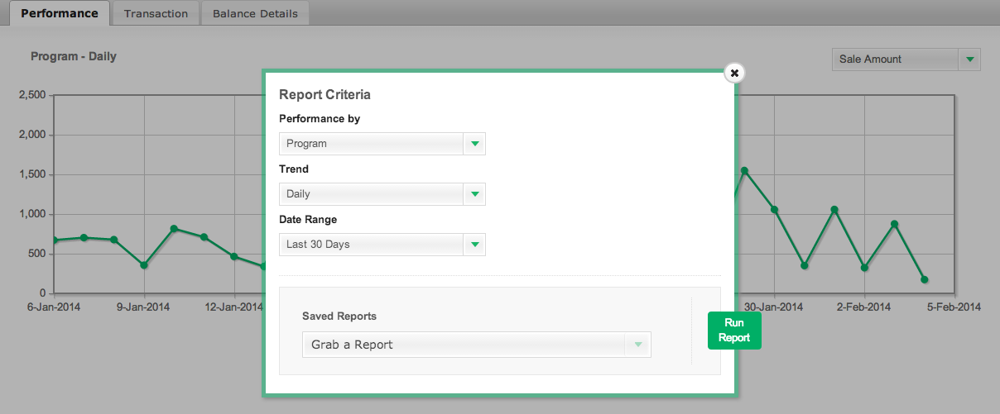

# [!DNL CJ Affiliate] データの読み込み

[!DNL CJ Affiliate (Commission Junction)] データを[!DNL Adobe Commerce Intelligence]に読み込むには、次の手順に従って、生成されたファイルを[&#x200B; サポートチケット &#x200B;](https://experienceleague.adobe.com/docs/commerce-knowledge-base/kb/troubleshooting/miscellaneous/mbi-service-policies.html)に添付するだけです。 Adobeは、アカウントのデータテーブルを設定し、引き続きデータを個別にアップロードできます。

## [!DNL CJ Affiliate] データの書き出し

1. [!DNL CJ Affiliate] アカウントで、「`Reports`」タブに移動します。

1. 「`Performance`」タブで、「`Report Options`」を選択します。

1. `Performance By`を`Program`に、`Trend`を`Daily`に、`Date Range`を監査中の日付範囲に設定します。

   <!--{:.zoom}-->

1. `Run Report`を選択します。

1. `File Format` ドロップダウンで、`CSV`を選択します。  **[!UICONTROL Download]**&#x200B;をクリックします。

   <!--{:.zoom}-->

1. ファイルをダウンロードしたら、[&#x200B; ファイル &#x200B;](../connecting-data/using-file-uploader.md)を[!DNL Commerce Intelligence] Data Warehouseにアップロードできます。

   これにより、[!DNL Commerce Intelligence] Data Warehouseにテーブルが作成され、定期的に新しいデータをアップロードし続けることができます。 ファイルをアップロードする場合は、[&#x200B; ファイルアップローダーの使用](../connecting-data/using-file-uploader.md)に記載されている書式要件に従います。
