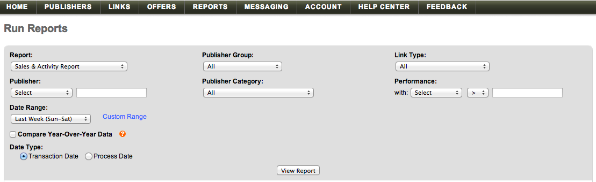

# [!DNL Linkshare] データの読み込み

[!DNL Linkshare] データを[!DNL Adobe Commerce Intelligence]に取り込むには、次の2つの操作を行う必要があります。

1. [でLinkshare データを書き出す ](#export)
1. [スプレッドシートを [!DNL Commerce Intelligence]にアップロード](../connecting-data/using-file-uploader.md)

## Linkshareからのデータのエクスポート {#export}

1. [!DNL Linkshare] アカウントで、**[!UICONTROL Reports** > **Run Reports]に移動します。**

1. `Report` ドロップダウンで、**[!UICONTROL Sales & Activity Report]**&#x200B;を選択します。

1. その他のドロップダウンオプションはすべてデフォルトの選択範囲のままにします。

1. `Date Range` ドロップダウンで、`Sun - Sat`の`Mon - Sun`設定と一致するオプション （`Start of Week`、[!DNL Commerce Intelligence]）を選択します。

1. 「`Compare Year-Over-Year Data`」チェックボックスをオフにします。

1. `Data Type`で、`Transaction Date`を選択します。

   

1. **[!UICONTROL View Report]**&#x200B;をクリックします。

1. **[!UICONTROL Download]**&#x200B;をクリックします。

   この時点で`.csv` ファイルがダウンロードされました。

ファイルをダウンロードしたら、[!DNL Commerce Intelligence]機能[`File Upload`を使用して](../connecting-data/using-file-uploader.md)にアップロードできます。
