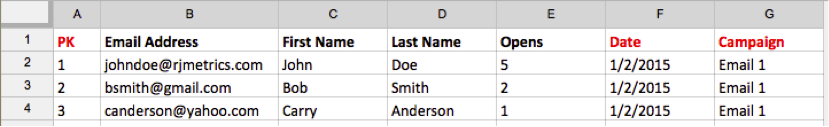
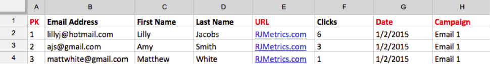

# インポート [!DNL Mailchimp] データ

キャンペーンの取り組みの包括的な状況を把握するには、 [!DNL Mailchimp] キャンペーンデータをメールで送る [!DNL Commerce Intelligence]. インポートを完了するには、それぞれに対して次の操作を実行する必要があります [!DNL Mailchimp] 以下のキャンペーンがあります。

## 開封数データを書き出し {#opens}

1. へのログイン後 [!DNL Mailchimp]、に移動します。 `Campaigns` タブをクリックします。

   

1. クリック **[!UICONTROL View Report]**（キャンペーン名の横）をクリックします。

   

1. 次をクリック： **[!UICONTROL Opened]** 数値。

   

1. クリック **[!UICONTROL Export]** をクリックし、 `.csv` ファイル。

   を追加する必要があります `primary key`, `date (mm/dd/yyyy)`、および `campaign name` 列をこのファイルに追加します。 次を確認します。 `primary keys` は、各行に固有です。

   

## クリック数データの書き出し {#clicks}

1. に戻ります。 `View Report` 画面を開きます。

1. 次の番号をクリックします。 `Clicked`.

   

1. 次のいずれかの数値をクリックします： `Total Clicks` または `Unique Clicks` 列。

   

1. クリック **[!UICONTROL Export]** をクリックし、 `.csv` ファイル。

   を追加する必要があります `Primary Key`, `date (mm/dd/yyyy)`, `campaign name`、および `URL` 列をこのファイルに追加します。 完全な URL を追加する必要はありません。何がクリックされたかを知らせる単なる手段です。

   

1. 電子メールでクリックした URL ごとに手順 3 と 4 を繰り返し、すべてのデータを同じに組み合わせます。 `.csv` ファイルを作成します。

## 送信済みデータの書き出し {#sent}

1. 次に進みます。 `Campaigns` タブ [!DNL Mailchimp].

1. クリック **[!UICONTROL View Report]** キャンペーン名の横に表示されます。

1. の横の数字をクリックします。 `Recipients`.

   

1. クリック **[!UICONTROL Export]** をクリックし、 `.csv` ファイル。

   を追加する必要があります `Primary Key`, `date (mm/dd/yyyy)`、および `campaign name` 列をこのファイルに追加します。

   

## へのアップロード用ファイルの準備 [!DNL Commerce Intelligence] {#upload}

各ファイル — `Opens`, `Clicks`、および `Sent`  — にアップロードする必要があります [!DNL Commerce Intelligence] を別のファイルとして指定します。 Adobeでは、次の命名規則を使用してファイルに名前を付けることをお勧めします。 `MailChimp\_ACTION\_DATE`. 置換 `ACTION` 次を使用 `Open`, `Click`または `Sent`、および `DATE` を、エクスポート日付と共に追加します。

ファイルをアップロードする準備が整ったら、 [`File Upload` 機能](../connecting-data/using-file-uploader.md) データをData Warehouseに取り込む
