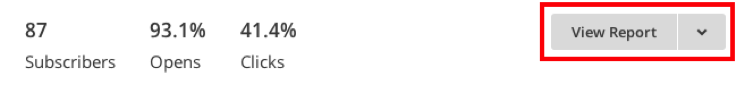
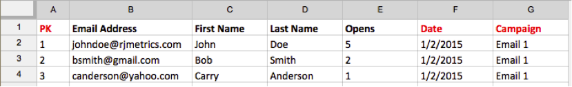
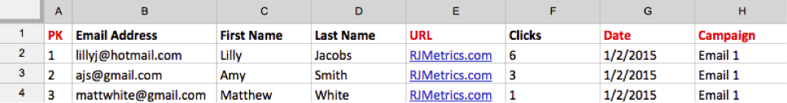
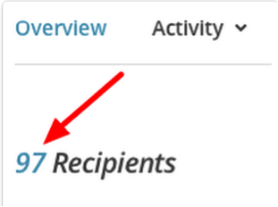
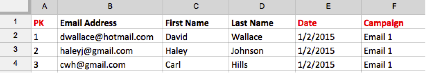

# [!DNL Mailchimp] データの読み込み

キャンペーン活動の全体像を把握するには、[!DNL Mailchimp]件の電子メールキャンペーンデータを[!DNL Commerce Intelligence]にインポートできます。 インポートを完了するには、お持ちの各[!DNL Mailchimp] キャンペーンに対して次の操作を行う必要があります。

## Export Opens data {#opens}

1. [!DNL Mailchimp]にログインしたら、「`Campaigns`」タブに移動します。

   のインポート

1. キャンペーン名の横にある「**[!UICONTROL View Report]**」をクリックします。

   のインポート

1. **[!UICONTROL Opened]**&#x200B;番号をクリックします。

   のインポート

1. **[!UICONTROL Export]**&#x200B;をクリックして、`.csv` ファイルを保存します。

   このファイルに`primary key`、`date (mm/dd/yyyy)`、`campaign name`列を追加する必要があります。 `primary keys`が各行に一意であることを確認してください。

   のインポート

## クリック数データの書き出し {#clicks}

1. キャンペーンの`View Report`画面に戻ります。

1. `Clicked`の番号をクリックします。

   のインポート

1. `Total Clicks`または`Unique Clicks`列の下にある番号のいずれかをクリックします。

   のインポート

1. **[!UICONTROL Export]**&#x200B;をクリックして、`.csv` ファイルを保存します。

   このファイルには、`Primary Key`、`date (mm/dd/yyyy)`、`campaign name`および`URL`列を追加する必要があります。 完全なURLを追加する必要はなく、クリックされた内容を知らせるだけです。

   のインポート

1. 電子メールでクリックされたURLごとに手順3と4を繰り返し、完了時にすべてのデータを同じ`.csv` ファイルに結合します。

## 送信したデータの書き出し {#sent}

1. [!DNL Mailchimp]の`Campaigns` タブに移動します。

1. キャンペーン名の横にある「**[!UICONTROL View Report]**」をクリックします。

1. `Recipients`の横にある数字をクリックします。

   のインポート

1. **[!UICONTROL Export]**&#x200B;をクリックして、`.csv` ファイルを保存します。

   このファイルに`Primary Key`、`date (mm/dd/yyyy)`、`campaign name`列を追加する必要があります。

   のインポート

## [!DNL Commerce Intelligence]にアップロードするファイルの準備 {#upload}

各ファイル （`Opens`、`Clicks`、`Sent`）は、個別のファイルとして[!DNL Commerce Intelligence]にアップロードする必要があります。 Adobeでは、この命名規則を使用してファイルに名前を付けることをお勧めします：`MailChimp\_ACTION\_DATE`。 `ACTION`を`Open`、`Click`または`Sent`に置き換え、`DATE`を書き出し日に置き換えます。

ファイルをアップロードする準備ができたら、[`File Upload`機能](../connecting-data/using-file-uploader.md)を使用してデータをData Warehouseに取り込みます。
