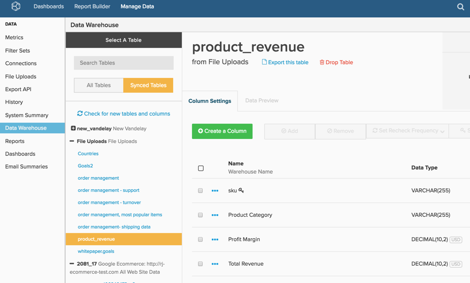

# ファイルアップローダの使用

>[!NOTE]
>
>[ 管理者権限 ](../../../administrator/user-management/user-management.md) が必要です。

[!DNL Adobe Commerce Intelligence] は、ビジュアライゼーション機能だけでなく、すべてのデータを 1 つのData Warehouseに配置する機能を提供するので強力です。 データベースや統合環境の外部にあるデータでも、Data Warehouse Manager のファイルのアップロードツールを使用して [!DNL Commerce Intelligence] に取り込むことができます。

広告キャンペーンを例として使用します。 オンラインとオフラインの両方のキャンペーンを実行している場合、オンライン統合のデータを分析するだけでは全体像を把握できません。 オフラインのキャンペーンデータを含んだスプレッドシートをアップロードすると、両方のデータセットを分析してキャンペーンのパフォーマンスをより堅牢に把握できます。

## 制限事項と要件 {#require}

1. **ファイルのアップロードでサポートされている形式は `CSV` または`comma separated values`** のみです。 Excel で作業している場合は、「名前を付けて保存」関数を使用してファイルを `.csv` 形式で保存できます。
1. **`CSV`ファイルは`UTF-8 encoding`** を使用する必要があります。 ほとんどの場合、これは問題ではありません。 ファイルのアップロード中にこのエラーが発生した場合は、[ こちらのサポート記事を参照 ](https://experienceleague.adobe.com/docs/commerce-knowledge-base/kb/troubleshooting/miscellaneous/resolving-utf-8-errors-for-csv-file-uploads.html)。
1. **ファイルは 100 MB 以下にする必要があります**。 ファイルのサイズがこのサイズより大きい場合は、テーブルをチャンクに分割して、個々のファイルとして保存します。 初期ファイルが読み込まれた後で、データを追加できます。
1. **すべてのテーブルには`primary key`** が必要です。 テーブルには、`primary key` として使用できる列か、テーブルの各行に対する一意の ID が少なくとも 1 つ必要です。 `primary key` として指定された列は、null *できません*。 `primary key` は、各行に数値を示す列を追加するのと同じくらい単純なものでも、2 つの列を連結して一意の値の列（`campaign name` や `date` など）にすることもできます。

   列（または列）が一意として指定されていて、重複がある場合、重複する行はインポートされません。

## アップロード用のデータのフォーマット {#formatting}

データを [!DNL Commerce Intelligence] にアップロードする前に、この節のガイドラインに従ってフォーマットされていることを確認してください。

### ヘッダー行 {#header}

列にラベルが付けられ、正しくインポートされるようにするには、スプレッドシートの最初の行が、各列のデータを説明するヘッダーであることを確認します。

列名は一意である必要があり、文字、数字、スペースおよび次の記号のみを含める：`$ % # /`。 列名にコンマが含まれている場合、ファイルをアップロードすると 2 つの列に分割されます。 Adobeまた、更新速度を最適化するために、ファイルの列数は 85 未満にすることをお勧めします。

### コンマを使用したデータ {#commas}

ファイルは `CSV` 形式にする必要があるので、コンマを使用すると、データのアップロードで問題が発生する可能性があります。 `CSV` ファイルでは、コンマを使用して新しい値を示します。したがって、`Campaigns` のような名前の列 `August`、1 つの列ではなく 2 つの列（`Campaigns` と `August`）として読み取られ、すべてのデータを 1 行に移動します。 Adobeでは、可能な限りコンマを避けることをお勧めします。 `Data Preview` を使用すると、更新が完了した後にデータが正しく表示されているかどうかを確認できます。

### 日付

日付を含むデータセットでは、[ 標準の日付形式 ](https://dev.mysql.com/doc/refman/5.7/en/datetime.html)`YYYY-MM-DD HH:MM:SS` または `MM/DD/YYYY` を使用する必要があります。

### 特殊文字

使用できない特殊文字があります。 例えば、パイプ記号 `& # 1 2 4` は列の作成として解釈され、ファイルのアップロード時にエラーが発生します。

### 10 進数

通貨の値のデータタイプ `Decimal Number` を選択する必要があります。これらの列は、Data Warehouseで自動的に小数点以下 2 桁に丸められます。 小数点以下の桁数を四捨五入しない場合やこれより精度が高い場合は、`Non-Currency Decimal Number` データタイプを選択する必要があります。

### 割合（%）

割合は小数で入力する必要があります。 例：

| **右：** | **間違った：** |
|-----|-----|
| `.05` | `5%` |
| `.23` | `23` |

{style="table-layout:auto"}

### 先頭または末尾に 0 がある値 {#zeroes}

ファイル内の一部の値（郵便番号や ID など）は、先頭または末尾がゼロの場合があります。 ゼロが適切に保持およびアップロードされるように、書式設定タイプを変更（たとえば [ 数値からテキスト ](https://support.microsoft.com/en-us/office/format-numbers-as-text-583160db-936b-4e52-bdff-6f1863518ba4?ui=en-us&rs=en-us&ad=us)）したり、数値の書式設定を適用したりできます。

数値の形式を変更する方法の例として、`US ZIP codes` を使用します。 [!DNL Excel] で、`ZIP codes` を含む列をハイライト表示し、[ 数値の形式を変更 ](https://support.microsoft.com/en-us/office/display-numbers-as-postal-codes-61b55c9f-6fe3-4e54-96ca-9e85c38a5a1d?ui=en-us&rs=en-us&ad=us) を `ZIP code` に変更します。 また、カスタムの数値形式を選択し、`Type` ウィンドウで `00000` と入力することもできます。 この方法では、一部のコードが `00000` 形式で書式設定され、その他のコードが `00000-0000` 形式の場合に問題が発生する可能性があることに注意してください。

`Type` は、ID などの他のデータタイプに対応するために [ 別の形式 ](https://support.microsoft.com/en-us/office/keeping-leading-zeros-and-large-numbers-1bf7b935-36e1-4985-842f-5dfa51f85fe7?correlationid=e1d4c2d3-cd5d-4a14-999d-437800274a90&ui=en-us&rs=en-us&ad=us) にすることができます。 例えば、`ID` の長さが 9 桁の場合、`Type` は `000000000` または `000-000-000` になります。 これは `123456` を `000-123-456` に変更します。

[!DNL Google Docs] と [!DNL Apple Numbers] のリソースについては、このページの下部にある [ 関連 ](#related) リストを参照してください。

## データのアップロード {#uploading}

スプレッドシートが正しく形式になり、使い [!DNL Commerce Intelligence] すくなったので、Data Warehouseに追加します。

1. 開始するには、**[!UICONTROL Data** > **File Uploads]** に移動してください。

1. 「**[!UICONTROL Upload to New Table]**」タブをクリックします。

1. 「**[!UICONTROL Choose File]**」をクリックしてファイルを選択します。 「**[!UICONTROL Open]**」をクリックしてアップロードを開始します。

   アップロードが完了すると、ファイル内の列のリスト [!DNL Commerce Intelligence] 表示されます。

1. 列名とデータタイプが正しいことを確認します。 特に、日付列が数値ではなく日付として読み取られていることを確認します。

   >[!NOTE]
   >
   >`datatype` は重要なので、この手順をスキップしないでください。

1. キーアイコンの下にあるチェックボックスを使用して、テーブルの `primary key` を構成する列を選択します（複数可）。

1. テーブルに名前を付けます。

1. 「**[!UICONTROL Save Table]**」をクリックします。

A *成功！テ* ブルを保存すると、メッセージが画面の上部に表示されます。

ビジュアルが必要な場合は、プロセス全体を見てみましょう。

アップロードされたテーブルは、Data Warehouse Manager のテーブルリストの **ファイルアップロード** セクションに表示されます（「すべてのテーブル」オプションと「同期されたテーブル」オプションの両方）。

## 既存のテーブルへのデータの更新または追加 {#appending}

既にアップロードしているファイルに、追加する新しいデータはありますか？ 問題なし – [!DNL Commerce Intelligence] でデータを簡単に更新および追加できます。

1. 開始するには、**[!UICONTROL Manage Data** > **File Uploads]** に移動してください。

1. 「既存のテーブルに **[!UICONTROL Edit/Upload `.csv`す]**」タブをクリックします。

1. ドロップダウンで、更新または追加するテーブルの名前をクリックします。

1. ドロップダウンを使用して、重複行を処理するためのオプションを選択します。

   | オプション | 説明 |
   |---|---|
   | `Overwrite old row with new row` | これにより、既存のテーブルと新しいファイルの両方のローに同じプライマリ・キーがある場合、既存のデータが新しいデータで上書きされます。 これは、時間の経過と共に値が変化する列（ステータス列など）に使用する方法です。 既存のデータが上書きされ、新しいデータで更新されます。 既存のテーブルにプライマリキーがない行が新しい行として追加されます。 |
   | `Retain old row; discard new row` | これにより、既存のテーブルと新しいファイルの両方で、行の主キーが同じ場合、新しいデータが無視されます。 |
   | `Purge all existing rows first and ignore duplicate keys within the file` | これにより、既存のデータがすべて削除され、ファイル内の新しいデータに置き換えられます。 このオプションは、既存のテーブルにデータが必要ない場合にのみ使用します。 |

1. 「**[!UICONTROL Choose File]**」をクリックしてファイルを選択します。

1. 「**[!UICONTROL Open]**」をクリックしてアップロードを開始します。

   アップロードが完了 [!DNL Commerce Intelligence] ると、ファイルのデータ構造が検証されます。 A *成功！テ* ブルを保存すると、メッセージが画面の上部に表示されます。

## データの可用性 {#availability}

計算列と同様に、ファイルのアップロードからのデータは、次の更新サイクルが完了した後で利用できます。 ファイルのアップロード中に更新が進行中の場合、次の更新が完了するまでデータを利用することはできません。 更新サイクルが完了したら、Data Warehouseの「`Data Preview`」タブに移動して、アップロードされたファイルが正しく、データが期待どおりに表示されていることを確認できます。

## まとめ {#wrapup}

このトピックでは、データの読み込みの使用に関する基本的な事項のみを説明しましたが、より高度な操作が必要な場合があります。 財務、e コマース、広告費用、その他のタイプのデータのフォーマット設定と読み込みに関するガイダンスについては、関連記事を参照してください。

また、ファイルのアップロードは、データを [!DNL Commerce Intelligence] に取り込む唯一の方法ではありません。 [Data Import API](https://developer.adobe.com/commerce/services/reporting/import-api/) 関数を使用すると、任意のデータを [!DNL Commerce Intelligence] Data Warehouseにプッシュできます。

## 関連 {#related}

* [財務データのフォーマットとインポート](../../../best-practices/format-import-financial-data.md)
* [オフライン/その他の広告費用データのインポート](../connecting-data/import-offline-ad-data.md)
* [予期される [!DNL Google ECommerce] データ](../integrations/google-ecommerce-data.md)

## サードパーティのリソース

* [ 数値データ形式ガイド ](http://www.dummies.com/how-to/content/how-to-choose-a-number-format-in-your-numbers-spre.html)
* [[!DNL Google Docs]  データ形式ガイド ](https://support.google.com/docs/answer/56470?hl=en)
