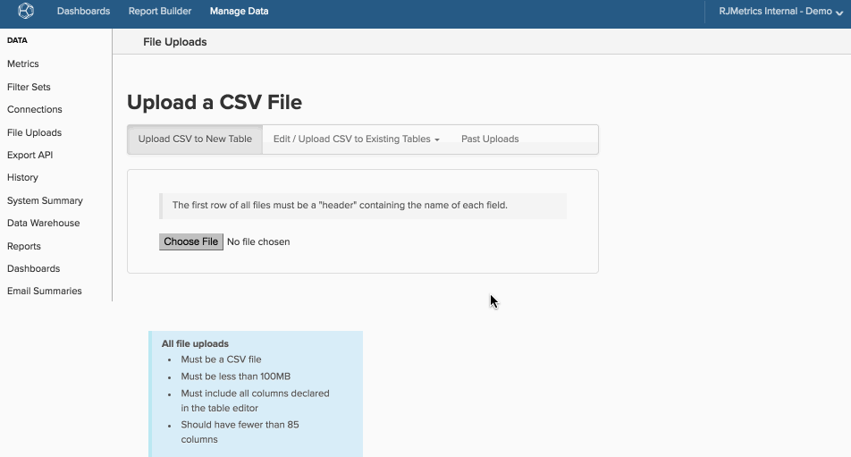
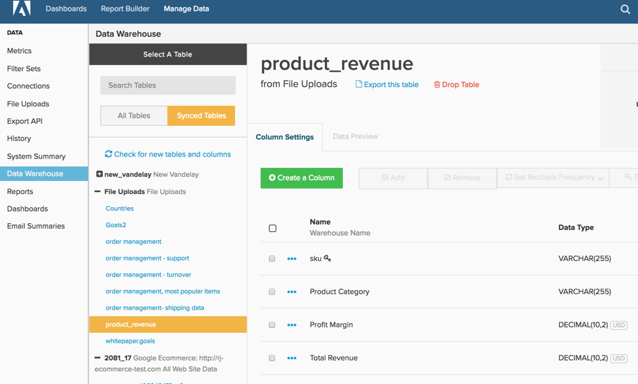

# ファイルアップローダーの使用

>[!NOTE]
>
>[管理者権限](../../../administrator/user-management/user-management.md)が必要です。

[!DNL Adobe Commerce Intelligence]は、ビジュアライゼーション機能だけでなく、あらゆるデータを1つのData Warehouseに統合できるため、強力です。 データベースや統合機能の外部にあるデータも、Data Warehouse Managerのファイル アップロード ツールを使用して[!DNL Commerce Intelligence]に取り込むことができます。

例えば、広告キャンペーンを考えてみましょう。 オンラインとオフラインの両方の施策を実施している場合、オンライン統合のデータを分析するだけでは、全体像を把握することはできません。 オフラインキャンペーンデータを使用してスプレッドシートをアップロードすると、両方のデータセットを分析し、キャンペーンのパフォーマンスをより詳細に把握できます。

## 制限と要件 {#require}

1. **ファイルのアップロードでサポートされている形式は`CSV`または`comma separated values`**&#x200B;のみです。 Excelで作業している場合は、「別名で保存」関数を使用して、ファイルを`.csv`形式で保存できます。
1. **`CSV`ファイルでは`UTF-8 encoding`**&#x200B;を使用する必要があります。 多くの場合、これは問題ではありません。 ファイルのアップロード中にこのエラーが発生した場合は、[このサポート記事](https://experienceleague.adobe.com/docs/commerce-knowledge-base/kb/troubleshooting/miscellaneous/resolving-utf-8-errors-for-csv-file-uploads.html?lang=ja)を参照してください。
1. **ファイルは100 MB**&#x200B;を超えることはできません。 ファイルがこれより大きい場合は、テーブルをチャンクに分割し、個別のファイルとして保存します。 最初のファイルを読み込んだ後でデータを追加できます。
1. **すべてのテーブルには`primary key`**&#x200B;が必要です。 テーブルには、`primary key`として使用できる列、またはテーブルの各行に一意の識別子が少なくとも1つ必要です。 `primary key`として指定されたすべての列は、*決して*&#x200B;をnullにすることはできません。 `primary key`は、各行に番号を付ける列を追加するのと同じくらい簡単です。または、2つの列を連結して一意の値の列を作成することもできます（例：`campaign name`と`date`）。

   列（または列）が一意として指定されているが、重複がある場合、重複した行は読み込まれません。

## アップロード用のデータの書式設定 {#formatting}

データを[!DNL Commerce Intelligence]にアップロードする前に、この節のガイドラインに従ってデータがフォーマットされていることを確認してください。

### ヘッダー行 {#header}

列が適切にラベル付けされ、読み込まれるようにするには、スプレッドシートの最初の行が、各列のデータを説明するヘッダーであることを確認します。

列名は一意で、文字、数字、スペース、およびこれらの記号のみを含める必要があります：`$ % # /`。 列名にコンマが含まれている場合、ファイルのアップロード時に2つの列に分割されます。 また、Adobeでは、更新速度を最適化するために、ファイル内に85列よりも少ない列を使用することをお勧めします。

### コンマ付きデータ {#commas}

ファイルは`CSV`形式である必要があるため、コンマを使用すると、データのアップロードに問題が発生する可能性があります。 `CSV` ファイルは新しい値を示すためにコンマを使用するため、`Campaigns`、`August`などの名前の列は、1行ではなく2列（`Campaigns`および`August`）として読み取られ、すべてのデータが1行に移動します。 Adobeでは、可能な限りコンマを避けることをお勧めします。 更新が完了すると、`Data Preview`を使用して、データが正しく表示されるかどうかを確認できます。

### 日付

日付を含むデータセットは、[標準日付形式](https://dev.mysql.com/doc/refman/5.7/en/datetime.html) `YYYY-MM-DD HH:MM:SS`または`MM/DD/YYYY`を使用する必要があります。

### 特殊文字

一部の特殊文字は使用できません。 例えば、パイプ記号`& # 1 2 4`は列の作成と解釈され、ファイルのアップロード時にエラーが発生します。

### 10進数

通貨値にはデータ型`Decimal Number`を選択する必要があり、これらの列はData Warehouseの小数点以下桁に自動的に丸められます。 10進数を丸めたくない場合、またはこれより大きい精度を使用する場合は、`Non-Currency Decimal Number` データタイプを選択する必要があります。

### 割合

パーセントは小数で入力してください。 例：

| **右：** | **間違っています：** |
|-----|-----|
| `.05` | `5%` |
| `.23` | `23` |

{style="table-layout:auto"}

### 先頭および末尾のゼロを含む値 {#zeroes}

ファイル内の一部の値（郵便番号やIDなど）は、ゼロで始まるか、ゼロで終わることがあります。 ゼロが適切に保持され、アップロードされるようにするには、書式設定の種類（[からテキスト &#x200B;](https://support.microsoft.com/en-us/office/format-numbers-as-text-583160db-936b-4e52-bdff-6f1863518ba4?ui=en-us&rs=en-us&ad=us)など）を変更するか、数値の書式設定を適用します。

数値の書式設定を変更する方法の例として、`US ZIP codes`を使用してください。 [!DNL Excel]で、`ZIP codes`と[を含む列を強調表示し、数値形式](https://support.microsoft.com/en-us/office/display-numbers-as-postal-codes-61b55c9f-6fe3-4e54-96ca-9e85c38a5a1d?ui=en-us&rs=en-us&ad=us)を`ZIP code`に変更します。 カスタム数値形式を選択し、`Type` ウィンドウに`00000`と入力します。 この方法では、一部のコードが`00000`形式で、他のコードが`00000-0000`形式の場合に問題が発生する可能性があることに注意してください。

`Type`は、IDなどの他のデータタイプ [に対応するために、](https://support.microsoft.com/en-us/office/keeping-leading-zeros-and-large-numbers-1bf7b935-36e1-4985-842f-5dfa51f85fe7?correlationid=e1d4c2d3-cd5d-4a14-999d-437800274a90&ui=en-us&rs=en-us&ad=us)異なる形式にすることができます。 例えば、`ID`が9桁の場合、`Type`は`000000000`または`000-000-000`になります。 これにより、`123456`が`000-123-456`に変更されます。

[!DNL Google Docs]および[!DNL Apple Numbers]のリソースについては、このページの下部にある[関連](#related)のリストを参照してください。

## データのアップロード {#uploading}

これで、スプレッドシートの形式が正しく、[!DNL Commerce Intelligence]に適したものになったので、Data Warehouseに追加します。

1. 開始するには、**[!UICONTROL Data** > **File Uploads]**&#x200B;に移動してください。

1. 「**[!UICONTROL Upload to New Table]**」タブをクリックします。

1. **[!UICONTROL Choose File]**&#x200B;をクリックし、ファイルを選択します。 **[!UICONTROL Open]**&#x200B;をクリックしてアップロードを開始します。

   アップロードが完了すると、ファイル内の列[!DNL Commerce Intelligence]のリストが表示されます。

1. 列名とデータタイプが正しいことを確認します。 具体的には、任意の日付列が数値ではなく日付として読み取られていることを確認します。

   >[!NOTE]
   >
   >`datatype`は重要なので、この手順をスキップしないでください。

1. キーアイコンの下にあるチェックボックスを使用して、テーブルの`primary key`を構成する列（または列）を選択します。

1. テーブルに名前を付けます。

1. **[!UICONTROL Save Table]**&#x200B;をクリックします。

*成功です！テーブルを保存すると、画面の上部に* メッセージが表示されます。

ビジュアルが必要な場合は、プロセス全体を確認しましょう。

アップロードされたテーブルは、Data Warehouse Managerのテーブルリストの「**ファイルアップロード**」セクション（すべてのテーブルおよび同期済みテーブルの両方）に表示されます。

## 既存のテーブルへのデータの更新または追加 {#appending}

既にアップロードしたファイルに追加する新しいデータはありますか？ 問題ありません – [!DNL Commerce Intelligence]のデータを簡単に更新および追加できます。

1. 開始するには、**[!UICONTROL Manage Data** > **File Uploads]**&#x200B;に移動してください。

1. 「**[!UICONTROL Edit/Upload `.csv`to Existing Tables]**」タブをクリックします。

1. ドロップダウンで、更新または追加するテーブルの名前をクリックします。

1. ドロップダウンを使用して、重複行を処理するオプションを選択します。

   | オプション | 説明 |
   |---|---|
   | `Overwrite old row with new row` | これにより、既存のテーブルと新しいファイルの両方に同じプライマリキーがある行の場合、既存のデータが新しいデータで上書きされます。 これは、時間の経過とともに値が変化する列（ステータス列など）に対して使用する方法です。 既存のデータが上書きされ、新しいデータで更新されます。 既存のテーブルにないプライマリキーを持つ行は、新しい行として追加されます。 |
   | `Retain old row; discard new row` | これにより、既存のテーブルと新しいファイルの両方に同じプライマリキーがある行の場合、新しいデータは無視されます。 |
   | `Purge all existing rows first and ignore duplicate keys within the file` | これにより、既存のデータが削除され、ファイルの新しいデータに置き換えられます。 このオプションは、既存のテーブルのデータが必要ない場合にのみ使用します。 |

1. **[!UICONTROL Choose File]**&#x200B;をクリックし、ファイルを選択します。

1. **[!UICONTROL Open]**&#x200B;をクリックしてアップロードを開始します。

   アップロードが完了すると、[!DNL Commerce Intelligence]はファイル内のデータ構造を検証します。 *成功です！テーブルを保存すると、画面の上部に* メッセージが表示されます。

## データの可用性 {#availability}

計算列と同様に、ファイルアップロードのデータは、次の更新サイクルの完了後に使用できます。 ファイルのアップロード中にアップデートが進行中だった場合、データは次のアップデートの後まで利用できません。 更新サイクルが完了したら、Data Warehouseの「`Data Preview`」タブに移動して、ファイルが正しくアップロードされ、データが期待どおりに表示されていることを確認できます。

## まとめ {#wrapup}

このトピックでは、データの読み込みを使用するための基本のみを説明しましたが、より高度な処理が必要な場合があります。 財務、e コマース、広告費、その他の種類のデータの形式と読み込みに関するガイダンスについては、関連する記事を参照してください。

また、データを[!DNL Commerce Intelligence]に取り込む方法は、ファイルのアップロードだけではありません。 [Data Import API](https://developer.adobe.com/commerce/services/reporting/import-api/)関数を使用すると、任意のデータを[!DNL Commerce Intelligence] Data Warehouseにプッシュできます。

## 関連 {#related}

* [金融データのフォーマットとインポート](../../../best-practices/format-import-financial-data.md)
* [オフライン/その他の広告費データのインポート](../connecting-data/import-offline-ad-data.md)
* [[!DNL Google ECommerce] データが必要です](../integrations/google-ecommerce-data.md)

## サードパーティリソース

* [[!DNL Google Docs]  データ形式ガイド &#x200B;](https://support.google.com/docs/answer/56470?hl=en)
