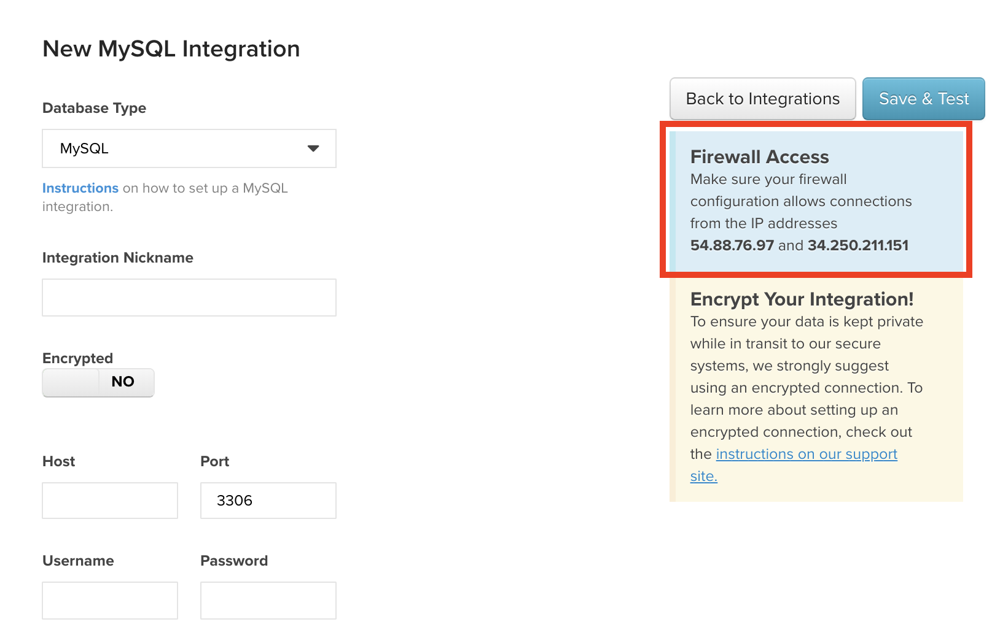

# [!DNL Amazon RDS]を接続

[!DNL Amazon Relational Database Services (RDS)]は、おそらく既に使い慣れているデータベース エンジン上で実行されるマネージド データベース サービスです。

* [[!DNL MySQL]](../integrations/mysql-via-a-direct-connection.md)
* [[!DNL Microsoft SQL]](../integrations/microsoft-sql-server.md)
* [[!DNL PostgreSQL]](../integrations/postgresql.md)

[!DNL RDS] インスタンスを接続する手順は、使用するデータベースの種類と、暗号化された接続（[`SSH tunnel for MySQL`](../integrations/mysql-via-ssh-tunnel.md)など）を使用しているかどうかに応じて異なりますが、基本的な手順は次のとおりです。

## [!DNL Commerce Intelligence]にデータベースへのアクセスを許可

各データベースの資格情報ページ （**[!UICONTROL Manage Data** > **Integrations]**）に、R[!DNL RDS]を[!DNL Commerce Intelligence]に接続するために認証する必要があるIP アドレスを含むボックスが表示されます：`54.88.76.97`と`34.250.211.151`。 ここでは、IP アドレスボックスを強調表示した`MySQL credentials` ページを見ていきます。

[!DNL Commerce Intelligence]が[!DNL RDS] インスタンスに正常に接続するには、これらのIP アドレスをAWS管理コンソールを使用して適切なデータベースセキュリティグループに追加する必要があります。 これらのIP アドレスは、既存のグループに追加することも、グループを作成することもできます。重要なことは、グループが[!DNL Commerce Intelligence]に接続するインスタンスへのアクセスを許可されていることです。

[!DNL Commerce Intelligence]個のIP アドレスを追加する場合は、正確なIP アドレスであることを`/32`に示すために、アドレスの末尾に[!DNL Amazon]を追加してください。 心配しないでください。AWSのインターフェイスは、これが必要であることを明確にしています。

## `Linux`の[!DNL Commerce Intelligence] ユーザーを作成 {#linux}

>[!NOTE]
>
>この手順は、暗号化された接続を使用している場合にのみ必要です。 この方法の手順については、使用しているデータベースのセットアップ トピック（例：MySQL）を参照してください。 `Linux` ユーザーは、インターネット経由でデータを送信する最も安全な方法である`SSH tunnel`を作成できます。

## [!DNL Commerce Intelligence]のデータベースユーザーを作成

これは、使用するデータベースによって手順が異なるプロセスの一部です。 しかし、考え方は同じですが、データベースへのアクセスに使用される[!DNL Commerce Intelligence]のユーザーを作成します。 データベース [!DNL Commerce Intelligence] ユーザーの作成手順については、使用しているデータベースのセットアップ トピックを参照してください。

## 接続情報を[!DNL Commerce Intelligence]に入力

インスタンスへの[!DNL Commerce Intelligence] アクセスを許可し、ユーザーを作成した後、最後に行う必要があるのは、接続情報を[!DNL Commerce Intelligence]に入力することです。

`MySQL`、`Microsoft SQL`および`PostgreSQL`の資格情報ページには、`Integrations`をクリックして&#x200B;**[!UICONTROL Manage Data** > **Integrations]** ページ （**[!UICONTROL Add Integration]**）からアクセスできます。 統合のリストが表示されたら、使用しているデータベースのアイコンをクリックして、資格情報ページに移動します。 現在、必要な統合機能にアクセスできない場合は、Adobe アカウントチームにお問い合わせください。

接続の作成を完了するには、次の情報が必要です。

* RDS インスタンスの公開アドレス：[!DNL AWS]管理コンソールで確認できます。
* データベースインスタンスが使用するポート：一部のデータベースにはデフォルトのポートがあり、`Port` フィールドに自動的に入力されます。 この情報は、データベースの設定ドキュメントにも記載されています。
* [!DNL Commerce Intelligence]用に作成したユーザーのユーザー名とパスワード。

暗号化された接続を使用している場合は、データベース資格情報ページの`Encrypted` トグルを`Yes`に変更します。 これにより、暗号化を設定するための追加フォームが表示されます。

暗号化が有効になっている

