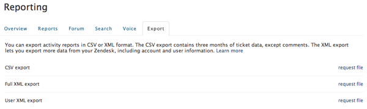

# Zendesk データを監査

あなたの中に何か奇妙なものが見つかりました [[!DNL Zendesk] データ](../integrations/exp-zendesk-data.md)? 問題を特定するには、データを調査する必要があります。 これは、 [!DNL Zendesk] データをダウンロード可能なファイルに書き出します。

## データエクスポートの有効化

データの書き出しは、現在、すべてに対して有効になっていません [!DNL Zendesk] アカウント。 この機能を有効にするには、 [サポートチケットを提出する](https://experienceleague.adobe.com/docs/commerce-knowledge-base/kb/troubleshooting/miscellaneous/mbi-service-policies.html)で、 [!DNL Zendesk] サブドメイン名。

>[!NOTE]
>
>のみ `Enterprise` および `Plus` プランは現在、この機能にアクセスできます。

データのエクスポートを有効にすると、特定の電子メールドメインの管理者のみが、 [!DNL Zendesk] アカウント この E メールドメインは通常、 [!DNL Zendesk]. アカウント所有者の E メールドメインがデフォルトとして使用されますが、必要に応じてドメインを変更できます。

## ダウンロード可能ファイルへの書き出し

1. サイドバーの管理者アイコン（歯車のロゴ）をクリックし、 **[!UICONTROL Manage** > **Reports]**.
1. 次をクリック： **[!UICONTROL Export]** タブをクリックします。
1. クリック **[!UICONTROL Request file]** をクリックします。

   この時点で、ビルドが開始されます。完了時に電子メールで通知が届きます。
   

1. 電子メール通知のリンクをクリックして、レポートを含む zip ファイルをダウンロードします。

   このダウンロードリンクは 3 日以上有効です。

このプロセスは、現在の [!DNL Zendesk] チケットデータ（コメント付き）、ユーザーデータ、アカウントデータを含むアカウント。 この時点で、次の操作を実行できます。 [サポートチケットを提出する](https://experienceleague.adobe.com/docs/commerce-knowledge-base/kb/troubleshooting/miscellaneous/mbi-service-policies.html) （このファイルを必ず添付してください。） データを詳しく見てみましょう ファイルが大きすぎる場合は、 [!DNL Commerce Intelligence] チーム経由で [!DNL Dropbox] または [!DNL Google Drive].

詳しくは、 [!DNL Zendesk] ファイルのエクスポート（公式を参照） [[!DNL Zendesk] 書き出しドキュメント](https://support.zendesk.com/hc/en-us/articles/4408886165402-Exporting-data-to-a-JSON-CSV-or-XML-file).
