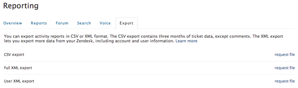

# Zendesk データの監査

[[!DNL Zendesk]  データ &#x200B;](../integrations/exp-zendesk-data.md)で何か変なものを見つけましたか？ 課題を特定するには、データを分析する必要があります。 これは、[!DNL Zendesk] データをダウンロード可能なファイルに書き出すことによって実行できます。

## データ書き出しの有効化

データの書き出しは、現在[!DNL Zendesk] アカウントすべてに対して有効になっていません。 この機能を有効にするには、[&#x200B; サポートチケット &#x200B;](https://experienceleague.adobe.com/docs/commerce-knowledge-base/kb/troubleshooting/miscellaneous/mbi-service-policies.html)を送信し、[!DNL Zendesk] サブドメイン名を指定します。

>[!NOTE]
>
>現在、`Enterprise`と`Plus`のプランのみがこの機能にアクセスできます。

データの書き出しが有効になると、特定の電子メールドメインの管理者のみが[!DNL Zendesk] アカウントからデータを書き出すことができます。 この電子メールドメインは、通常、[!DNL Zendesk]と同じ電子メールドメインです。 アカウント所有者のメールドメインがデフォルトとして使用されますが、必要に応じてドメインを変更できます。

## ダウンロード可能なファイルへのエクスポート

1. サイドバーの管理アイコン （歯車のロゴ）をクリックし、**[!UICONTROL Manage** > **Reports]**&#x200B;を選択します。
1. 「**[!UICONTROL Export]**」タブをクリックします。
1. 次の画像に示すように、「**[!UICONTROL Request file]**」をクリックして、完全XML書き出しをクリックします。

   この時点でビルドが開始され、完了するとメールで通知されます。
   

1. メール通知のリンクをクリックして、レポートを含むzip ファイルをダウンロードします。

   このダウンロードリンクは少なくとも3日間有効です。

このプロセスでは、現在の[!DNL Zendesk] アカウントに保存されているすべての情報（コメント付き）、ユーザーデータ、アカウントデータを含むXML ファイルを作成します。 この時点で、[&#x200B; サポートチケット &#x200B;](https://experienceleague.adobe.com/docs/commerce-knowledge-base/kb/troubleshooting/miscellaneous/mbi-service-policies.html)を送信できます（このファイルを添付してください）。 そのため、データを詳しく見てみましょう。 ファイルが大きすぎる場合は、[!DNL Dropbox]または[!DNL Google Drive]を介して[!DNL Commerce Intelligence] チームと共有します。

[!DNL Zendesk] ファイルの書き出しについて詳しくは、公式の[[!DNL Zendesk] 書き出しドキュメント &#x200B;](https://support.zendesk.com/hc/en-us/articles/4408886165402-Exporting-data-to-a-JSON-CSV-or-XML-file)を参照してください。
