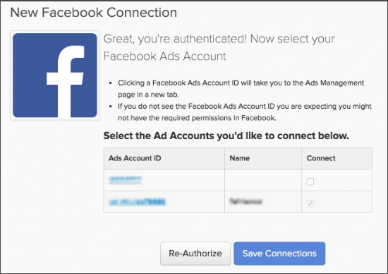

# [!DNL Facebook Ads]を接続

>[!NOTE]
>
>[管理者権限](../../../administrator/user-management/user-management.md)が必要です。

調査を行い、広告を作成し、[!DNL Facebook]にキャンペーンを開始しました。 広告費のデータを分析し、そのお金が効果的に使われているかどうかを確認する必要があります。 広告費データを使用すると、キャンペーンから獲得したユーザーの広告コストと顧客生涯価値（CLV） [を組み合わせることで、](../../../data-analyst/analysis/roi-ad-camp.md) キャンペーン ROIを測定できます。

[!DNL Facebook Ad] データを[!DNL Commerce Intelligence]に接続するには、次の簡単な3 ステップの手順を実行します。

1. [&#x200B; [!DNL Facebook] を [!DNL Commerce Intelligence]のデータソースとして追加](#stepone)
1. [&#x200B; [!DNL Commerce Intelligence]  データへの [!DNL Facebook Ads]  アクセスを許可する](#steptwo)
1. [データを引き出す [!DNL Facebook Ads]  アカウントを選択](#stepthree)

## [!DNL Facebook]を[!DNL Commerce Intelligence]のデータソースとして追加 {#stepone}

1. [!DNL Facebook]統合を[!DNL Commerce Intelligence] アカウントに追加するには、`Connections`の下の&#x200B;**[!UICONTROL Manage Data** > **Integrations]** ページに移動します。
1. 右側にある「**[!UICONTROL Add Integration]**」をクリックします。
1. [!DNL Facebook] アイコンをクリックします。 これにより、[!DNL Facebook]認証ページが表示されます。
1. **[!UICONTROL Authorize]**&#x200B;をクリックします。

## [!DNL Commerce Intelligence] データへの[!DNL Facebook Ads] アクセスを許可する {#steptwo}

**[!DNL Facebook Authorize]**&#x200B;をクリックすると、小さなポップアップウィンドウが表示されます。

Commerce IntelligenceFacebook アクセス権限ダイアログ

次の一連の手順に従って、[!DNL Commerce Intelligence]がパブリック プロファイル、[!DNL Facebook Ads]および関連する統計からデータにアクセスできるようにします。 続行するには、次の手順で&#x200B;**[!UICONTROL OK]**&#x200B;をクリックします。

## データを取得する[!DNL Facebook Ads] アカウントを選択 {#stepthree}

1. 認証が完了すると、データを取得する[!DNL Facebook Ads] アカウントを選択するように求められます。 `Connect`列のチェックボックスをクリックして、目的のアカウントを選択します。

   

1. **[!UICONTROL Save Connections]**&#x200B;をクリックします。

   接続が成功した場合、*接続が成功しました。* メッセージがページの上部に表示されます。

## 次のステップ？ {#next}

[!DNL Facebook]で[!DNL Google Analytics]件のキャンペーンを追跡していることを確認してください。 これにより、`utm\_campaign`の[!DNL Google Analytics] フィールドが[!DNL Facebook] キャンペーン用に正しく入力されます。

## 関連

* [統合を再認証しています](https://experienceleague.adobe.com/docs/commerce-knowledge-base/kb/how-to/mbi-reauthenticating-integrations.html)
* [&#x200B; [!DNL Google Adwords]  アカウントを接続](../integrations/google-ecommerce.md)
* [&#x200B; [!DNL Google eCommerce]経由で注文の紹介ソースを追跡](../integrations/google-ecommerce.md)
* [データベース内のユーザー紹介ソースの追跡](../../analysis/google-track-user-acq.md)
* [データベース内のユーザーデバイス、ブラウザー、OS データの追跡](../../analysis/track-usr-dev-browser.md)
* [最も価値のある獲得ソースとチャネルの発見](../../analysis/most-value-source-channel.md)
* [広告キャンペーンのROIを高める](../../analysis/roi-ad-camp.md)
* [&#x200B; [!DNL Google Analytics] UTM アトリビューションの仕組み](../../analysis/utm-attributes.md)
