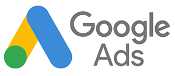

# [!DNL Google Adwords]を接続

>[!NOTE]
>
>[管理者権限](../../../administrator/user-management/user-management.md)が必要です。

調査を行い、広告を作成し、[!DNL Google] キャンペーンを開始しました。 広告費のデータを分析し、そのお金が効果的に使われているかどうかを確認する必要があります。 広告費データを使用すると、キャンペーンから獲得したユーザーの広告コストと顧客生涯価値（CLV） [を組み合わせることで、](../../analysis/roi-ad-camp.md) キャンペーン ROIを測定できます。

[!DNL Google Adwords]資格情報を[!DNL Commerce Intelligence]に入力して開始します。

1. `Connections` データの管理/統合&#x200B;**の下の** ページに移動します。
1. 画面の右上にある「**統合を追加**」をクリックします。
1. **[!DNL Google Adwords]** アイコンをクリックします。 これにより、[!DNL Google Adwords]資格情報ページが開きます。
1. [!DNL Google Analytics]資格情報を入力してください。 認証プロセスが完了すると、次の場所にリダイレクトされます：[!DNL Commerce Intelligence]。
1. プロファイル IDのリストが表示されます。 [!DNL Commerce Intelligence]に接続するプロファイルを確認してください。

   プロファイルの選択内容を表示する

1. 変更は自動的に保存されるので、完了したら&#x200B;**[!UICONTROL Back to Connections]**&#x200B;をクリックします。

複数のプロファイルがあり、そのプロファイルを特定するヘルプが必要な場合は、以下の「`Connecting Multiple Google Analytics profiles`」セクションを参照してください。

## 複数の[!DNL Google Analytics] プロファイルを接続しています

1つの[!DNL Google Analytics] アカウントに複数のWeb サイトを接続している可能性があります。各Web サイトは、独自の[!DNL Google Analytics] プロファイル IDで識別されます。 この場合、すべてのプロファイル IDを[!DNL Commerce Intelligence]に含めるオプションがあります。 プロファイル選択手順に含めるプロファイル IDを確認します。

**特定のweb サイトのGoogle Analytics プロファイル IDを識別するには：**

1. [!DNL Google Analytics]にログイン
1. 特定のweb サイトの[!DNL Google Analytics] ダッシュボードに移動
1. URLを見てください – プロファイル IDは、行の末尾にある`p`に続く8つの数字に対応しています。

   `www.google.com/analytics/web/#home/a11345062w43527078p**XXXXXXXX**`

## [!DNL Google Adwords]の接続を切断しています

1. [!DNL Google] [&#x200B; アカウント設定](https://www.google.com/account/about/?hl=en) ページにアクセスします。
1. `Security` セクションで、**[!UICONTROL edit]**&#x200B;個のアプリケーションとサイトの横にある`Authorizing`をクリックします。
1. **[!UICONTROL revoke access]**&#x200B;をクリックします。

## 関連

* [統合を再認証しています](https://experienceleague.adobe.com/docs/commerce-knowledge-base/kb/how-to/mbi-reauthenticating-integrations.html?lang=ja)
* [&#x200B; [!DNL Google ECommerce]経由で注文の紹介ソースを追跡](../integrations/google-ecommerce.md)
* [データベース内のユーザー紹介ソースの追跡](../../analysis/google-track-user-acq.md)
* [最も価値のある獲得ソースとチャネルの発見](../../analysis/most-value-source-channel.md)
* [広告キャンペーンのROIを高める](../../analysis/roi-ad-camp.md)
* [&#x200B; [!DNL Google Analytics] UTM アトリビューションの仕組み](../../analysis/utm-attributes.md)
