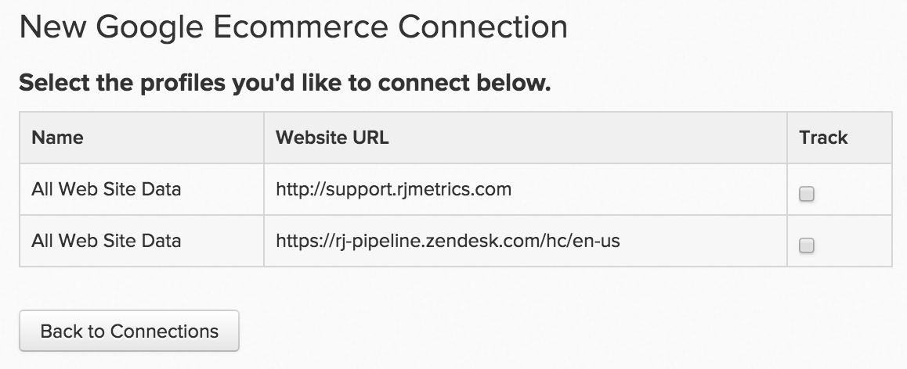

# [!DNL Google ECommerce]を接続

>[!NOTE]
>
>[管理者権限](../../../administrator/user-management/user-management.md)が必要です。

トラフィックと注文が常に発生しているため、顧客に効果的にリーチし、獲得することができます。 しかし、最も価値のある紹介チャネルは何でしょうか？ あるソースから取得した顧客と別のソースから取得した顧客の平均生涯価値は何ですか？ [!DNL Google ECommerce]から[!DNL Commerce Intelligence]までの注文紹介ソースデータを接続することで、[最も価値のあるマーケティングチャネル ](../../../data-analyst/analysis/most-value-source-channel.md)を特定するのに役立つ分析を作成できます。

[!DNL Google ECommerce]資格情報を[!DNL Commerce Intelligence]に入力して開始します。

1. `Connections`の下の&#x200B;**[!UICONTROL Admin** > **Connections]** ページに移動します。

1. **[!UICONTROL Add a New Source]** テーブルの上の画面の右側にある「`Data Sources`」をクリックします。

1. [!DNL Google ECommerce] アイコンをクリックします。 これにより、[!DNL Google ECommerce]資格情報ページが開きます。

1. [!DNL Google Analytics]資格情報を入力してください。 認証プロセスが完了すると、次の場所にリダイレクトされます：[!DNL Commerce Intelligence]。

1. プロファイル IDのリストが表示されます。 [!DNL Commerce Intelligence]に接続するプロファイルを確認してください。

   複数のプロファイルがあり、そのプロファイルを特定するヘルプが必要な場合は、以下の「[!DNL Google Analytics] プロファイルを複数**接続」セクションを参照してください。

   <!--{: width="500"}-->

1. 変更は自動的に保存されるので、完了したら&#x200B;**[!UICONTROL Back to Connections]**&#x200B;をクリックします。

## 複数の[!DNL Google Analytics] プロファイルを[!DNL Commerce Intelligence]に接続しています

1つの[!DNL Google Analytics] アカウントに複数のWeb サイトを接続している可能性があります。各Web サイトは、独自の[!DNL Google Analytics] プロファイル IDで識別されます。 この場合、すべてのプロファイル IDを[!DNL Commerce Intelligence]に含めるオプションがあります。 プロファイル選択手順に含めるプロファイル IDを確認します。

特定のweb サイトの[!DNL Google Analytics] プロファイル IDを識別するには：

1. [!DNL Google Analytics]にログインします。
1. 特定のweb サイトの[!DNL Google Analytics] ダッシュボードに移動します。
1. URLを見てください – プロファイル IDは、行の末尾にある`p`に続く8つの数字に対応しています。

   `www.google.com/analytics/web/#home/a11345062w43527078p**XXXXXXXX**/`

## [!DNL Google ECommerce]を[!DNL Commerce Intelligence]から切断しています {#disconnect}

1. [!DNL Google Analytics] [ アカウント設定](https://www.google.com/account/about/?hl=en) ページにアクセスします。
1. `Security` セクションで、**[!UICONTROL edit]**&#x200B;個のアプリケーションとサイトの横にある`Authorizing`をクリックします。
1. **[!UICONTROL revoke access]**&#x200B;の横にある[!DNL Commerce Intelligence]をクリックします。

## 関連：

* [期待される [!DNL Google ECommerce]  データ](../integrations/google-ecommerce-data.md)
* [統合を再認証しています](https://experienceleague.adobe.com/docs/commerce-knowledge-base/kb/how-to/mbi-reauthenticating-integrations.html)
* [ セットアップ  [!DNL Google ECommerce]  トラッキング ](https://support.google.com/analytics/answer/1009612?hl=en)
* [最も価値のある獲得ソースとチャネルの発見](../../analysis/most-value-source-channel.md)
* [広告キャンペーンのROIを高める](../../analysis/roi-ad-camp.md)
