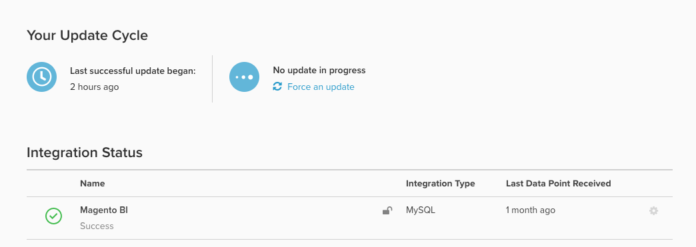

# データベース結果と[!DNL SQL Editor]結果の比較

`Last successful update began` ページ内の`Integrations` フィールドの内容に興味がある場合があります。

## `timestamp` フィールドについて

アカウントの`timestamp`最後に成功した更新サイクル _の開始_ （アカウントに設定されたタイムゾーン）が表示されます。

- 同期されたテーブルのいずれかが、前回の更新サイクル中に問題が発生した場合、このタイムスタンプは&#x200B;*更新されません*。
- そのため、新しいデータでレポートが更新された場合もありますが、*最後に正常に更新が開始された*&#x200B;はまだ遅れています。

## 最後の「実際の」データポイントの特定

特定の統合の最新のデータポイントは、各統合の右側にある`Last Data Point Received` タイムスタンプによって決まります。 このタイムスタンプとは、データベース、API、サードパーティ統合など、Data Warehouseがそのソースからデータポイントを正常に受信した最後の時点を指します。

*特定のテーブル*&#x200B;のデータの鮮度を確認するには、Adobeでは、アカウントの最も重要なテーブルで[[!DNL SQL] を実行する簡単な](../../dev-reports/sql-rpt-bldr.md) レポート `MAX(timestamp)`を作成することをお勧めします。 このタイムスタンプを`Last Data Point`と比較すると、問題がアカウント全体またはテーブルのサブセットに影響を与えたかどうかを示します。 Adobeでは、3つから4つの重要な一般的に使用されるテーブルに対して行うことをお勧めします。

- `MAX(timestamp)`の値が`Last Data Point Received`より新しい場合、テーブルのサブセットが影響を受けましたが、アカウント全体の更新サイクルは安定しています。
- `MAX(timestamp)`の値が`Last Data Point Received`以前の場合、アカウントの更新サイクルが影響を受けたことを意味します。 このような状況では、[&#x200B; サポートチケットを送信](https://experienceleague.adobe.com/docs/commerce-knowledge-base/kb/troubleshooting/miscellaneous/mbi-service-policies.html)します。
