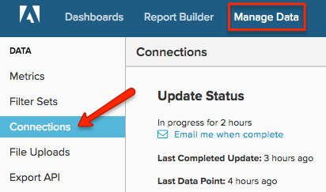

# [!DNL Microsoft SQL] サーバーを接続

>[!NOTE]
>
>[管理者権限](../../../administrator/user-management/user-management.md)が必要です。

このトピックでは、4段階のプロセスで[!DNL Microsoft SQL] データベースを[!DNL Commerce Intelligence]に接続する方法について説明します。 このプロセスには、サーバー接続とSQLに関する技術的な専門知識が必要であり、チームの開発者のサポートが必要になる場合があります。

[!DNL Commerce Intelligence]は、[!DNL Amazon RDS]、[!DNL EC2]、[!DNL Microsoft SQL Azure]およびその他のほとんどのクラウドサーバープロバイダーをサポートしています。 特定のホストに関する質問がある場合は、[&#x200B; サポートチケット &#x200B;](https://experienceleague.adobe.com/docs/commerce-knowledge-base/kb/troubleshooting/miscellaneous/mbi-service-policies.html?lang=ja)を送信して、この情報の提供を依頼してください。

システムは、データベースでSELECT クエリを実行する必要があります。 これは最初にデータベース構造のスナップショットを取得するために行われ、次にデータを最新の状態に保つために定期的に超過時間が発生します。 アップデートは段階的に行われ、Adobeはアップデートの頻度と時間を制限して、サーバーへの不要な負荷を防ぎます。

これを行う最善の方法は、TCP/IP経由でデータベースサーバーに接続することです。 SELECT クエリのみを実行できるユーザーを作成します（オプションで、指定したテーブルからのみデータを選択できます）。 これは、[!DNL Commerce Intelligence]に接続している各サーバーに対して実行する必要があります。

## `Microsoft SQL`を[!DNL Commerce Intelligence]に接続中：

1. サーバーがTCP/IPおよび混合モード認証を介した接続を許可していることを確認してください。

1. ファイアウォールで、サーバーの専用IPが接続できることを確認します。

   サーバーへの接続に使用されるIP アドレスは、`Settings` ページの「接続」セクションにあります。

1. データベースサーバーにログインするユーザーを作成します。 `UI`または`query`のいずれかを使用して2つのオプションがあります。
   * `UI`
   * `Query`

1. [!DNL Commerce Intelligence]の&#x200B;**[!UICONTROL Manage Data** > **Connections]**&#x200B;にサーバーのIP アドレス、ユーザー名、パスワードを入力します。

   

1. **[!UICONTROL Add a Data Source]**&#x200B;をクリックします。

1. 選択して`Microsoft SQL` データベースを接続し、新しい`Connections` ページのフィールドに資格情報を入力します。

   `Windows Azure`を使用している場合は、データベース名も指定する必要があります。
