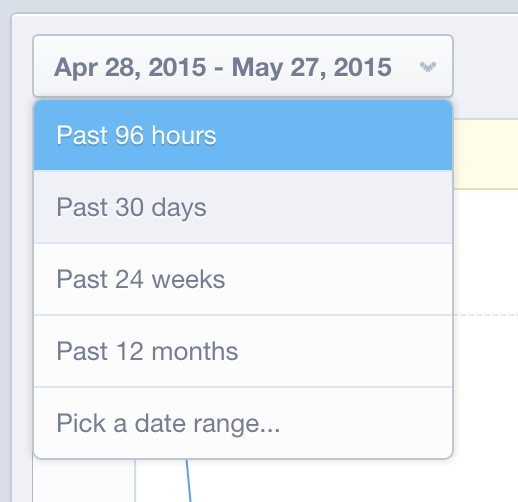

# でのデータ検証 [!DNL Mixpanel]

条件 [!DNL Adobe Commerce Intelligence] 最初に [!DNL Mixpanel] データを使用する場合、アカウントマネージャーまたはアナリストは、次の場所からデータエクスポートを提供するように要求できます： [!DNL Mixpanel] 検証の目的で使用します。 これにより、内で直接使用可能な同じデータをすべて同期したことを確認できます [!DNL Mixpanel].

## データの書き出しプロセス： `Events`

1. 次のサイトにアクセス： `Segmentation` セクションとビュー `Your Top Events`.

   

1. 選択 `Past 96 Hours` 時間範囲

   

1. レポートの右下部分までスクロールし、 `.csv` ファイル：

   

1. を `.csv` ファイルを、この検証プロセスで作業しているアカウントマネージャーまたはアナリストに送信します。
