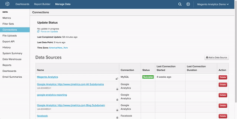

# [!DNL SSH Tunnel]経由で[!DNL PostgreSQL]に接続

[!DNL PostgreSQL] データベースを`SSH tunnel`経由で[!DNL Commerce Intelligence]に接続するには、次の操作を行う必要があります。

1. [&#x200B; [!DNL Commerce Intelligence] 公開鍵を取得](#retrieve)
1. [&#x200B; [!DNL Commerce Intelligence] IP アドレスへのアクセスを許可](#allowlist)
1. [&#x200B; [!DNL Commerce Intelligence]の [!DNL Linux]  ユーザーを作成](#linux)
1. [&#x200B; [!DNL Commerce Intelligence]の [!DNL PostgreSQL]  ユーザーを作成](#postgres)
1. [接続とユーザー情報を [!DNL Commerce Intelligence]に入力します](#finish)

## [!DNL Commerce Intelligence] [!DNL public key]を取得しています {#retrieve}

`public key`は、[!DNL Commerce Intelligence] [!DNL Linux] ユーザーの認証に使用されます。 次に、ユーザーを作成し、キーを読み込みます。

1. **[!UICONTROL Manage Data** > **Connections]**&#x200B;に移動し、**[!UICONTROL Add a Data Source]**&#x200B;をクリックします。
1. [!DNL PostgreSQL] アイコンをクリックします。
1. `PostgreSQL credentials` ページが開いたら、`Encrypted` トグルを`Yes`に設定します。 `SSH`設定フォームが表示されます。
1. `public key`はこのフォームの下にあります。

このページをチュートリアル全体を通して開いたままにします。次のセクションと最後に必要になります。

以下に、[!DNL Commerce Intelligence]を移動してキーを取得する方法を示します。



## [!DNL Commerce Intelligence] IP アドレスへのアクセスを許可 {#allowlist}

接続を成功させるには、IP アドレスからのアクセスを許可するようにファイアウォールを設定する必要があります。 `54.88.76.97/32`ですが、`PostgreSQL`資格情報ページにもあります。 上のGIFの青いボックスを参照してください。

## [!DNL Commerce Intelligence]の[!DNL Linux] ユーザーを作成しています {#linux}

これは、リアルタイム（または頻繁に更新される）データを含む限り、実稼動マシンまたはセカンダリマシンにすることができます。 [!DNL PostgreSQL] サーバーに接続する権利を保持している限り、このユーザー[&#128279;](../../../administrator/account-management/restrict-db-access.md)を任意の方法で制限できます。

1. 新しいユーザーを追加するには、次のコマンドを[!DNL Linux] サーバー上のルートとして実行します。

```bash
        adduser rjmetric -p<password>
        mkdir /home/rjmetric
        mkdir /home/rjmetric/.ssh
```

1. 最初のセクションで取得した`public key`を覚えていますか？ ユーザーがデータベースにアクセスできるようにするには、キーを`authorized\_keys`に読み込む必要があります。

   キー全体を次のように`authorized\_keys` ファイルにコピーします。

```bash
        touch /home/rjmetric/.ssh/authorized_keys
        "<PASTE KEY HERE>" >> /home/rjmetric/.ssh/authorized_keys
```

1. ユーザーの作成を完了するには、`/home/rjmetric` ディレクトリの権限を変更して、`SSH`経由のアクセスを許可します。

```bash
        chown -R rjmetric:rjmetric /home/rjmetric
        chmod -R 700 /home/rjmetric/.ssh
```

>[!IMPORTANT]
>
>サーバーに関連付けられている`sshd\_config` ファイルが既定のオプションに設定されていない場合、特定のユーザーのみがサーバーアクセスを持っています。これにより、[!DNL Commerce Intelligence]への接続が正常に行われなくなります。 このような場合、rjmetric ユーザーがサーバーにアクセスできるようにするには、`AllowUsers`のようなコマンドを実行する必要があります。

## [!DNL Commerce Intelligence] [!DNL Postgres] ユーザーを作成しています {#postgres}

組織には別のプロセスが必要な場合がありますが、このユーザーを作成する最も簡単な方法は、権限を付与する権限を持つユーザーとしてPostgresにログインしたときに次のクエリを実行することです。 ユーザーは、[!DNL Commerce Intelligence]にアクセス権が付与されているスキーマも所有している必要があります。

```sql
    GRANT CONNECT ON DATABASE <database name> TO rjmetric WITH PASSWORD <secure password>;GRANT USAGE ON SCHEMA <schema name> TO rjmetric;GRANT SELECT ON ALL TABLES IN SCHEMA <schema name> TO rjmetric;ALTER DEFAULT PRIVILEGES IN SCHEMA <schema name> GRANT SELECT ON TABLES TO rjmetric;
```

`secure password`を、SSH パスワードとは異なる独自の安全なパスワードに置き換えます。 また、`database name`と`schema name`をデータベース内の適切な名前に置き換えることも確認してください。

複数のデータベースまたはスキーマを接続する場合は、必要に応じてこのプロセスを繰り返します。

## 接続とユーザー情報を[!DNL Commerce Intelligence]に入力しています {#finish}

最後に、接続とユーザー情報を[!DNL Commerce Intelligence]に入力する必要があります。 [!DNL PostgreSQL]資格情報ページを開いたままにしましたか？ そうでない場合は、**[!UICONTROL Manage Data > Connections]**&#x200B;に移動して&#x200B;**[!UICONTROL Add a Data Source]**&#x200B;をクリックし、[!DNL PostgreSQL] アイコンをクリックします。 `Encrypted` トグルを`Yes`に設定することを忘れないでください。

`Database Connection` セクションから始めて、このページに次の情報を入力します。

* `Username`: RJMetrics Postgres ユーザー名（rjmetricである必要があります）
* `Password`: RJMetrics Postgres パスワード
* `Port`: サーバー上のPostgreSQL ポート （既定では5432）
* `Host`: 127.0.0.1

`SSH Connection`以下：

* `Remote Address`: SSH接続するサーバーのIP アドレスまたはホスト名
* `Username`: SSH ログイン名（rjmetricにする必要があります）
* `SSH Port`: サーバーのSSH ポート （既定では22）

完了したら、**[!UICONTROL Save & Test]**&#x200B;をクリックして設定を完了します。

>[!NOTE]
>
>SSH ホストキーの登録、更新、エラーメッセージ、およびトラブルシューティングについては、[SSH ホストキー検証](ssh-host-key-verification.md)を参照してください。

## 関連 {#related}

* [SSH ホスト キーの検証](ssh-host-key-verification.md)
* [統合の再認証](https://experienceleague.adobe.com/docs/commerce-knowledge-base/kb/how-to/mbi-reauthenticating-integrations.html?lang=ja)
