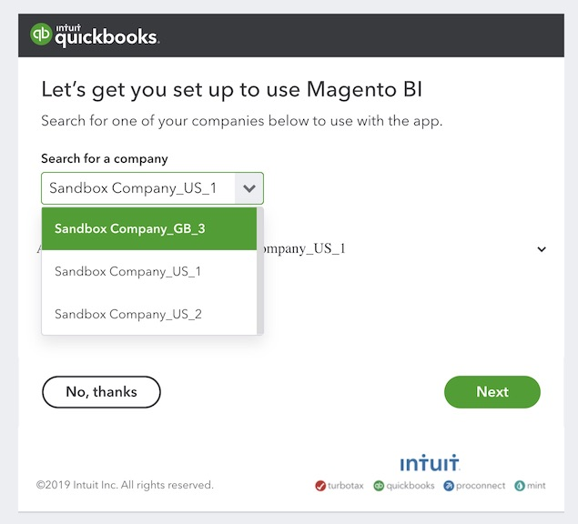

# [!DNL QuickBooks]を接続

>[!NOTE]
>
>[管理者権限](../../../administrator/user-management/user-management.md)が必要です。

[!DNL QuickBooks]との統合により、ビジネスの財務情報をセールスおよびマーケティングのデータと共に活用できるようになりました。これにより、経費の管理や過剰支出の特定などを迅速かつ簡単に行うことができます。

>[!NOTE]
>
>Adobe Commerce IntelligenceはQuickBooks Online （デスクトップではなく）と統合され、ローカルにインストールされたQuickBooks Desktop モデルではなく、QuickBooks Online SaaS構造に一致するクラウド接続を使用するIntuit アカウントのログインが必要です。

## [!DNL QuickBooks]を[!DNL Commerce Intelligence]のデータソースとして追加

1. `Integrations`の下の&#x200B;**[!UICONTROL Manage Data** > **Data Sources]** ページに移動します。
1. **[!UICONTROL Add Integration]** テーブルの上の画面の右側にある「`Data Sources`」をクリックします。
1. [!DNL QuickBooks] アイコンをクリックします。
1. **[!UICONTROL Connect to Quickbooks]**&#x200B;をクリックします。

## [!DNL Commerce Intelligence] データへの[!DNL QuickBooks] アクセス権の付与

**[!UICONTROL Connect to Quickbooks]**&#x200B;をクリックしたら、[!DNL Intuit] アカウントにログインし、接続を承認します。

1. `Search for a company` ドロップダウンで、会社を選択します。
1. **[!UICONTROL Next]**&#x200B;をクリックします。 [!DNL Commerce Intelligence]にリダイレクトされ、*接続が成功しました。* メッセージが画面の上部に表示されます。

## 関連

* [期待される [!DNL QuickBooks]  データ](../integrations/quickbooks-data.md)
* [統合を再認証しています](https://experienceleague.adobe.com/docs/commerce-knowledge-base/kb/how-to/mbi-reauthenticating-integrations.html?lang=ja)
