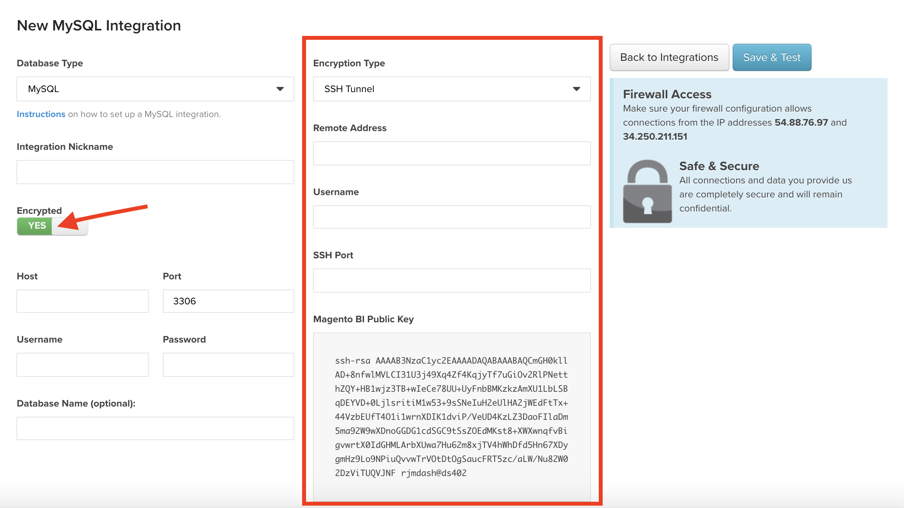

# ダッシュボードへのチャートの追加

既存のグラフは、画面の右上領域にある[!UICONTROL Add Report]関数を使用してダッシュボードに追加できます。 複数のダッシュボードに同じチャートを追加できます。つまり、チャートが編集された場合、このチャートを含むすべてのダッシュボードに変更が反映されます。

>[!NOTE]
>
>**[!UICONTROL Add Report]**&#x200B;をクリックすると、グラフ エディターで&#x200B;**[!UICONTROL Save As]**&#x200B;をクリックするのとは異なります。 `Add Report`はダッシュボードにグラフを追加するだけですが、`Save As`は既存のグラフのバージョンを作成します。

## グラフを追加

1. **[!UICONTROL Add Report]**&#x200B;をクリックします。 既存のグラフのリストが表示されます。

1. 追加するグラフの名前を検索するか、クリックします。

1. チャートがダッシュボードに追加されます。

例：

