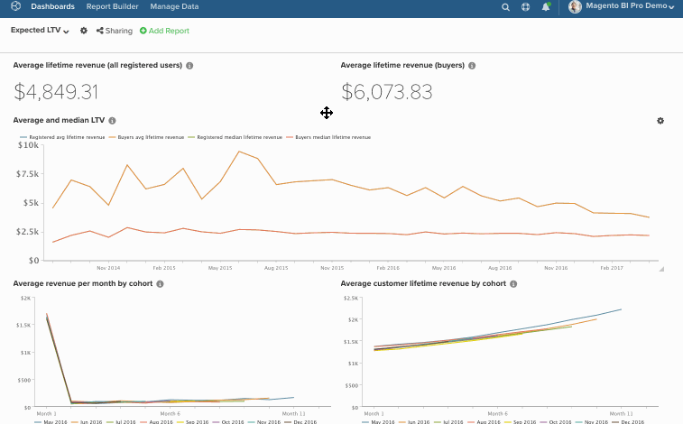

# ダッシュボードでのチャートの一括編集

一括編集機能を使用すると、ダッシュボードでグラフの名前と日付を簡単に変更できます。 たとえば、特定のダッシュボードのすべてのチャートで、四半期ではなく月単位で、単一のストアとレポートを参照するように設定します。 すべてを手動で変更するのではなく、`bulk-editing`機能で作業します。 このトピックでは、次の使用方法について説明します。

* [&#x200B; [!DNL Find/Replace] 機能](#findreplace)

* [&#x200B; [!DNL Prepend Name] 機能](#prepend)

* [&#x200B; [!DNL Change Dates] 機能](#dates)

ただし、このことを考慮してください – *これらの変更は永続的である必要がありますか？*&#x200B;そうでない場合は、ダッシュボードを複製してから、新しいダッシュボードの日付を変更することを検討してください。 これにより、必要な変更を行いながら、元のダッシュボードを保持できます。

>[!NOTE]
>
>多数のレポートを変更する場合、更新プロセスに時間がかかる場合があります。

## [!DNL Find/Replace]の使用中 {#findreplace}

1. ダッシュボード名の横にある歯車（）アイコンをクリックし、[!UICONTROL Bulk Edit Reports] ウィンドウをクリックします。

1. ポップアップで「**[!UICONTROL Chart Title Find and Replace]**」をクリックします。

1. `Chart Title Find` フィールドに、検索する単語または文字を入力します。

1. `Replace With` フィールドに、`Find` フィールドの内容を置き換える単語または文字を入力します。

1. **[!UICONTROL Update Reports]**&#x200B;をクリックします。

例：

## `Chart Names`が保留中です {#prepend}

1. ダッシュボード名の横にある歯車（）アイコンをクリックし、[!UICONTROL Bulk Edit Reports] ウィンドウをクリックします。

1. ポップアップで「**[!UICONTROL Prepend Report Names]**」をクリックします。

1. グラフの前に付ける単語または文字を入力します。

1. **[!UICONTROL Update Reports]**&#x200B;をクリックします。

例：

## `Dates`を変更中 {#dates}

1. ダッシュボード名の横にある歯車（）アイコンをクリックし、[!UICONTROL Bulk Edit Reports] ウィンドウを選択します。

1. ポップアップウィンドウで「**[!UICONTROL Change Dates]**」をクリックします。

1. 新しい`Start/End Date`と`Time Interval`を設定します。 これらのフィールドは変更しないでください。

1. **[!UICONTROL Update Reports]**&#x200B;をクリックします。

例：

