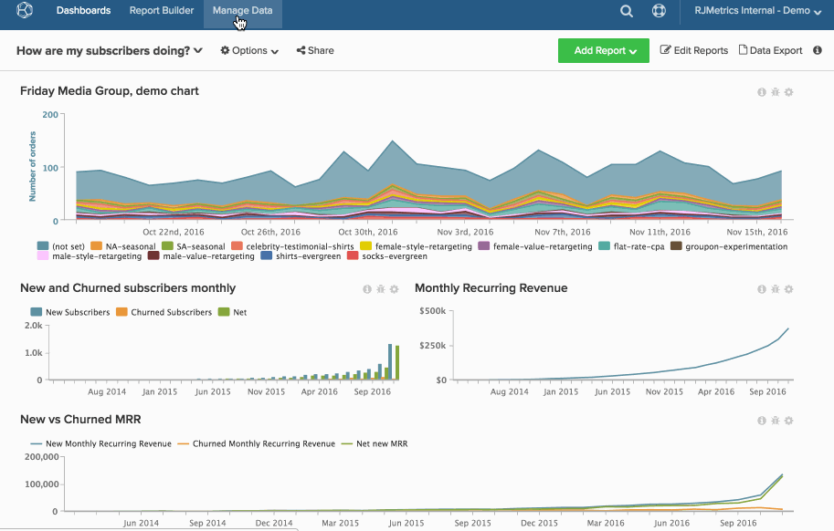

# グラフを完全に削除する

[ ダッシュボードからグラフを削除 ](../../data-user/dashboards/remove-charts-dashboard.md) しても、そのグラフは [!DNL Commerce Intelligence] アカウントに存在します。

グラフを完全に削除するには：

1. サイドバーの「**[!UICONTROL Account Setting]**」をクリックします。

1. 「**[!UICONTROL Charts]**」をクリックします。

1. （ユーザー権限とグラフの所有権に基づいて）削除できるグラフは、画面の右側に表示されます。

1. 削除するグラフの線の横にあるチェックボックスをクリックします。

1. 「**[!UICONTROL Delete Selected]**」をクリックします。

   >[!NOTE]
   >
   >グラフがダッシュボードまたはメールの概要で使用されている場合は、通知が表示されます。 続行するには、削除を確認し、[**[!UICONTROL Force Deletion]**] をクリックする必要があります。

例：

<!--{: width="630" height="402"}-->
