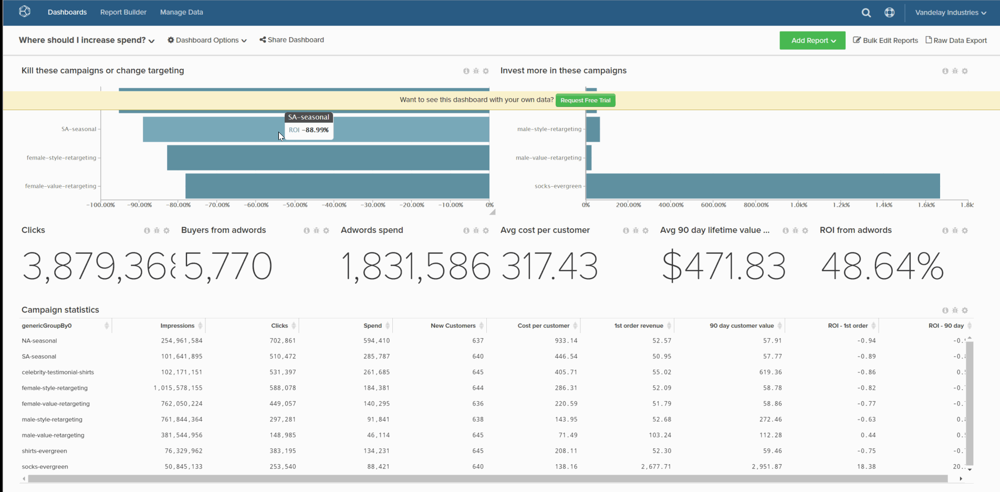

# ダッシュボードの削除

ダッシュボードのリストが乱雑になりすぎないようにしたい場合は、不要になったダッシュボードを削除することができます。 これは、次の2つの方法のいずれかで実現できます。

1. [`Account Settings` ページ ](#account)経由 – この方法には[管理者権限](../../administrator/user-management/user-management.md)が必要です。

1. [ `Dashboard Options` メニュー](#do)を介して – この方法では、ダッシュボードを所有するか、`Edit`権限を持っている必要があります。

## `Account Settings` ページ経由でダッシュボードを削除 {#account}

1. **[!UICONTROL Account Settings** > **Dashboards]**&#x200B;をクリックします。

1. ダッシュボードのリストで、削除するダッシュボードをクリックします。

1. **[!UICONTROL Delete Dashboard]**&#x200B;をクリックします。

例：

<!--{: width="703" height="346"}-->

## `Dashboard Options` メニューからダッシュボードを削除 {#do}

1. 画面上部の&#x200B;**[!UICONTROL Dashboard Options]** メニューをクリックします。

1. ドロップダウンで、**[!UICONTROL Delete]**&#x200B;をクリックします。

1. 確認を求められたら、**[!UICONTROL Delete]**&#x200B;をクリックします。

例：

<!--{: width="703" height="347"}-->
